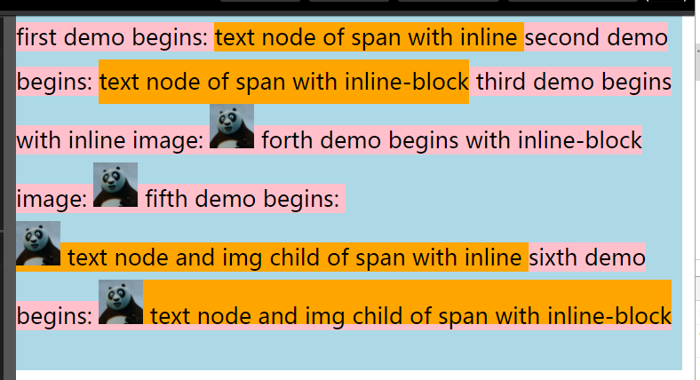
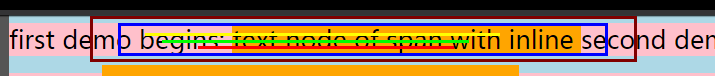
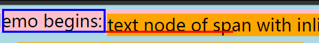
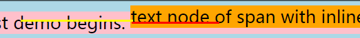
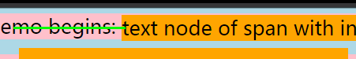
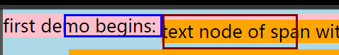

## Preface

I have been confused about `vertical-align` for a long time. At last,I decided to learn it radically according to specifications and demos.

## Preparations

Before getting into demos,you have to do some preparations listed below:

1.  Put [specifications][specifications] and [errata][errata] on your hand.
2.  Code below lists the **main code** of the demos

```html
<div class="body">
  <span class="wrapper">
    first demo begins:
    <span class="inline text-wrapper">
      text node of span with inline
    </span>
    second demo begins:
    <span class="inline-block text-wrapper">
      text node of span with inline-block
    </span>
    third demo begins with inline image:
    
    forth demo begins with inline-block image:
    
    fifth demo begins: <br>
    <span class="inline img-wrapper">
      
      text node and img child of span with inline
    </span>
    sixth demo begins:
    <span class="inline-block img-wrapper">
      
      text node and img child of span with inline-block
    </span>
  </span>
</div>
```

```css
* {
  margin: 0;
  padding: 0;
}
.body {
  font-family: Microsoft Yahei;
  font-size: 25px;
  background-color: lightblue;
  height: 400px;
  width: 750px;
  line-height: 2;
  vertical-align: baseline;
}
.body span {
  background-color: pink;
}
.body img {
  width: 50px;
  height: 50px;
}
.body .inline,
.body .inline-block {
  background-color: orange;
}
.body .inline {
  display: inline;
}
.body .inline-block {
  display: inline-block;
  height: 50px;
}
```

So,the demo starts like this:



**Attention:** the **main code** is always used and never change through the whole demo. However ,it may change between demos.

For example,in **Demo1** or **Demo2**,it always keeps the same while **main code** in **Demo1** may be different from **main code** in **Demo2**.If any change happens,changes will be listed just under the subtitle with **Attention:**.

3.  When we were testing,what we do is just adding some **test code** to the **main code**.Usually,the **test code** is like code below:

```css
.inline-block.img-wrapper > img {
  vertical-align: baseline;
}
```

And we just modify the value of `vertical-align`,and try to explain what happened and why it happened like that.

After we have tested all the values of `vertical-align` for an element,then we delete the **test code** and try next demo.

For example,we have finished the test of element `.inline-block.img-wrapper > img`,then we prepare to test element `.inline-block.img-wrapper`.So,all of the **test code** would be:

```css
.inline-block.img-wrapper {
  vertical-align: baseline;
}
```

And the **main code** still the same,never change!Doing this just for the accuracy of the test.

Is it clear now?If not,read it again or give me issues.

Now,let's start:

## Demo1

1.  `.inline.text-wrapper`,`vertical-align`

Before we test all the values,we have to figure something out.

According to specifications,for element `.inline.text-wrapper` ,:

> The following values only have meaning with respect to a parent inline element, or to the strut of a parent block container element.

* the following values only have meaning with respect to`.wrapper`.

> In the following definitions, for inline non-replaced elements, the box used for alignment is the box whose height is the 'line-height' (containing the box's glyphs and the half-leading on each side, see above). For all other elements, the box used for alignment is the margin box.

* the box used for alignment is the box whose height is the 'line-height' (32px)

* As you see,



1.  `baseline` of `.wrapper` is the red line
2.  `sub` of `.wrapper` is a little lower than `baseline`,can barely think that it is the bottom of the `content area`.
3.  `super` of `.wrapper`is a little higher than `baseline`,can barely think that it is the yellow line.
4.  `middle` of `.wrapper` is the green line.
5.  `content area` of `.wrapper` is the blue box,`text-top` and `text-bottom` is the top and bottom of `content area`.
6.  `box used for alignment` is the brown box.

After point these out,the result of `vertical-align` can be more clear:

```css
.inline.text-wrapper {
  vertical-align: sub;
}
```



```css
.inline.text-wrapper {
  vertical-align: super;
}
```



```css
.inline.text-wrapper {
  vertical-align: middle;
}
```



```css
.inline.text-wrapper {
  vertical-align: text-top;
}
```



[specifications]: https://www.w3.org/TR/2011/REC-CSS2-20110607/visudet.html
[errata]: http://www.w3.org/Style/css2-updates/REC-CSS2-20110607-errata.html
