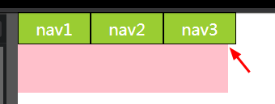
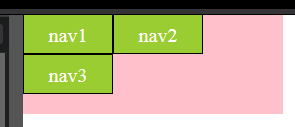

## Preface

As we all know there would be extra space between inline-blocks when using inline-block layout. There are lots of solutions like `font-size:0`,`word-spacing`,`margin-left`,`letter-spacing` and so on.

## Choice I Made

Normally I prefer using `letter-spacing` because

1.  it seems ok when we assign a value which is bigger than the width of extra space(e.g. `-1em`).
2.  However, it won't be okay with `word-spacing` and `margin-left` when we set bigger value like `-1em`.
3.  Using `font-size` is not convenient when we try to using `em` as `font-size` unit.

So, `letter-spacing` seems to be the best choice.

Well, I agree with that though I found a bug in chrome66.0.3359.139 today.

## Bug I Found

Please run the code below:

```html
<nav class="nav">
    <span class="nav__text">nav1</span>
    <span class="nav__text">nav2</span>
    <span class="nav__text">nav3</span>
</nav>
```

```css
* {
  margin: 0;
  padding: 0;
}
a {
  text-decoration: none;
  color: inherit;
  cursor: auto;
}
.nav {
  width: 260px;
  height: 100px;
  background-color: pink;
  color: white;
  font-size: 20px;
  letter-spacing: -1em;
}
.nav__text {
  width: 90px;
  height: 40px;
  box-sizing: border-box;
  border: 1px solid black;
  line-height: 40px;
  background-color: yellowgreen;
  text-align: center;
  display: inline-block;
  letter-spacing: normal;
}
```

If you are using Chrome(test version 66.0.3359.139) or Opera(test version 53.0.2907.99), what you see might be:



If you are using Firefox(60.0.2),IE10 or Edge, what you see might be:



That's interesting. So, I checked the [mdn-letter-spacing][mdn-letter-spacing] and found this:

> <length>
> Specifies extra inter-character space in addition to the default space between characters. Values may be negative, but there may be implementation-specific limits. **User agents may not further increase or decrease the inter-character space in order to justify text.**

It seems that this is the reason.

So, I tested and try to find the best value for `letter-spacing` and **it turns out that `0.3em` or `0.31em` is the best value.**

## Ending

Anyway, `letter-spacing` is still the best solution though we have to be more careful.

## Reference

[mdn-letter-spacing][mdn-letter-spacing]

[mdn-letter-spacing]: https://developer.mozilla.org/en-US/docs/Web/CSS/letter-spacing
