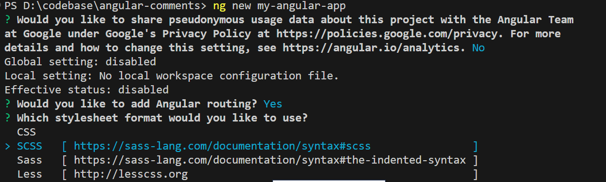
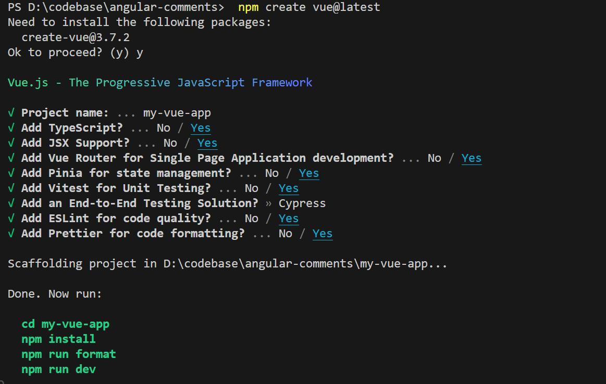
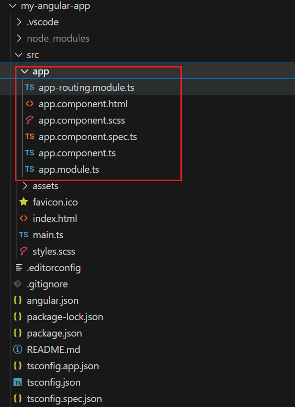
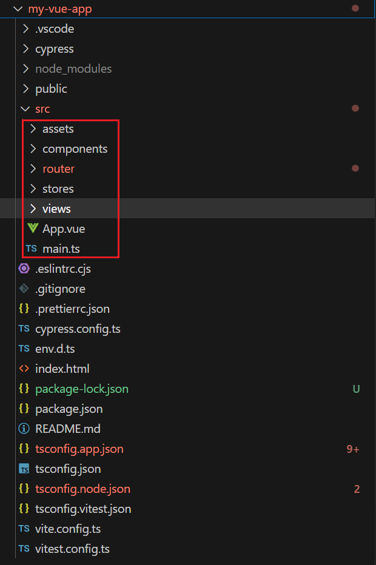
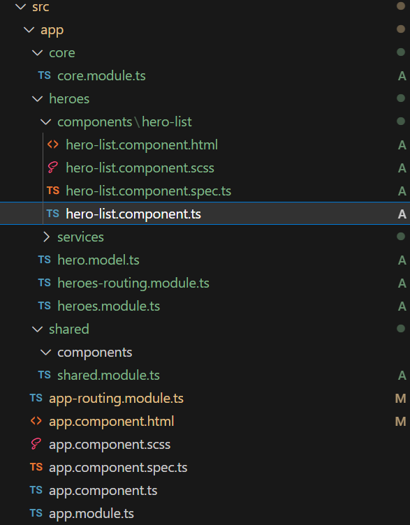
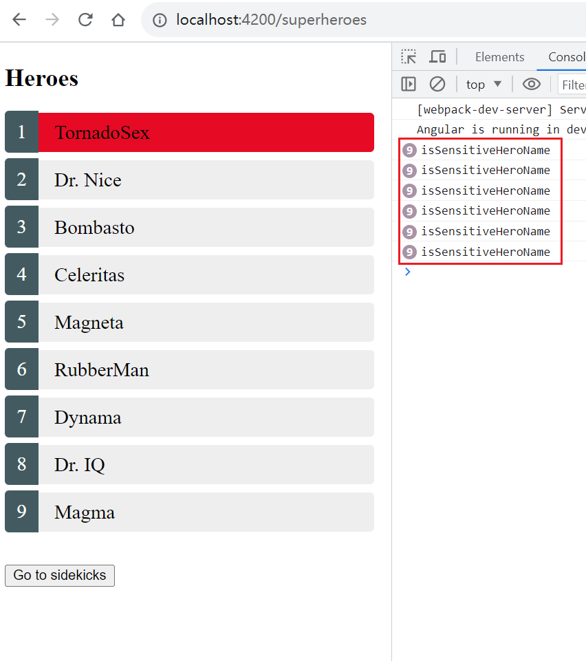
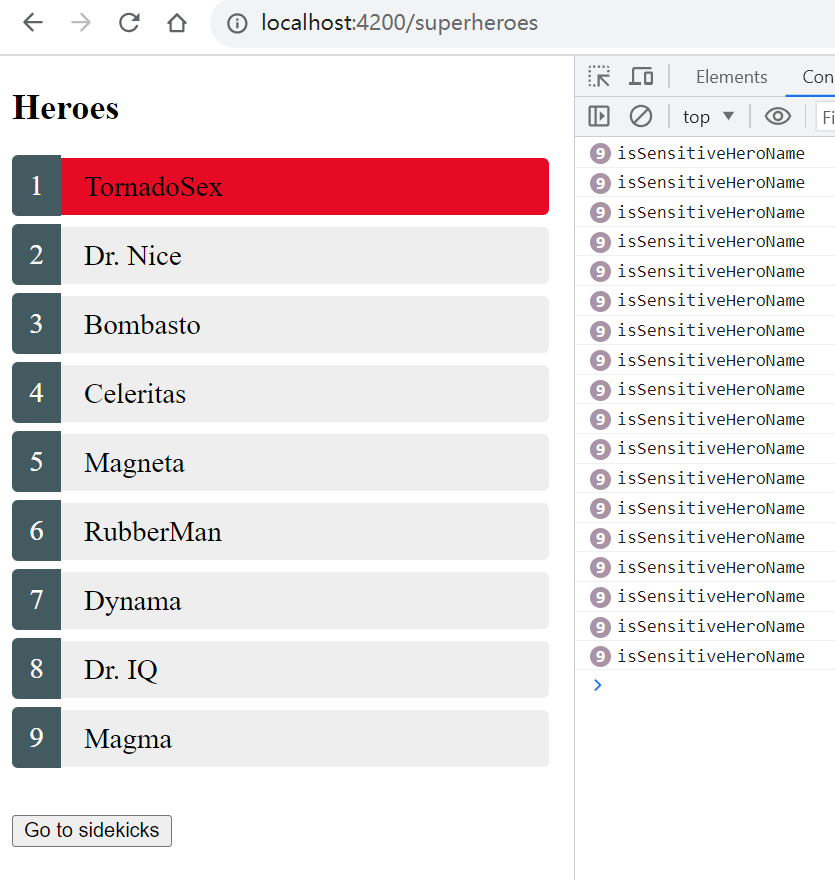
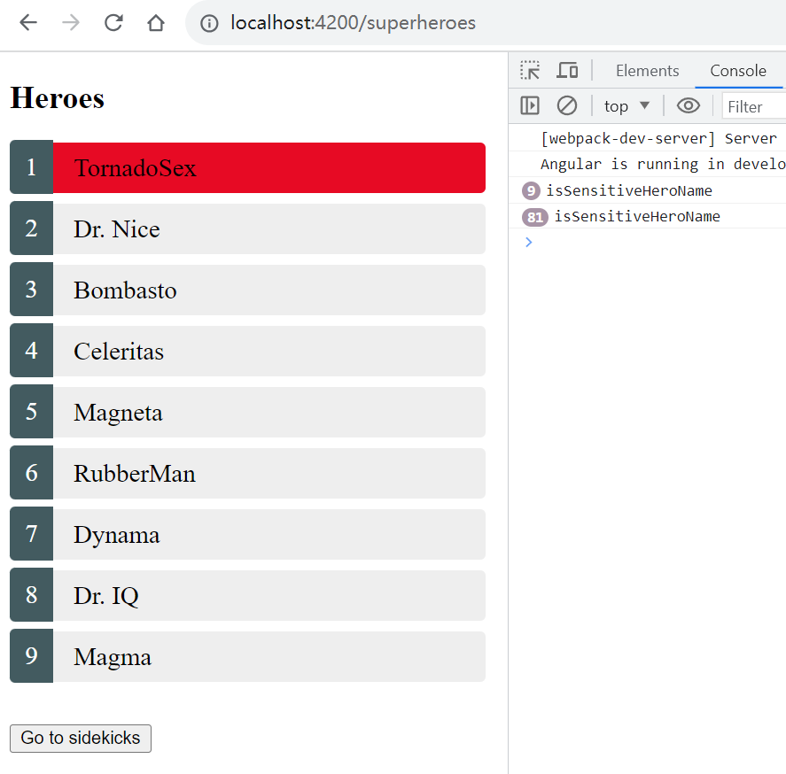

You might have often heard someone saying that

> Angular is waiting for you in 3 years.
> 
> Angular is better for big or enterprise project
> 
> Angular provides an excellent updating experience
> 
> ...

In this article, I'll show you why I think Angular is not as good as you have heard **before 2023 Angular 15, 16**.

**Of course, I can't be 100% fair when comparing Angular with other frameworks/libs. Also, because I'm trying to demo that Angular before 2023 is not that good, so I'll focus too much on the disadvantages. It's unfair for Angular. After 2023, Angular is getting much better but I'll cover those parts in other articles.**

To be fair, I'm creating 2 projects, 1 for Angular, 1 for Vue in 2023/8/15.

For Angular, I'm creating with `ng new my-app-angular` with `@angular/cli@16.2.0`.
For Vue, I'm creating with `npm create vue@latest` with `create-vue@3.7.2`.

And I will demo it step by step.

### Too simple template when creating a new project

When creating a new project with Angular CLI, I have 2 options

- Need routing
- CSS format



While with Vue CLI,



besides the 2 options, I also have more than 4 options

- state-management lib
- e2e test lib
- `ESLint`
- `Prettier` for code formatting
- ......


To be honest, in my opinion, the above 4 options are important for a big or enterprise project. 

If they're not set up at the beginning of a big project, it's not easy to make all team members agree on one specific solution. Some people like this state management lib while others like another one. Some people like semi while others don't...

By the way, Angular doesn't have an official state-management solution until now. Angular added this feature to the backlog in 2022 because of [this issue](https://github.com/angular/angular/issues/46662). Until now, the most starred state management solution for Angular is [ngrx](https://github.com/ngrx/platform).

### Too simple default project folder structure

For Angular, I don't even know how to code with the template before I find the [CodingStyleGuide](https://angular.io/guide/styleguide#overall-structural-guidelines) chapter.



- Where to put router views?
- Where to put shared code?
- ...

While for Vue, I think developers can code immediately.



Anyway, I'll follow the Angular style guide to create a `heroes` feature module. 



_The demo code is copied from Angular homepage demo._

And here is the UI:



### Default change detection strategy is a performance killer

Have you noticed how many times the function is called at the console when the page is loaded? **6\*9=54 times!** Here is the code

```html
<h2>Heroes</h2>
<ul class="heroes">
  <li
    *ngFor="let hero of heroes$ | async"
    [class.selected]="hero.id === selectedId"
    [class.sensitive]="isSensitiveHeroName(hero)"
    (mouseenter)="showTooltip()"
  >
    <a [routerLink]="['/hero', hero.id]">
      <span class="badge">{{ hero.id }}</span>{{ hero.name }}
    </a>
  </li>
</ul>

<button type="button" routerLink="/sidekicks">Go to sidekicks</button>
```

```ts
@Component({
  selector: "app-hero-list",
  templateUrl: "./hero-list.component.html",
  styleUrls: ["./hero-list.component.scss"],
})
export class HeroListComponent implements OnInit {
  heroes$!: Observable<Hero[]>;
  selectedId = 0;

  constructor(private service: HeroService, private route: ActivatedRoute) {}

  ngOnInit() {
    this.heroes$ = this.route.paramMap.pipe(
      switchMap((params) => {
        this.selectedId = parseInt(params.get("id")!, 10);
        return this.service.getHeroes();
      })
    );
  }

  isSensitiveHeroName(hero: Hero) {
    console.log("isSensitiveHeroName");
    return hero.name.toLowerCase().includes("sex");
  }
  showTooltip() {}
}
```

And if you move your mouse from top to bottom, the function will be triggered **2\*9\*9 times!**



In this case, we can use the `OnPush` strategy.

```ts
@Component({
  selector: 'app-hero-list',
  templateUrl: './hero-list.component.html',
  styleUrls: ['./hero-list.component.scss'],
  changeDetection: ChangeDetectionStrategy.OnPush // +
})
```

`isSensitiveHeroName` will be triggered **9** times in the first time and **9\*9** times for `mouseenter` event.



So the performance is improved by 1200% with `OnPush` strategy. **In reality, if we want to change the `Default` strategy to `OnPush`, we need to apply more changes, not just one line in this demo.**

Regarding this case, there's a better solution for Angular.

```ts
export interface Hero {
  id: number;
  name: string;
  isSensitive?: boolean; // +
}
```

```ts
this.heroes$ = this.route.paramMap.pipe(
  switchMap((params) => {
    this.selectedId = parseInt(params.get("id")!, 10);
    return this.service.getHeroes().pipe(
      map((heroes) => { // +
        return heroes.map((hero) => {
          return {
            ...hero,
            isSensitive: this.isSensitiveHeroName(hero), // +
          };
        });
      })
    );
  })
);
```

Now, we get better performance, maybe the best performance. That's why you can often see this in the Angular community.

> Never call functions in the template

Ok. Here are my concerns

> Is it really good to avoid using functions in the template?

For better performance, we defined a derived state `isSensitive`. So, each time we change the name of the hero, we need to update `isSensitive`.

In real-word apps, there would be many derived states dependent on 2 or more other states. So we need to add more and more code to keep the current performance which will quickly bring bugs and maintenance issues.

There might be other ways to keep the performance without writing more code. But Here are my concern

> How long time does Angular need to take developers to write high-performance and easy-maintenance code? 1 month or 1 year?

**Luckily, in 2023 Angular launched `Signals` which is in developer preview now. `Signals` allows you to write high-performance and easy-maintenance code.**

### Complicated NgModule

Now, let's assume I want to use `HeroListComponent` out of `HeroesModule`. I need to export it from `HeroesModule`, then import the `HeroesModule` to another module(let's assume `AppModule`).

```ts
@NgModule({
  declarations: [HeroListComponent],
  imports: [CommonModule, HeroesRoutingModule],
  exports: [
    HeroListComponent, // +
  ],
})
export class HeroesModule {}
```

```ts
@NgModule({
  declarations: [AppComponent],
  imports: [
    BrowserModule,
    AppRoutingModule,
    HeroesModule, // +
  ],
  providers: [],
  bootstrap: [AppComponent],
})
export class AppModule {}
```

I can see only 1 good point. If I want to use the components exported from `HeroesModule`, I don't need to import the components to `AppModule` again.

However, I can see many drawbacks.

> It's not easy for developers to know how many things `AppModule` has imported from `HeroesModule`. Only Angular knows.
>
>Because a component has to be declared in a module, it's not easy for developers to know how many things the component is dependent on in the module. For example, is `HeroListComponent` dependent on `CommonModule` and `HeroesRoutingModule`? We need to check.
>
> Thus it's quite common that if you move a component from one module to another and it's not working because you need to find out what dependencies the component needs and move the dependencies also. Because the dependencies are not declared in the component.

In conclusion, a component can not work by itself which is hard to think about if you're coming from other frameworks.

Luckily, we got `standalone` components in Angular@15 by the end of 2022. Angular team even provided a tool for you to migrate from `NgModule` to `standalone` component.

### Deep binding with RxJs

Many Angular APIs are exposed with `Observable`, even `HttpClient`. However, it's not easy for beginners to write code with fewer bugs with RxJs.

#### Things to be cautious in RxJs declarative style

For example, the previous `HeroListComponent` is implemented with a declarative style. **If we remove the `heroes$ | async` in the template, the `service.getHeroes` will never be called again.** If you're new to Angular or RxJs, it might be a shock to you.

```html
<h2>Heroes</h2>
<ul class="heroes">
  <!-- <li *ngFor="let hero of heroes$ | async" [class.selected]="hero.id === selectedId" [class.sensitive]="hero.isSensitive" (mouseenter)="showTooltip()">
    <a [routerLink]="['/hero', hero.id]">
      <span class="badge">{{ hero.id }}</span>{{ hero.name }}
    </a>
  </li> -->
</ul>
```

Also, if the `service.getHeroes` throws an error once, the function will not work anymore. That's why you can often see `catchError(() => EMPTY)` in declarative code.

```ts
this.heroes$ = this.route.paramMap.pipe(
  switchMap((params) => {
    this.selectedId = parseInt(params.get("id")!, 10);
    return this.service.getHeroes().pipe(
      map((heroes) => {
        return heroes.map((hero) => {
          return {
            ...hero,
            isSensitive: this.isSensitiveHeroName(hero),
          };
        });
      }),
      catchError(() => EMPTY) //+
    );
  })
);
```
#### Things to be cautious in RxJs imperative style

In reality, many developers are using imperative programming. In this case, `HeroListComponent` would be like

```ts
export class HeroListComponent implements OnInit {
  heroes!: Hero[];
  selectedId = 0;

  constructor(private service: HeroService, private route: ActivatedRoute) {}

  ngOnInit() {
    this.route.paramMap.subscribe((params) => {
      this.selectedId = parseInt(params.get("id")!, 10);
      this.service.getHeroes().subscribe((heroes) => {
        this.heroes = heroes.map((hero) => {
          return {
            ...hero,
            isSensitive: this.isSensitiveHeroName(hero),
          };
        });
      });
    });
  }
  //...
}
```

And in the template, `heroes$ | async` needs to be changed to `heroes`.

However, it has bugs. Just like we need `removeEventListener` after `addEventListener`, we also need to `unsubscribe` or use `takeUntilDestroyed`.

```ts
this.route.paramMap.pipe(takeUntilDestroyed()).subscribe((params) => {
  this.selectedId = parseInt(params.get("id")!, 10);
  this.service
    .getHeroes()
    .pipe(takeUntilDestroyed())
    .subscribe((heroes) => {
      this.heroes = heroes.map((hero) => {
        return {
          ...hero,
          isSensitive: this.isSensitiveHeroName(hero),
        };
      });
    });
});
```

However, `takeUntilDestroyed` is in the developer preview until now. Before 2023, we need to add more code. And one more thing, this way is unfriendly for `OnPush` strategy.

#### Short conclusion

As you can see, deep binding with RxJs makes it easier for developers to make mistakes or write less performant code. 

I do think RxJs is powerful and especially good for edge cases. However, having a powerful tool doesn't mean that we need to use it in all cases. Lots of frameworks/libs/projects without RxJs are working quite well.

Also, I didn't mention the things developers need to know from RxJs and the very intrusive code style it brings.

### Current status of Angular

As you can see, Angular has brought many new solutions. It's a good thing, but it could be a bad thing if they don't point out recommended solutions in time. The community could get much more split than before.

- declarative or imperative programming
- less or more `RxJs`
- `Default` or `OnPush`
- `NgModule` or `standalone`
- `zone.js` or `Singals`
- ...

Choses between those will result in different styles, which also make code hard to maintain.

The first 2 choices have already made the community split. Now we have more.

### In my opinion,

- `standalone` + `Singals` are the future of Angular.
- [`RxJs` will be optional for Angular](https://github.com/angular/angular/issues/5689#issuecomment-879474919).
- Official state management solution will be provided.
- Angular will be more like other frameworks/libs.

Angular has made great choices like choosing `typescript`, but choosing `NgModule` and `zone.js` might have been proven not that successful. Even built-in `RxJs` APIs is also probably not a good solution.

> Angular is not waiting for other frameworks/libs in 3 years.
>
> He is making progress and choices. Some solutions that many frameworks and developers are not choosing often mean that they might not be that suitable for front end developing. In those cases, Angular is also learning from other frameworks/libs instead of waiting and insisting that he's in the right direction.

Actually, frameworks/libs are both learning from each other. Learning and improving themselves is much better than thinking I'm the best one.

[**Issue**](https://github.com/xianshenglu/blog/issues/149)

[**Source**](https://github.com/xianshenglu/blog/blob/master/source/_posts/angular-is-not-that-good-before-2023.md)

## Reference
