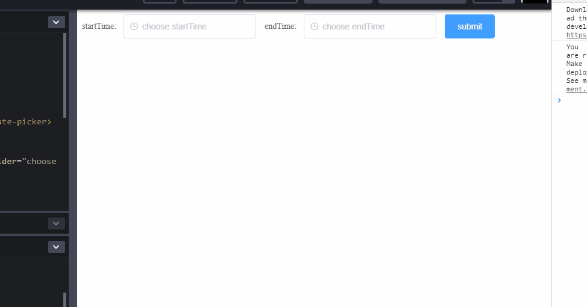

## Scenario

Let's see this gif:



And collapsed code:

<details>
<summary>Click here to expand code</summary>

```html
<script src="//unpkg.com/vue/dist/vue.js"></script>
<script src="//unpkg.com/element-ui@2.11.0/lib/index.js"></script>
<script src="https://cdnjs.cloudflare.com/ajax/libs/moment.js/2.24.0/moment.min.js"></script>
<div id="app">
  <el-form :inline="true" ref="form" :rules="rules" :model="formData">
    <el-form-item label="startTime:" prop="startTime">
      <el-date-picker
        v-model="formData.startTime"
        type="datetime"
        placeholder="choose startTime"
        value-format="yyyy-MM-dd HH:mm:ss"
      ></el-date-picker>
    </el-form-item>
    <el-form-item label="endTime:" prop="endTime">
      <el-date-picker
        v-model="formData.endTime"
        type="datetime"
        placeholder="choose endTime"
        value-format="yyyy-MM-dd HH:mm:ss"
      ></el-date-picker>
    </el-form-item>
    <el-form-item>
      <el-button type="primary" @click="onSubmit">submit</el-button>
    </el-form-item>
  </el-form>
</div>
```

```css
@import url("//unpkg.com/element-ui@2.11.0/lib/theme-chalk/index.css");
```

```js
var Main = {
  data() {
    return {
      formData: {
        startTime: "",
        endTime: ""
      },
      rules: {
        startTime: [{ validator: this.startEndTimeValidator }],
        endTime: [{ validator: this.startEndTimeValidator }]
      }
    };
  },
  watch: {
    // "formData.startTime"() {
    //   this.validateField("endTime");
    // },
    // "formData.endTime"() {
    //   this.validateField("startTime");
    // }
  },
  methods: {
    startEndTimeValidator(rule, value, callback) {
      let {
        formData: { startTime, endTime }
      } = this;
      startTime = moment(startTime, "YYYY-MM-DD HH:mm:ss");
      endTime = moment(endTime, "YYYY-MM-DD HH:mm:ss");
      if (startTime > endTime) {
        return callback(
          new Error(`start time shouldn't be larger than end time！`)
        );
      }
      callback();
    },
    validateField(...args) {
      if (typeof this.$refs.form === "undefined") {
        return;
      }
      this.$refs.form.validateField(...args);
    },
    onSubmit() {
      console.log("submit!");
    }
  }
};
var Ctor = Vue.extend(Main);
new Ctor().$mount("#app");
```

</details>

<br>

When user selected a smaller `endTime`, we show the message:

> start time shouldn't be larger than end time！

If user changes the `endTime` with a larger one everything is okay. However, user could also choose a smaller `startTime` to avoid this message.

But the behavior of changing `startTime` wouldn't trigger the `endTime` validation. So, user would still see the error message though he did the right thing.

That's what we are going to talk about:

> Associated Validation.

## Implementation

At the very beginning, I have tried adding similar logic in the validator. However, it fails because of dead loop.

To avoid dead loop, I add this

```js
var Main = {
  // ...
  watch: {
    "formData.startTime"() {
      this.validateField("endTime");
    },
    "formData.endTime"() {
      this.validateField("startTime");
    }
  }
  // ...
};
```

Em, not so good but works.

**[Issue](https://github.com/xianshenglu/blog/issues/99)**

**[Source](https://github.com/xianshenglu/blog/blob/master/source/_posts/associated-validation-in-vue.md)**

## Reference
