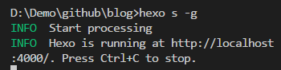
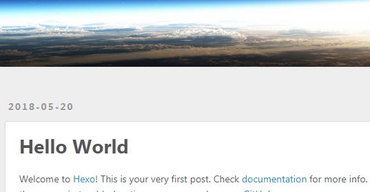

## Preface

There is a lot of tutorials teaching you build your own blog by github pages with url like `https://username.github.io`.

Well, I am not going to do that. Why would I have to build blog on my main site rather than `https://username.github.io/blog`?

That is what I'm going to do! Build a blog under main site so that it wouldn't take over the main site. Suppose that you have already known something about `npm` and `git` or `Github`.

## Steps

- Install `hexo` and `hexo-cli`

```bash
npm install -g hexo-cli
npm install -g hexo
```

- Create your blog folder with no file, and get into the folder(for example, my blog folder is _blog_).

```bash
cd blog
```

- Initialize hexo and install dependencies

```bash
hexo init
npm install
```

Normally, dependencies will be installed automatically

- Try to run it locally

```bash
hexo s -g
```

Normally, you will see:



- Open the browser with the url in the above screenshot:



You can change the theme if you don't like it. However that is not the point of this article. You can do it according to the docs in [hexo][hexo].

- Also, if we want to deploy it on github, we have to install `hexo-deployer-git` according to [docs][hexo].

```bash
npm install hexo-deployer-git --save
```

- Suppose that you already have a repository on github. For example, the name is `blog` and url is `https://github.com/username/blog`. Then find the _\_config.yml_ file in the folder. Open it update the `url` and `root` as follows:

```bash
url: https://github.com/username/blog
root: /blog/
```

Also, update `deploy` like this:

```bash
deploy:
  type: git
  repo: https://github.com/username/blog
  branch: master
```

Well, I have to warn you that
and the space before word `type`, `repo` and `branch`should be _blank space_ not _tab_. Otherwise, you will get error about your `indentation`.

- Now, try to deploy it on github:

```bash
hexo d -g
```

Open your repository url like `https://github.com/username/blog` and you will find there is a few files and folders. Remember to clear cash with `ctrl+shift+delete` if you just pushed.

- Suppose that you already make the repository become a github page. Then, you can open your page url like: `https://username.github.io/blog/`. You will see what you see locally last time.

## Default settings

some stuff should be done by default which hexo didn't:

- Generate _.deploy_git/categories_ folder when deployed. This might be done by default.

```bash
npm install hexo-generator-category --save
```

- Generate _index.md_ under folder _source/categories_ and _source/tags_

```bash
hexo new page categories
hexo new page tags
```

Also, need to add `type: tags` and `type: categories` in the above corresponding file _index.md_. It will help you generate _index.html_ under folder _.deploy_git/categories_ and _.deploy_git/tags_ when deployed.

## Update

- I just found that default `hexo-renderer-marked` didn't work with some markdown syntax like _.deploy_git/categories_. So, I change my markdown parser;

```bash
npm uninstall hexo-renderer-marked  --save
npm install hexo-renderer-markdown-it  --save
```

- Before deploying, you had better remove the _public_ and _.deploy_git_ folder because they won't be rewritten sometimes.

- Above operation works well if there is no image in the markdown. However, if there is an image, for example:

```md

```

The path for the image will be resolved incorrectly. In consistent with above case, the correct path should be `https://username.github.io/blog/images/20180520102405.png` while what we got is like `https://username.github.io/blog/2018/05/20/images/20180520101721.png`.So, we need to modify `src` to get a new url.

```javascript
window.addEventListener('error', windowErrorCb, { capture: true }, true)
document.addEventListener(
  'DOMContentLoaded',
  refreshImgUrl,
  { capture: true },
  true
)
function windowErrorCb(event) {
  let target = event.target
  imgErrorCb()
  function imgErrorCb() {
    let isImgErrorHandled = target.hasAttribute('data-src-error')
    let isImgPathMatch =
      target.tagName.toLowerCase() === 'img' &&
      target.src.match(/\/images\/[^/]*?\d{10,20}[^/]*$/)

    if (isImgPathMatch && !isImgErrorHandled) {
      target.src = 'https://xianshenglu.github.io/blog' + isImgPathMatch[0]
      target.setAttribute('data-src-error', 'handled')
    }
  }
  return true
}

function refreshImgUrl(event) {
  let isImgPathMatchReg = /\/images\/[^/]*?\d{10,20}[^/]*$/
  $('img')
    .toArray()
    .forEach(img => {
      if (img.src.match(isImgPathMatchReg)) {
        img.src = img.src
      }
    })
}
```

To solve question above, you can put the code above in the bottom of the file _theme/next/source/js/src/motion.js_ which should be changed according to your theme and image's path. Actually, you can put the code in any js file as long as you are sure that it will be loaded.

## Ending

Well, the main settings have already finished. And if you want to set the theme or other things, go check the [docs][hexo].

[hexo]: https://hexo.io/docs/
