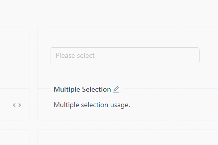
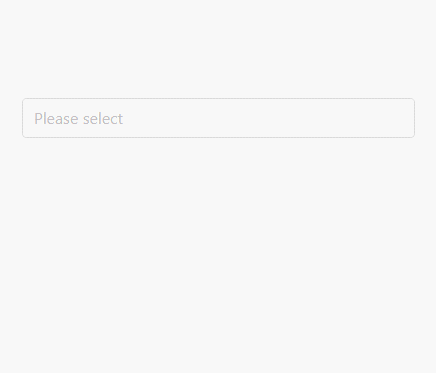

## Preface

I need to make a cascader which can support multiple choices. However, I didn't find any ui which supports that until 2018.11.18. That was a little pity.

## Main

I check the `element-ui` and find multiple cascader was in toDoList while `ant-design` refuse to support that directly. Maybe because they have already implemented [TreeSelect](https://ant.design/components/tree-select/). Here is what `TreeSelect` looks like:



Almost the result I want except the ui. It doesn't look like a cascader but a tree.

Anyway, I built a multiple cascader component based on select and cascader in `ant-design-vue`. Here is the result:



The principle is easy. I use the `input` in `select` and hide the popup. And then I hide the `input` in `cascader` and show the popup. So, MultipleCascader is equal to `input` in `select` plus popup in `cascader` and use `transform` to let them stay together.

Talking about the event, you have to listen and change the data to show correctly. That is a little troublesome.

Anyway, here is the earliest [demo](https://codesandbox.io/s/8njr9xy212) in codesandbox. I am not sure if the demo would be always able to visit.

The latest version is in [here](https://github.com/xianshenglu/vue/tree/master/demo/multi-cascader-ant-design-vue).
So, here is the earliest code:

_App.vue_

```vue
<template>
  <div id="app" class="app"><MultipleCascader /></div>
</template>

<script>
import MultipleCascader from './components/MultipleCascader'
export default {
  name: 'app',
  components: {
    MultipleCascader
  }
}
</script>

<style scoped></style>
```

_MultipleCascader.vue_

```vue
<template>
  <div class="multi_cascader">
    <a-cascader
      size="large"
      class="multi_cascader__cascader"
      :popupVisible="cascaderPopupVisible"
      :popupClassName="'multi_cascader__cascader_popup' + timestamp"
      changeOnSelect
      expandTrigger="hover"
      :options="cascaderOptions"
      :fieldNames="{ label: 'label', value: 'id', children: 'children' }"
      v-model="cascaderValues"
      ref="cascader"
      :showSearch="{ cascaderFilter }"
      @change="cascaderChange"
    ></a-cascader>
    <a-select
      size="large"
      class="multi_cascader__select"
      dropdownClassName="hide"
      mode="multiple"
      :value="selectValues"
      allowClear
      placeholder="Please select"
      :options="selectOptions"
      @focus="cascaderPopupVisible = true"
      @deselect="deleteOption"
      @change="selectChange"
      @search="selectSearch"
    ></a-select>
  </div>
</template>

<script>
export default {
  name: 'MultipleCascader',
  data: function() {
    return {
      timestamp: Date.now(),
      selectOptions: [],
      selectValues: [],
      cascaderPopupVisible: false,
      cascaderValues: [],
      cascaderOptions: [
        {
          id: 1,
          value: '1',
          label: '1',
          children: [
            { id: 1.1, value: 1.1, label: '1-1' },
            {
              id: 1.2,
              value: 1.2,
              label: '1-2',
              children: [
                { id: 1.21, value: 1.21, label: '1-2-1' },
                { id: 1.22, value: 1.22, label: '1-2-2' }
              ]
            }
          ]
        },
        { id: 2, value: 2, label: '2' }
      ]
    }
  },
  mounted() {
    document.addEventListener('click', this.hideCascaderPopup)
  },
  destroyed() {
    document.removeEventListener('click', this.hideCascaderPopup)
  },
  methods: {
    cascaderChange(values, options) {
      // you may have different logic with the selected option, here I just want the last one.
      let targetValue = values.slice(-1).pop()
      let targetOption = options.slice(-1).pop()
      let selectedValIndex = this.selectValues.indexOf(targetValue)
      if (selectedValIndex >= 0) {
        this.selectValues.splice(selectedValIndex, 1)
        this.selectOptions.splice(selectedValIndex, 1)
      } else {
        this.selectValues.push(targetValue)
        this.selectOptions.push(targetOption)
      }
    },
    deleteOption(value) {
      let selectedValIndex = this.selectValues.indexOf(value)
      this.cascaderChange([value], [this.selectOptions[selectedValIndex]])
    },
    selectChange(values, vNodes) {
      if (values.length === 0) {
        this.selectValues = []
        this.selectOptions = []
      }
    },
    selectSearch(keyword) {
      let searchInput = this.$refs.cascader.$el.querySelector('input')
      if (searchInput) {
        searchInput.value = keyword
        searchInput.dispatchEvent(new Event('input'))
      }
    },
    cascaderFilter(inputValue, path) {
      return path.some(
        option =>
          option.label.toLowerCase().indexOf(inputValue.toLowerCase()) > -1
      )
    },
    hideCascaderPopup(event) {
      let cascaderPopup = document.querySelector(
        '.multi_cascader__cascader_popup' + this.timestamp
      )
      let isClickCascaderPopup =
        cascaderPopup && cascaderPopup.contains(event.target)
      if (isClickCascaderPopup) {
        return
      }
      this.cascaderPopupVisible = false
    }
  }
}
</script>

<style scoped>
.multi_cascader {
  height: 100vh;
  display: flex;
  flex-flow: column;
  justify-content: center;
  align-items: center;
}
.multi_cascader__select {
  width: 50%;
  margin-top: 0;
  margin-bottom: auto;
  transform: translate(0, -100%);
}
.multi_cascader__cascader {
  width: 50%;
  margin-top: auto;
  margin-bottom: 0;
  opacity: 0;
}
</style>

<style>
/* global style*/
.hide {
  display: none;
}
</style>
```

## Ending

## Reference
