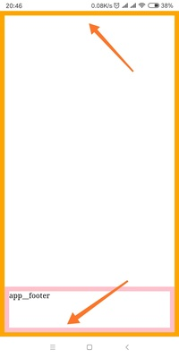

The first time when I know `vh` I was very excited. Finally, we can do this by `css` instead of `js`. However, still too naive.

As we all know, scroll bar would hide automatically on mobile. So, it wouldn't affect the layout like on desktop.

However, the address bar would also hide when scrolling. Like images below:




And the code is:

```html
<!DOCTYPE html>
<html lang="en">
  <head>
    <meta charset="UTF-8" />
    <meta name="viewport" content="width=device-width, initial-scale=1.0" />
    <meta http-equiv="X-UA-Compatible" content="ie=edge" />
    <title>Document</title>
    <style>
      * {
        margin: 0;
        padding: 0;
      }

      html,
      body,
      .app {
        /* height: 100%; */
        height: 100vh;
      }

      .app {
        width: 100%;
        border: 10px solid orange;
        box-sizing: border-box;
        position: relative;
      }

      .app__footer {
        height: 100px;
        width: 100%;
        box-sizing: border-box;
        border: 10px solid pink;
        position: absolute;
        bottom: 0;
      }
    </style>
  </head>

  <body>
    <div id="app" class="app">
      <header class="app__header"></header>
      <main class="app__main"></main>
      <footer class="app__footer">app__footer</footer>
    </div>
  </body>
</html>
```

The viewport size changes when scrolling. In my Mi6X, the smaller is `659px` while the larger one is `715px` when the address bar is hidden.

According to test on chrome 70, `height:100%` and `window.innerHeight` is always equal to the smaller one. I think it is correct. I also thought `100vh` would act like `100%`. However, it's not.

According to [developers.google][url bar resizing] the `vh` is always calculated as if the URL bar is hidden since Chrome version 56.

So, `100vh` is equal to the larger one which is 715px on my phone. That's why images above would happen. In this case, if we use something like `bottom:0;` with `100vh` we would meet situation like image one. Part of `app__footer` was covered. Instead, if we use `height:100%`, it won't happen.

However, as we all know it wouldn't be possible to use 100% when we were in nested css modules. So, in this case, how can we get the 100% in nested css modules?

Of course, we can save the 100% to `rem` like:

```js
document.documentElement.style.fontSize = window.innerHeight * 0.01 + 'px'
```

But I think the better way is using [CSS_variables](https://developer.mozilla.org/en-US/docs/Web/CSS/Using_CSS_variables). For example:

```css
html,
body,
.app {
  /* height: 100%; */
  /* height: 100vh; */
  height: calc(var(--vh) * 100);
}
```

```js
document.documentElement.style.setProperty(
  '--vh',
  window.innerHeight * 0.01 + 'px'
)
```

Also, if you are worried about the compatibility. Here is the [polyfill](https://github.com/jhildenbiddle/css-vars-ponyfill).

[**Original Post**](https://github.com/xianshenglu/blog/issues/38)

## Reference

- [the-trick-to-viewport-units-on-mobile](https://css-tricks.com/the-trick-to-viewport-units-on-mobile/)
- [CSS3 100vh not constant in mobile browser](https://stackoverflow.com/questions/37112218/css3-100vh-not-constant-in-mobile-browser)

[url bar resizing]: https://developers.google.com/web/updates/2016/12/url-bar-resizing
