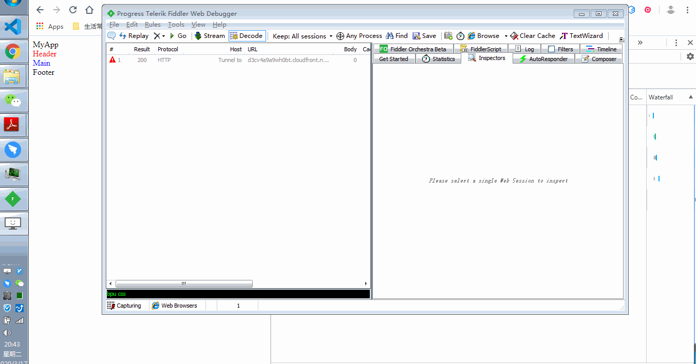

## Preface

For a long time, I was thinking if the _.css_ files would block DOM parsing and rendering. It seems I got different results sometimes. So, I decided to test and summarize the behaviors carefully in browser.

Let's begin.

### Put _.css_ Files in the `<head>`.

Normally, we would put the _.css_ files in the head and put _.js_ files at the bottom of `<body>`. For example,

```html
<!DOCTYPE html>
<html lang="en">
  <head>
    <meta charset="UTF-8" />
    <meta name="viewport" content="width=device-width, initial-scale=1.0" />
    <title>Document</title>
    <link rel="stylesheet" href="./static/header.css" />
    <link rel="stylesheet" href="./static/main.css" />
  </head>
  <body>
    <div>MyApp</div>
    <header>
      Header
    </header>
    <main>
      Main
    </main>
    <footer>Footer</footer>
    <script src="./static/app.js"></script>
  </body>
</html>
```

Say we blocked the _.css_ files request by fiddler. And here are the questions,

- Would _header.css_ block DOM parsing and rendering?
- Would _header.css_ block _main.css_, _app.js_ and other resources fetching?

And here are the results.


- _header.css_ won't block DOM parsing.
- _header.css_, _main.css_ all blocked rendering which means **the page would be always blank until all the _.css_ files request finished.**
- _header.css_ won't block _main.css_, _app.js_ and other resources fetching. Though the codes in the resources won't be executed in before!

In my opinion, the results are desirable and everything worked as expected.

<!-- However, consider a complicated situation like below:
<!-- todo add a complicated situation  -->

<!-- ```html
<!DOCTYPE html>
<html lang="en">
  <head>
    <meta charset="UTF-8" />
    <meta name="viewport" content="width=device-width, initial-scale=1.0" />
    <title>Document</title>
    <link rel="stylesheet" href="./static/header.css" />
    <link rel="stylesheet" href="./static/main.css" />
  </head>
  <body>
    <div>MyApp</div>
    <header>
      Header
    </header>
    <script src="./static/app.js"></script>
    <main>
      Main
    </main>
    <footer>Footer</footer>
  </body>
</html>
``` -->

### Put _.css_ Files in the `

<body>
  `. It is not very common to see this usage. However, in this case, the
  behavior in the browser is a little weird. For example, ```html
  <!DOCTYPE html>
  <html lang="en">
    <head>
      <meta charset="UTF-8" />
      <meta name="viewport" content="width=device-width, initial-scale=1.0" />
      <title>Document</title>
    </head>
    <body>
      <div>MyApp</div>
      <link rel="stylesheet" href="./static/header.css" />
      <header>
        Header
      </header>
      <link rel="stylesheet" href="./static/main.css" />
      <main>
        Main
      </main>
      <footer>Footer</footer>
      <script src="./static/app.js"></script>
    </body>
  </html>
</body>
````

Say I still block all the _.css_ files with fiddler. The results are in the gif below:



As you can see,

- _header.css_ **blocked DOM parsing**, hence blocked render.
- _header.css_ didn't block _app.js_ fetching and _app.js_ is still not executed in advance!
- After _header.css_ was loaded, the DOM parsing keeps working. Then blocked by _main.css_.
- After _main.css_ was loaded, _app.js_ is executed!

Compared with the first example, we can find that _.css_ files in the `<body>` would block DOM parsing.

## End

The above tests are tested in windows7 Chrome 80.0.3987.106.

[**Source**](https://github.com/xianshenglu/blog/issues/103)
