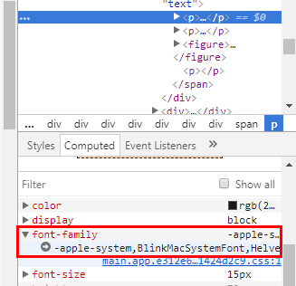
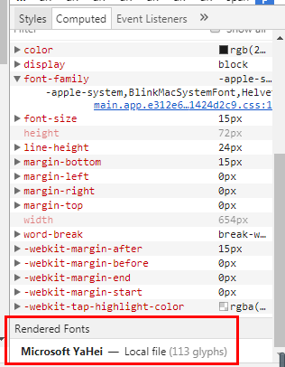

## Preface

When the designer asked me what is the font of some text I told her to press F12 and check the `font-family` in Computed, like this:

## Main

However, when I am using that `font-family` I find that I was totally wrong. The actual font the text used is this:

That is totally different from the `font-family` though I know that we can't be sure that the browser would use the `font-family` we set in css.

## Ending

## Reference

- [how-can-i-determine-what-font-a-browser-is-actually-using-to-render-some-text](https://stackoverflow.com/questions/884177/how-can-i-determine-what-font-a-browser-is-actually-using-to-render-some-text)
