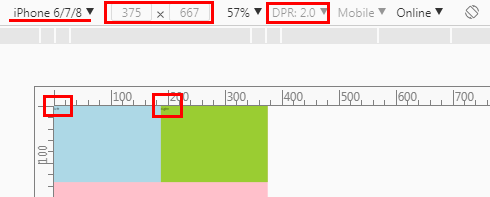
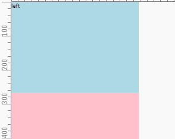
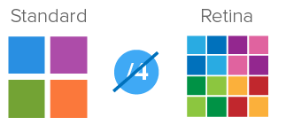

## Preface

Recently, I have been working on mobile development. Before this I have heard something strange but I didn't pay attention to. Now, I have to figure out though there is a lot of stuff. I am trying to make it clear as possible as I can but I am not sure content below is completely right.

## Basic concepts

### Css Pixels, Physical Pixels and DPR

First, let's start with demo:

```html
<div class="cont">
  <div class="left">left</div>
  <div class="right">right</div>
</div>
```

```css
* {
  margin: 0;
  padding: 0;
}

html,
body {
  height: 100%;
  width: 100%;
}

.cont {
  background: pink;
  overflow: auto;
  height: 100%;
  width: 100%;
}

.left {
  float: left;
  width: 50%;
  height: 20%;
  background: lightblue;
}

.right {
  float: right;
  width: 50%;
  height: 20%;
  background: yellowgreen;
}
```

Before switching to device mode, make sure you don't have code starts with `<meta name="viewport" ...` in your `head` tag.

Normally, we will find everything seems ok when we switch to mobile. For example, Let's switch to iPhone6.



According to [chrome-devtools][chrome-devtools], width 375 and height 667 is `css pixels`. And before we keep going , we need to figure out some terms first including `css pixels`, `physical pixels` and `DPR`. Here is some related readings:

- [converting-between-physical-pixels-and-css-pixels][converting-between-physical-pixels-and-css-pixels]

- [what-exactly-is-device-pixel-ratio][what-exactly-is-device-pixel-ratio]

- [mdn-devicePixelRatio][mdn-devicepixelratio]

After reading those stuff, I am still confused. But I can figure something out at least. Well, here is the point based on iPhone6:

- width 375 and height 667 is `css pixels`

- `DPR` is 2

- `DPR` = `physical pixels`/`css pixels`. So `physical pixels` is 750\*1334

### Layout Viewport and Visual Viewport

Ok, let's keep going. If you calculate the dimensions of viewport, you will get some strange values like below:

```js
document.documentElement.clientWidth //980
document.documentElement.clientHeight //1743
```

Maybe you thought that the value should be 375\*667 or 750\*1334. However, it doesn't. The result 980\*1743 is the dimensions of `layout viewport`. Well, before keep going we need to know something about `layout viewport` and `visual viewport`. Here is the related articles:

- [quirksmode-viewports][quirksmode-viewports]

- [quirksmode-viewports2][quirksmode-viewports2]

- [quirksmode-viewports-app][quirksmode-viewports-app]

Based on the articles above we can be sure of something about `layout viewport` and `visual viewport`.

- `layout viewport` is the area that the browser uses to calculate the dimensions of elements with percentual width.

- `visual viewport` is the part of the page that’s currently shown on-screen. The user may scroll to change the part of the page he sees, or zoom to change the size of the `visual viewport`.

- Zoom doesn't change the size of `layout viewport` but `visual viewport`.

- The size of `visual viewport` <= the size of `layout viewport`.

- Both `layout viewport` and `visual viewport` are measured by `css pixels`.

- Many mobile browsers initially show any page in fully zoomed-out mode to show the complete content of the site. Thus `layout viewport` is equal to the `visual viewport` at that moment.

And in this case of iPhone6, here is something we can be sure of:

- `layout viewport` is 980\*1743

- `visual viewport` is also 980\*1743

- The mobile browser show the page in fully zoomed-out mode to show the complete content of the site.

### Meta Tag

Now, we know what happened when we switch to mobile mode. Also, we know why the size of font becomes smaller in visual.

However, we would want the `layout viewport` to be 375\*667 or 750\*1334 if we want to build a adaptive website. Fortunately, we can control the size of `layout viewport` by tag `meta`. For instance,

```html
<meta name="viewport" content="width=375,initial-scale=1,user-scalable=no">
```

You can find the doc of `meta` in [mdn-meta][mdn-meta] and `viewport` in [mdn-viewport_meta_tag][mdn-viewport_meta_tag]. In the code above, we define 375px for the `width` of `layout viewport`. Here, 375px is `css pixels`. Also, you can prove it by:

```js
document.documentElement.clientWidth //375
document.documentElement.clientHeight //667
```

So, any change? Yes. The change is the font-size is bigger in visual than before. Before we change the text is too small to read.

We can keep testing by change the `width` in `meta`. For example, let's try 750:

```html
<meta name="viewport" content="width=750,initial-scale=1,user-scalable=no">
```

Look what we got:



This makes sense. However, if you remove `user-scalable=no` in the `meta` the browser will again enter into the fully zoomed-out mode. In that case, you will find the font-size is smaller and the whole page is showed in the screen which make the effect of `initial-scale=1` disappear.

To be compatible with mobiles with different sizes we need to switch the number to `device-width`:

```html
<meta name="viewport" content="width=device-width,initial-scale=1,user-scalable=no">
```

It is easy to understand, I think. Until now, it seems that we can be compatible with mobiles. Is that true?

## Adaptive Layout

In the case above, we set `width:50%` for the `.left` and `.right` box. So, they could be adaptive. If we use `px` the page will not be adaptive because the size of viewport varies between mobiles. So, we have two choices

1.  Use different size according to the size of viewport
2.  Use percentage always

Option2 will work if our page is simple enough. In most instances, it will bring a disaster because of nested elements. One modification in parent will bring changes to all descendant elements.

The problem of option1 is if we can avoid writing so many media queries codes to adapt to different sizes of viewport. For example:

```css
/* ... other codes for .cont with different sizes */
@media (max-width: 800px) {
  .cont {
    width: 200px;
  }
}

@media (max-width: 400px) {
  .cont {
    width: 100px;
  }
}
/*... other codes for .cont with different sizes */
```

Actually, we can avoid these codes. The key is `rem`. For example, code above can be simplified like:

```css
html {
  font-size: 80px;
}

.cont {
  width: 2.5rem;
}

/* no more codes for .cont with different sizes */
```

When the size of viewport is 400px, we just need to update the `font-size` of `html` with `40px`. That is easy with js. Seems wonderful with `rem`? huh?

You can use `rem` everywhere and js just run one time. Here is the related lib [lib-flexible][lib-flexible].

## Latest Adaptive Layout

Basically, there is no big problem with `rem`. Well, you might realize that we can totally use `vw` instead. That's correct! The compatibility has become better for most developers to use. The same thing happen to `flex` and `grid` layout. Until 2018.6, `flex` is a choice but we still need to wait for `grid` or look for some polyfill.

However, there is still some little problems when using `vw` or `rem` layout.

- We still use `px` for `font-size` and `border`.

I think it is easy to understand because decimals would appear. In that case, we may get `15px` or `17px` instead of `16px`. At the same time, `border` may disappear because of some numbers like `0.9px`.

- Develop with plugins

For instance, if we are developing based on iPhone6 whose width is 375px in css pixel while the designer gives us a PSD whose width is 750px, how we are going to do? Calculate the div with 75px and transform to 10% and write 10vw? So we calculate and write it one by one? That's terrible.

We can just write 75px and other numbers and leave the transform jobs to plugins(e.g. `less`,`postcss`.etc.).

## Problems Caused by DPR

### Blurry or Sharp in Different DPR Device

Until now, we haven't talked about DPR which we mentioned in the beginning. As [mdn-devicepixelratio][mdn-devicepixelratio] says:

> In simpler terms, this tells the browser how many of the screen's actual pixels should be used to draw a single CSS pixel.

On the desktop or before the appearance of Retina display, DPR is always equal to 1. However, things became complicated after that. At present, there is a lot of DPR on the market which varies from 1 to 4. Sometimes, there comes 1.5 or 2.75. Anyway, we will talk about it later.

We can always get DPR by `window.devicePixelRatio`. The problem is that on retina screens or device whose DPR more than 1 images will become blurry. Of course we will try to avoid that. So, we have to figure out what happened to those mobiles with bigger DPR.

According to [towards-retina-web][towards-retina-web],

> A bitmap pixel is the smallest unit of data in a raster image (PNG, JPG, GIF, etc). Each pixel contains information on how it is to be displayed, including its position in the image’s coordinate system and its color.

> Beside its raster resolution, an image on the Web has an abstract size, defined in CSS pixels. The browser squeezes or stretches the image based on its CSS height or width during the rendering process.

> When a raster image is displayed at full size on a standard-density display, 1 bitmap pixel corresponds to 1 device pixel, resulting in a full-fidelity representation. Because a bitmap pixel can’t be further divided, it gets multiplied by four on Retina displays(assuming DPR is 2) to preserve the same physical size of the image, losing detail along the way.

For example, we got iPhone6 whose DPR is 2. And img we have is:

```html

```

Assume that size of example.png is 2\*2 and the picture is like:


With DPR of 2, the browser has to use 2 device pixels to draw a single css pixel. So `img` with 2\*2 css pixels will be drew by 4\*4 device pixel which means example.png with 2\*2 bitmap pixels will be drew by 4\*4 device pixel. So, 4 bitmap pixels of example.png will be drew by 16 device pixels which means 1 bitmap pixel will be drew by 4 device pixels.

Let's move on, normally what we want might be:


However, actual result will be:



The result happens because 1 bitmap pixel can't be further divided into 4 device pixels. That's what @smashingmagazine says:

> A bitmap pixel is the smallest unit of data in a raster image (PNG, JPG, GIF, etc).

> Because a bitmap pixel can’t be further divided, it gets multiplied by four on Retina displays(assuming DPR is 2) to preserve the same physical size of the image, losing detail along the way.

You can also find another example in [mdn-devicepixelratio][mdn-devicepixelratio].

So, how can we fix this? Basically, choices we have are listed as below:

1.  Change the size of `img`, for example:

```html

```

In this case, `img` with 1\*1 css pixel will be drew by 2\*2 device pixels which means example.png with 2\*2 bitmap pixels will be divided by 2\*2 device pixels. Hence, 1 bitmap pixel corresponds to 1 device pixel.

We might not use this alone because the layout would be affected.

2.  Replace example.png with 4\*4 and keep the original `img` with 2\*2 css pixels, same explanation as above.

In this case, we might do this by changing the `src` attribute in the `img`. For example, update the `src` search param `?v=2*2` with `?v=4*4` or change from example.png to example@2x.png. [retinajs][retinajs] will help you do this job.

3.  Use icon-font instead of raster image.

4.  Use svg instead.

Actually, what you need to care about is not only `img` but also `background-image`. So, option1 and option2 will be not convenient without any other help(e.g. retinajs).

Also, with DPR smaller than 2 we need to switch size back. If not, image will become sharp which is the opposite process of blur. For instance:


Compare with the process of blur:


Option3 and option4 would be easier. And with the help of [iconfont][iconfont], things can be easier and easier when you choose svg.

Personally, I would choose option4 in daily work. For more information about the options, click [towards-retina-web][towards-retina-web].

### Problems about Border

Assume that we are using iPhone6 whose DPR is 2, border with 1 css pixel will be drew with 2 device pixels. Does that matter?

Yeah, sometimes that make the border thicker in visual. When we set 1px on border, actually what we might want is to set the thinnest border that device support. Normally, on desktop browser 1px is the thinnest. So in this case, you might need to talk with designer if he wants the thinnest border(e.g. 0.5px) or still 1px.

Anyway, there is lots of ways if we want to set the thinnest border. So, I wrote another blog to talk about that. Please check [border on mobile][border on mobile].

## Ending

I have written too much about the basic knowledge about layout on mobile. However, there are still lots of problems I haven't mentioned. Anyway, I will write them in other blogs.

## Reference

[quirksmode-viewports][quirksmode-viewports]

[quirksmode-viewports2][quirksmode-viewports2]

[quirksmode-viewports-app][quirksmode-viewports-app]

[a_pixel_is_not][a_pixel_is_not]

[mdn-meta][mdn-meta]

[mdn-viewport_meta_tag][mdn-viewport_meta_tag]

[mdn-devicepixelratio][mdn-devicepixelratio]

[specs-mediaqueries-3][specs-mediaqueries-3]

[chrome-devtools][chrome-devtools]

[what-exactly-is-device-pixel-ratio][what-exactly-is-device-pixel-ratio]

[converting-between-physical-pixels-and-css-pixels][converting-between-physical-pixels-and-css-pixels]

[towards-retina-web][towards-retina-web]

[iconfont][iconfont]

[retinajs][retinajs]

[lib-flexible][lib-flexible]

Chinese:

[移动端适配方案(上)][移动端适配方案(上)]

[移动端适配方案(下)][移动端适配方案(下)]

[移动端高清、多屏适配方案][移动端高清、多屏适配方案]

[使用 flexible 实现手淘 h5 页面的终端适配][使用 flexible 实现手淘 h5 页面的终端适配]

[如何在 vue 项目中使用 vw 实现移动端适配][如何在 vue 项目中使用 vw 实现移动端适配]

[再聊移动端页面的适配][再聊移动端页面的适配]

[quirksmode-viewports]: https://www.quirksmode.org/mobile/viewports.html
[quirksmode-viewports2]: https://www.quirksmode.org/mobile/viewports2.html
[quirksmode-viewports-app]: https://quirksmode.org/mobile/viewports/
[a_pixel_is_not]: https://www.quirksmode.org/blog/archives/2010/04/a_pixel_is_not.html
[mdn-meta]: https://developer.mozilla.org/en-US/docs/Web/HTML/Element/meta#Specifications
[mdn-viewport_meta_tag]: https://developer.mozilla.org/en-US/docs/Mozilla/Mobile/Viewport_meta_tag
[specs-mediaqueries-3]: https://drafts.csswg.org/mediaqueries-3/#units
[chrome-devtools]: https://developer.chrome.com/devtools/docs/device-mode
[mdn-devicepixelratio]: https://developer.mozilla.org/en-US/docs/Web/API/Window/devicePixelRatio
[what-exactly-is-device-pixel-ratio]: https://stackoverflow.com/questions/8785643/what-exactly-is-device-pixel-ratio
[converting-between-physical-pixels-and-css-pixels]: https://stackoverflow.com/questions/3588983/converting-between-physical-pixels-and-css-pixels
[towards-retina-web]: https://www.smashingmagazine.com/2012/08/towards-retina-web/
[iconfont]: http://www.iconfont.cn/
[retinajs]: https://github.com/strues/retinajs
[lib-flexible]: https://github.com/amfe/lib-flexible
[移动端适配方案(上)]: https://segmentfault.com/a/1190000004336869
[移动端适配方案(下)]: https://segmentfault.com/a/1190000004358316
[移动端高清、多屏适配方案]: http://www.html-js.com/article/Mobile-terminal-H5-mobile-terminal-HD-multi-screen-adaptation-scheme%203041
[使用 flexible 实现手淘 h5 页面的终端适配]: https://www.w3cplus.com/mobile/lib-flexible-for-html5-layout.html
[如何在 vue 项目中使用 vw 实现移动端适配]: https://www.w3cplus.com/mobile/vw-layout-in-vue.html
[再聊移动端页面的适配]: https://www.w3cplus.com/css/vw-for-layout.html
[border on mobile]: ./layout-on-mobile.md
