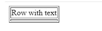

If you have met empty rows in HTML table or have seen this question

[Prevent collapse of empty rows in HTML table via CSS](https://stackoverflow.com/questions/42225196/prevent-collapse-of-empty-rows-in-html-table-via-css/42225797)

you might know what I am saying. See this image:



Above answers can't handle strings like `" "`. In this case, we still need the help of js. Just like the idea of css,

```css
// prevent empty table rows collapse
.cell:empty:after {
  content: "\00a0";
}
```

We can write a function like

```js
function falsyToNbsp(value, falsyValues = [null, undefined, "", NaN]) {
  value = typeof value === "string" ? value.trim() : value;
  return falsyValues.includes(value) ? "\u00a0" : value;
}
```

 <!--//todo unicode in `html`, how does `\u00a0` show? -->

You can use it in vue filters like

```js
import { falsyToNbsp } from "utils";
export default {
  // ...
  filters: {
    falsyToNbsp
  }
  // ...
};
```

or with other libs.

**[Issue](https://github.com/xianshenglu/blog/issues/98)**

**[Source](https://github.com/xianshenglu/blog/blob/master/source/_posts/how-to-prevent-collapse-of-empty-rows-in-html-table.md)**

## Reference
