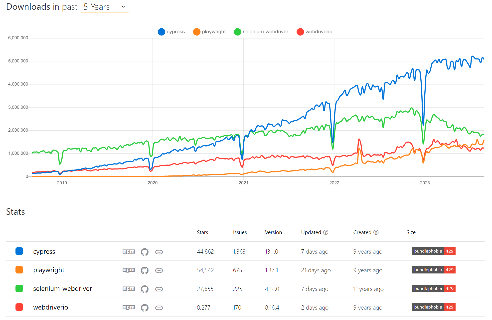
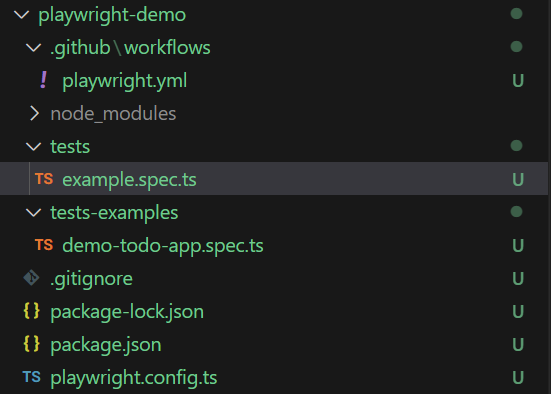
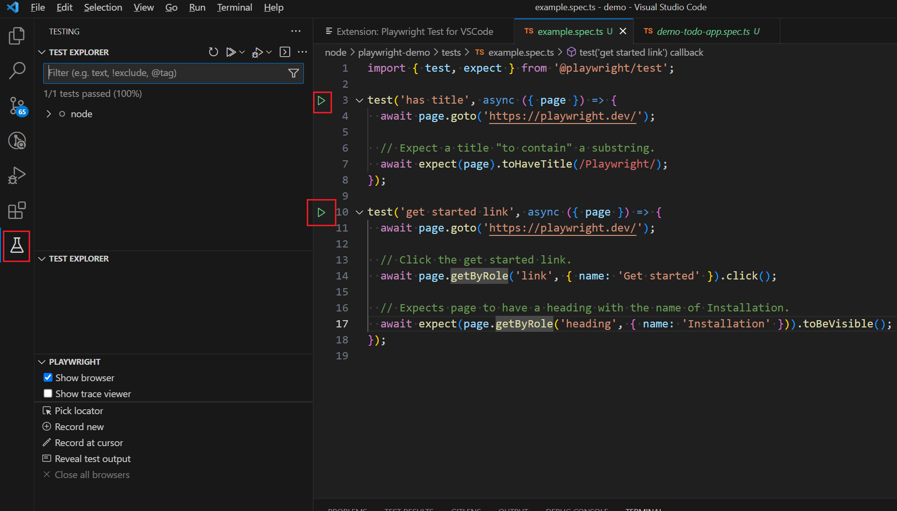
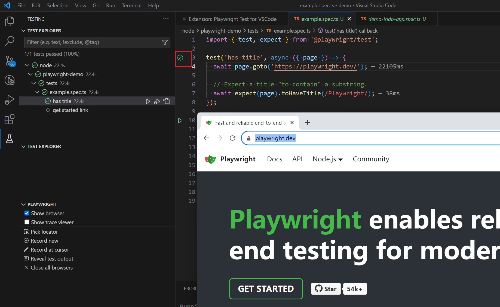
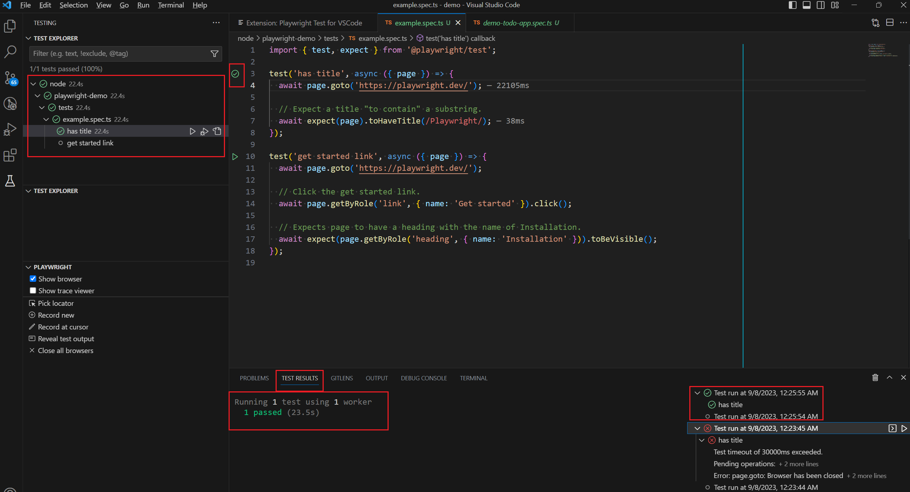
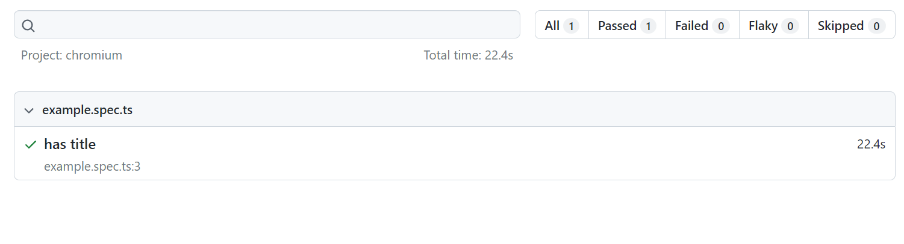
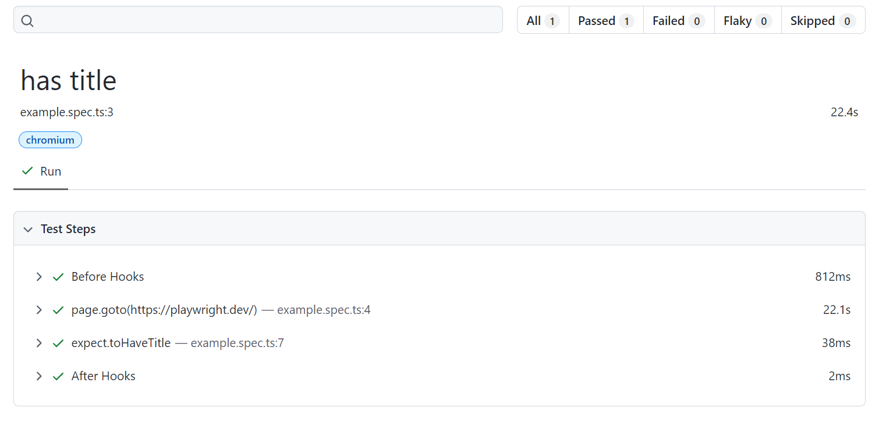
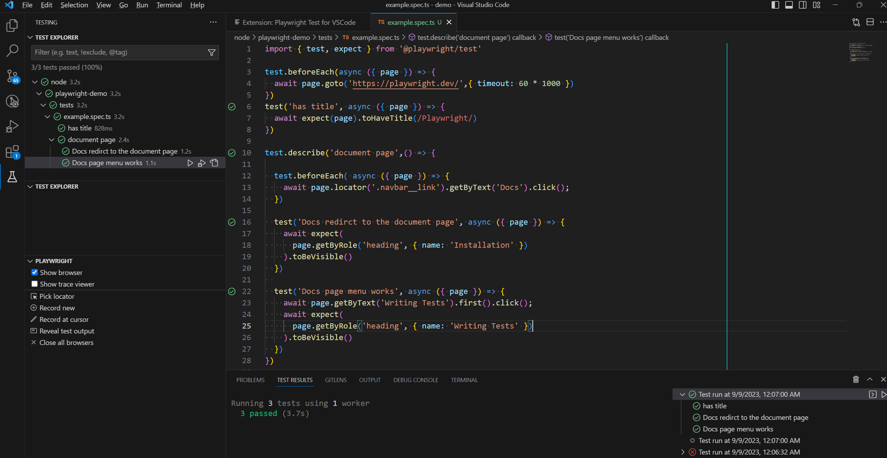

It's very common that developers don't have time to write tests, especially unit tests. 

In real-world apps, unit tests take lots of time so many teams give it up. Since they have given up the foundation of the test suit(unit test), they will also give up other tests. emmm......

Actually, investing time in e2e(end-to-end) tests can be a cost-effective choice, especially for web apps. The least time can help you solve the biggest problem. For example,

- I want to avoid the blank page appearing in my website(Fatal bugs but only need the least time to avoid).
- I want to reduce the high/critical bugs in the testing phase or production environment(Important for the DEV/QA team but only need a little time)
- I want to keep the core functions available in any case(Depends on how many core functions you want to cover)

Now, I'll show the demo.

### Choose an e2e test frameworks

There're many e2e test frameworks. I'll compare them in another article, you can see a short comparison  via this graph. 



_[source](https://npmtrends.com/cypress-vs-playwright-vs-selenium-webdriver-vs-webdriverio)_

Because [playwright]() is very convenient to demo, I'll choose this one in this article. 

### Set up e2e tests

I create the test project using `npm init playwright@latest`. Also, I installed [playwright vscode extension](https://marketplace.visualstudio.com/items?itemName=ms-playwright.playwright). These are the files created by playwrite.



### Run the example tests

Now, I'll run the example test through the start button provided by the vscode extension.



You can see the browsers opened and the test passed.



You can also see the test results in many places.



### A brief conclusion

- As you can see, it's extremely simple to run tests and see the running status(because the browser can be opened during the tests). 

- Also, in the example test, **we only need 3 lines to verify that the target websites is available** and not displaying a blank page to users. If we deploy the tests to the CI QA and end users will have much lower chances of meeting a blank page.

You can also see the generated test reports




### One step further

If [playwright homepage](https://playwright.dev/) is our own product, then we can summarize the core functions or test cases

1. The homepage should be available
2. click the `Docs` should go to the document page
3. The document page should display the correct documents

Actually, there're many remaining functions in the homepage, but the core functions are not too many. Since it's a document website, the core function is that it is available and provides correct content. 

If other functions are broken, it's not that important. Even if found in the production environment, you may not be required to fix it urgently like in 1 hour.

**That's the truth in reality, not everything has the same importance.**

If you do have enough time, of course, you can cover more cases. In that case, I guess you're also required to write unit tests.

Anyway, based on my time budget and assumption, I'll demo how to cover the remaining test cases.

Here's all the code for the above cases, less than 30 lines(including empty lines).



In real-world apps, to make element locating easier, we can add an attribute like `data-testid` in the testing element, then we can use something like 

```ts
await page.getByTestId('nav-docs').click();
```

instead of 

```ts
await page.locator('.navbar__link').getByText('Docs').click();
```

to make writing e2e tests even easier.

The only thing left now is to deploy the e2e test to your CI environment(Jenkins, Github Actions...). You can find the documents [here](https://playwright.dev/docs/ci).

### One more thing

Writing e2e tests can also help you write automation scripts to **solve life problems**, not just good for development works. 

So, are you planning to write some e2e tests for your project now?
