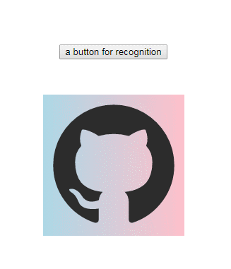

## Preface

In the past, I posted an answer in SO about how to [replace broken images](https://stackoverflow.com/questions/92720/jquery-javascript-to-replace-broken-images/50484874). And the code is

```js
window.addEventListener(
  'error',
  windowErrorCb,
  {
    capture: true
  },
  true
)

function windowErrorCb(event) {
  let target = event.target
  let isImg = target.tagName.toLowerCase() === 'img'
  if (isImg) {
    imgErrorCb()
    return
  }

  function imgErrorCb() {
    let isImgErrorHandled = target.hasAttribute('data-src-error')
    if (!isImgErrorHandled) {
      target.setAttribute('data-src-error', 'handled')
      target.src = 'backup.png'
    } else {
      //anything you want to do
      console.log(target.alt, 'both origin and backup image fail to load!')
    }
  }
}
```

And the point is :

1. Put the code in the head and executed as the first inline script. So, it will listen the errors happen after the script.

2. Use event capturing to catch the errors earlier, also for those events which don't bubble.

3. Use event delegation which avoids binding events on each image.

4. Give the error img element an attribute after giving them a backup.png to avoid error of the _backup.png_ and subsequent infinite loop like below:

> img error->backup.png->error->backup.png->error->,,,,,

I thought the answer is almost perfect. But it turns out there is more scenes I don't know.

#### No Src?

Until Chrome 70.0.3538.102 in win7, code below wouldn't trigger error event.

```html

```

But code below would trigger!

```html
 
```

That does make sense. However, `img` without `src` wouldn't hidden. They would have 1px border like:


In this case, we may have to do something about that. For instance,

```css
img:not([src]) {
  opacity: 0;
}
```

or a default `backgroundImage` which will work on `img` though 1px border is still there.

```css
img:not([src]) {
  background: no-repeat left top / cover;
  background-image: linear-gradient(to right, lightblue, pink); /*or your logo*/
}
```

#### BackgroundImage Error?

I still can't find a perfect solution for `backgroundImage`. The best answer in SO is like:

```css
.app__bg_img_box {
  background: no-repeat left top / cover;
  background-image: url(./images/github.png), linear-gradient(to right, lightblue, pink);
  /* you can also use default.png like code below */
  /* background-image: url(./images/github.png), url(./images/default.png); */
}
```

And the cons is obvious.



1. You have to take care of the transparency problem of the target image.
2. Users can see the toggle between target image and default image.
3. A little flaw is that default image will always be downloaded.

Another way I figured out is like code below. Here is the simplest code:

```js
let backgroundDivs = Array.from(document.querySelectorAll('.app__bg_img_box'))
backgroundDivs.forEach(div => {
  let imgUrl = window
    .getComputedStyle(div)
    .backgroundImage.match(/url\(["']?(.*)["']?\)/)
  if (imgUrl) {
    let img = new Image()
    img.src = imgUrl[1]
    img.onerror = function(event) {
      div.style.backgroundImage = 'url(./images/default.png)'
      img.onerror = null
    }
  }
})
```

It will work well in most simple scenes but the cons is also obvious:

1. Code will be more complicated if you want to deal with multiple backgroundImages.
2. Each time you updated your dom structure, you may have to run the code above if you have add new divs with backgroundImage.

## Ending

If lucky enough, we may have the new API in [Images][image-set-notation] which would make code below work.

```css
background: image('target.gif', 'fallback.gif');
```

## Reference

- [onerror event using background: url()](https://stackoverflow.com/questions/22287474/onerror-event-using-background-url)

- [image-set-notation][image-set-notation]

[image-set-notation]: https://drafts.csswg.org/css-images-4/#image-set-notation
