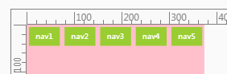
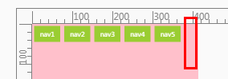
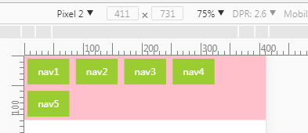

## Preface

Based on [first-exploration-on-mobile][first-exploration-on-mobile] we can develop adaptive pages on mobile. Now, let's do it.

## Main

### Basic Code

Suppose that we got the PSD which is designed according to iPhone6. So, what do we have now?

- width:375\*667
- DPR:2

So, let's develop according to iPhone6 first. And this is the basic code:

```html
<head>
  <meta charset="UTF-8">
  <title>Document</title>
  <meta name="viewport" content="width=375,initial-scale=1,user-scalable=no">
  <style>
    /* reset.css */

    * {
      margin: 0;
      padding: 0;
    }

    html,
    body {
      height: 100%;
      width: 100%;
    }

    li {
      list-style: none;
    }

    a {
      text-decoration: none;
      color: inherit;
    }

    /* base.css */

    .nav,
    .nav__list {
      width: 100%;
      height: 100%;
    }

    .nav__list {
      background-color: pink;
      overflow: hidden;
    }

    .nav__item {
      width: 65px;
      height: 40px;
      line-height: 40px;
      margin: 5px;
      float: left;
      background-color: yellowgreen;
      color: white;
    }

    .nav__link {
      display: block;
      width: 100%;
      height: 100%;
      text-align: center;
    }

  </style>
</head>

<body>
  <nav class="nav">
    <ul class="nav__list">
      <li class="nav__item">
        <a href="#" class="nav__link">nav1</a>
      </li>
      <li class="nav__item">
        <a href="#" class="nav__link">nav2</a>
      </li>
      <li class="nav__item">
        <a href="#" class="nav__link">nav3</a>
      </li>
      <li class="nav__item">
        <a href="#" class="nav__link">nav4</a>
      </li>
      <li class="nav__item">
        <a href="#" class="nav__link">nav5</a>
      </li>
    </ul>
  </nav>
</body>
```

Well, I made a simple one just for test. Hope you don't mind. If we switch to iPhone6 device, it looks okay.



Of course it will be terrible if we switch to other devices. For example, iPhone6 Plus:



We got extra space on the right because the width of iPhone6 Plus is 414px which is wider than 375px in iPhone6.

**Please notice that we have used 65px, 40px and 5px in the css. Those values should be zoomed according to the device-width.**

So, here is the way how we fix this:

### Adaptive by rem and js

We need do some transform to use rem. On iPhone6 with 375px and DPR:2,

1.  We can use 65px, 40px, 5px with:

```html
  <meta name="viewport" content="width=375,initial-scale=1,user-scalable=no">
```

2.  We can also use 130px, 80px, 10px with:

```html
  <meta name="viewport" content="width=750,initial-scale=0.5">
```

3.  Further on, if we calculate rem by (device-width\*DPR)/10:

```html
  <!--width=750=375*DPR,initial-scale=0.5=1/DPR-->
  <meta name="viewport" content="width=750,initial-scale=0.5">
```

```css
html {
  /*75px = device-width * DPR / 10 */
  font-size: 75px;
}
body {
  /*32px = 16px * DPR */
  font-size: 32px;
}
```

Those numbers would be:

- 65px => (65/375) \* device-width => (65/375) \* 10rem
- 40px => (40/375) \* device-width => (40/375) \* 10rem
- 5px => (5/375) \* device-width => (5/375) \* 10rem

In fact, options above will get the same effect. But for option3, **we make everything connected with DPR and device-width.**

So, here is the basic logic to be adaptive:

1.  We use the device-width\*DPR/10 to calculate `rem` and set it on `html`.
2.  We set (initial font-size \* DPR) on `body`.
3.  For `font-size` set with px, we have to set different font-size for different DPR by [@media/-webkit-device-pixel-ratio][@media/-webkit-device-pixel-ratio] or plugins(e.g. less).
4.  We update `meta` by setting the `width` as device-width\*DPR and `initial-scale` as 1/DPR which would make the page render in device-width\*DPR and then scale to device-width.

Well, you can just see the code:

```html
<head>
  <meta charset="UTF-8">
  <title>Document</title>
  <meta name="viewport" content="width=device-width,initial-scale=1">
  <script>
    document.addEventListener(
      'DOMContentLoaded',
      () => {
        let dpr = window.devicePixelRatio
        let html = document.documentElement
        let body = document.body
        let deviceWidth = window.innerWidth || html.clientWidth
        html.style.fontSize = (deviceWidth * dpr) / 10 + 'px'
        html.setAttribute('data-dpr', dpr)
        body.style.fontSize = 'initial'
        body.style.fontSize = parseInt(getComputedStyle(body).fontSize) * dpr + 'px'
        let metaViewport = document.querySelector('meta[name=viewport]')
        metaViewport.setAttribute(
          'content',
          `width=${dpr * deviceWidth},initial-scale=${1 / dpr}`
        )
      },
      { capture: true },
      true
    )
  </script>
  <link rel="stylesheet/less" href="./less.less">
  <script src="http://cdnjs.cloudflare.com/ajax/libs/less.js/3.0.2/less.min.js"></script>
</head>
```

base.css in _less.less_

```less
/* base.css */
.px2px(@name, @px) {
  @{name}: round(@px) * 1px;
  [data-dpr='2'] & {
    @{name}: round(@px*2) * 1px;
  }
  // for mx3
  [data-dpr='2.5'] & {
    @{name}: round(@px * 2.5) * 1px;
  }
  //for Pixel2
  [data-dpr='2.625'] & {
    @{name}: round(@px * 2.625) * 1px;
  }
  // for XiaoMi note
  [data-dpr='2.75'] & {
    @{name}: round(@px * 2.75) * 1px;
  }
  [data-dpr='3'] & {
    @{name}: round(@px * 3) * 1px;
  }
  //for Pixel2 XL
  [data-dpr='3.5'] & {
    @{name}: round(@px * 3.5) * 1px;
  }
  // for Samsung note4
  [data-dpr='4'] & {
    @{name}: @px * 4px;
  }
}

.nav {
  //suggest use em not px otherwise have to set different font-size for different DPR
  .px2px(font-size, 16px);
  overflow: hidden;
  width: 100%;
}

.nav__list {
  // width: 110%;
  width: 100%;
  height: 100%;
  // for inline-block
  // white-space: nowrap;
  overflow: hidden;
  background-color: pink;
  // letter-spacing: -0.3em;
}

.nav__item {
  float: left;
  // display: inline-block;
  // letter-spacing: normal;
  color: white;
  background-color: yellowgreen;

  width: 65/375 * 10rem;
  height: 40/375 * 10rem;

  margin: 5/375 * 10rem;
  line-height: 40/375 * 10rem;
}

.nav__link {
  display: block;

  width: 100%;
  height: 100%;

  text-align: center;
}
```

Code above will work in Apple's product. However, when we switch to Pixel 2 we will find this:



After a little calculation, I find that the total width of 5 `navs` is 1078.85 while width of `.nav__list` is 1078. Well, I think it is reasonable though I hate this.

In this case, we have to do something else to fix this. For example:

- Set `margin-right:auto` on the last nav.
- Set wider `width` of `.nav__list` and set `overflow:hidden` on `.nav`.
- Use `width:20%` and `padding` instead of `margin`.
- Other css tricks.

Anyway, this is the previous solution for adaptation on mobile before appearance of `vw`,`flex` and `grid` layout.

Let's make a conclusion:

- principle

1.  Set different font-size for different DPR by less.
2.  Use viewport scale to solve the problem of 1px on border and font-size.
3.  Make the width and height of element connect with device-width by `rem`.

- pro

1.  Fix 1px problem on `border` because we set 1px on device\*DPR.

- con

1.  We have to set lots of `font-size` based on DPR every time we want to set `font-size` with px. Though we can simplify our job by preprocessor(e.g. less). However, how we going to do with more and more DPR?

```less
.px2px(@name, @px) {
  @{name}: round(@px) * 1px;
  [data-dpr='2'] & {
    @{name}: round(@px*2) * 1px;
  }
  // for mx3
  [data-dpr='2.5'] & {
    @{name}: round(@px * 2.5) * 1px;
  }
  //for Pixel2
  [data-dpr='2.625'] & {
    @{name}: round(@px * 2.625) * 1px;
  }
  // for XiaoMi note
  [data-dpr='2.75'] & {
    @{name}: round(@px * 2.75) * 1px;
  }
  [data-dpr='3'] & {
    @{name}: round(@px * 3) * 1px;
  }
  //for Pixel2 XL
  [data-dpr='3.5'] & {
    @{name}: round(@px * 3.5) * 1px;
  }
  // for Samsung note4
  [data-dpr='4'] & {
    @{name}: @px * 4px;
  }
}
```

Write more and more? That's not a good idea.

**If we use `em` instead it will not be a problem because we already set the initial font-size \* DPR on `body`.**

2.  Decimals appear which may cause a little problem in layout.

### Adaptive by vw

Before we start with `vw` let's take a look at the rem and js solution. So, do we have a **better** solution for:

1.  border 1px problem? I don't think so.
2.  make the width and height of element connect with device-width? Yes, we do have `vw`, `vh` even `vmin` and `vmax`.

And for the con of the rem and js solution:

1.  **In this case, we can use `rem` instead of `em` because `rem` works more like `px` than `em`**
2.  Can we avoid the decimals ? May be not with `vw` but won't be worse than `rem`.

Anyway, here is the code:

```html
<head>
  <meta charset="UTF-8">
  <title>Document</title>
  <meta name="viewport" content="width=device-width,initial-scale=1">
  <script>
    document.addEventListener(
      'DOMContentLoaded',
      () => {
        let dpr = window.devicePixelRatio
        let html = document.documentElement
        let body = document.body
        let deviceWidth = window.innerWidth || html.clientWidth
        html.setAttribute('data-dpr', dpr)
        html.style.fontSize = 'initial'
        html.style.fontSize = parseInt(getComputedStyle(html).fontSize) * dpr + 'px'
        let metaViewport = document.querySelector('meta[name=viewport]')
        metaViewport.setAttribute(
          'content',
          `width=${dpr * deviceWidth},initial-scale=${1 / dpr}`
        )
      },
      { capture: true },
      true
    )
  </script>
  <link rel="stylesheet/less" href="./less.less">
  <script src="http://cdnjs.cloudflare.com/ajax/libs/less.js/3.0.2/less.min.js"></script>
</head>
```

base.css in _less.less_

```less
/* base.css */
.nav {
  font-size: 1rem;
  width: 100%;
}

.nav__list {
  width: 100%;
  height: 100%;
  overflow: hidden;
  background-color: pink;
}

.nav__item {
  float: left;
  color: white;
  background-color: yellowgreen;

  width: 65/375 * 100vw;
  height: 40/375 * 100vw;

  margin: 5/375 * 100vw;
  line-height: 40/375 * 100vw;
}

.nav__link {
  display: block;

  width: 100%;
  height: 100%;

  text-align: center;
}
```

I tested every device in chrome device-mode. They all work.

**However, there are still decimals which might bite you someday.**

Anyway, let's make a conclusion:

- principle

1.  Make the font-size connect with dpr by `rem`.
2.  Use viewport scale to solve the problem of 1px on border and font-size.
3.  Make the width and height of element connect with device-width by `vw`.

- pro

1.  Border 1px problem is solved as before.
2.  Decimals problem will be a litter better than rem and js solution.

- con

1.  Decimals still exist.

### Adaptive by vw and flex

Solution with vw almost perfect except the decimals. So, how we are going to fix that? `Flex` gave us a choice.

**We can leave the decimals to browser by `flex`.**

```less
/*part of css which has been modified*/
.nav__list {
  width: 100%;
  height: 100%;
  overflow: hidden;
  background-color: pink;
  display: flex; /*new added*/
  justify-content: space-around; /*new added*/
}

.nav__item {
  color: white;
  background-color: yellowgreen;
  flex: 0 0 auto; /*new added*/

  width: 65/375 * 100vw;
  height: 40/375 * 100vw;

  line-height: 40/375 * 100vw;
}
```

If you don't know something about flex, please check MDN. Anyway, we can leave decimals to browser. That is the most exciting part.

Well, let's make a conclusion:

- principle

1.  Make the font-size connect with dpr by `rem`.
2.  Use viewport scale to solve the problem of 1px on border and font-size.
3.  Make the width and height of element connect with device-width by `vw`.
4.  Leave margin to browser by `flex`.

- pro

1.  Border 1px problem is solved as before.
2.  Decimals problem will be better than `vw`.

- con

1.  Decimals still exist but only has a little influence.

## Ending

Anyway, the decimals problem always exist because of different sizes of mobiles. But the more new API we have, the less influence it will have.

Besides, js above is not perfect. Here is the [current][current] version I am using.

And the last thing is we didn't handle the problem with `img`. Maybe you should seek some help from [retina.js][retina.js].

## Reference

[first-exploration-on-mobile][first-exploration-on-mobile]

[@media/-webkit-device-pixel-ratio][@media/-webkit-device-pixel-ratio]

[lib-flexible][lib-flexible]

[retina.js][retina.js]

[retina.js]: https://github.com/strues/retinajs
[first-exploration-on-mobile]: ../first-exploration-on-mobile/
[@media/-webkit-device-pixel-ratio]: https://developer.mozilla.org/en-US/docs/Web/CSS/@media/-webkit-device-pixel-ratio
[lib-flexible]: https://github.com/amfe/lib-flexible
[current]: https://github.com/xianshenglu/mobile/blob/master/layout/
