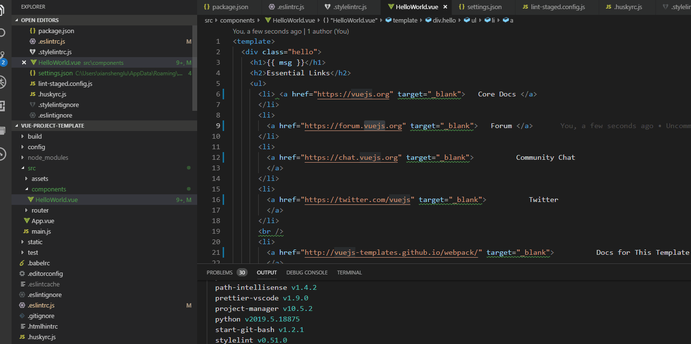
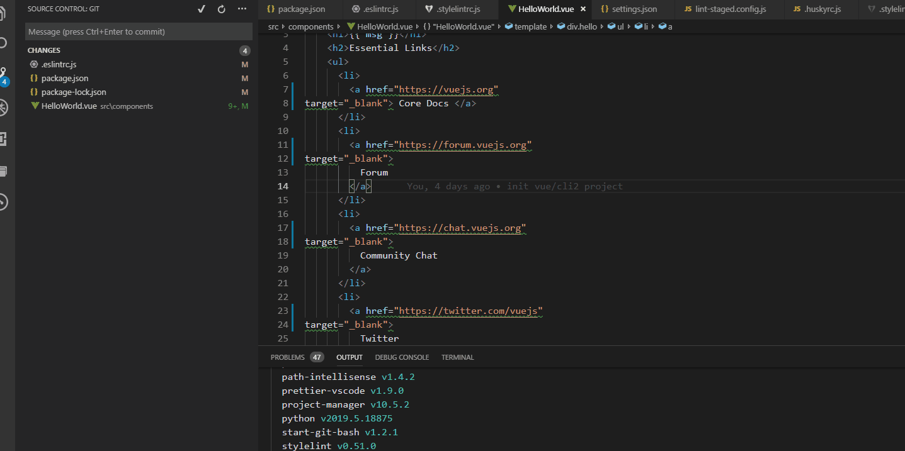
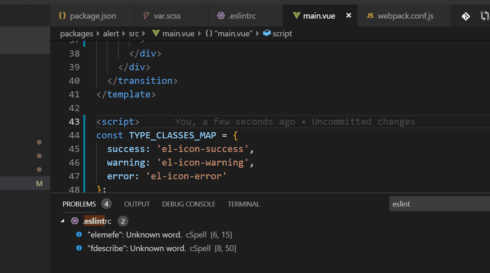
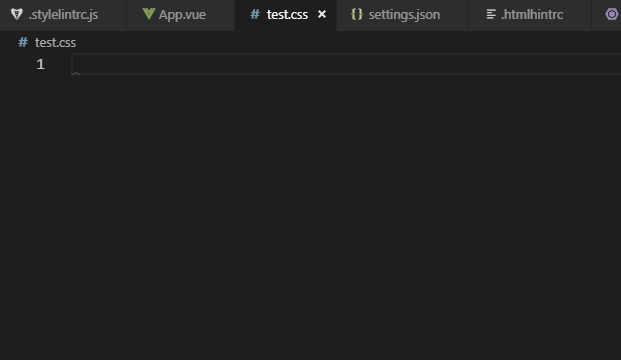
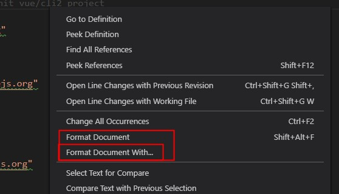
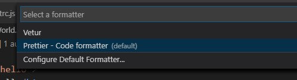

As far as I know, several formatters would run with several rules when I want to format .vue file in the `vscode` editor. I have been confused for a long time about these formatters and their specific rules, also the combined situations. Sometimes it makes me crazy. For example,

- For formatters, there are `ESLint`, `prettier`, `vscode internal formatter` and some other formatters which I don't know.
- For rules, there are `.eslintrc.js`, `.prettierrc.js`, `user settings` and other plugins like `eslint-plugin-html`, `eslint-plugin-vue`, etc.
- In some cases, I am so sure that the code has been processed by at least 2 formatters because I saw the process of the code.
- ...

## What Do You Want?

Before we keep going we have to figure out one question.

> What exactly format do we want ?

After thinking, I figure it out.

> How can I let different developers **commit** with the identical styles?

To be more specific, I want

- [x] Slightly dependent on developers' user settings, use configuration files instead of plugins or rules in developers' editor as possible as we can.
- [x] Syntax-highlighting
- [x] Format and lint .js and `script` in .vue.
- [x] Format and lint .css, .less, .scss and `style` in .vue.
- [x] Format and lint `template` in .vue.
- [ ] Format and lint `.html`.
- [x] Format and lint before commit
- [x] Can be unified on `vscode` at least, better if works on more editors.

## Can We Do This by One Plugin Like Prettier?

Well, I didn't find that plugin. And prettier can't do this job either.

As we all know, currently prettier is the most popular format plugins. And it supports lots of editors and languages. So, it's quite common to think that why don't we just use prettier directly instead of using lots of linters or plugins?

Well, according to doc in [prettier](https://prettier.io/docs/en/comparison.html),

> Linters have two categories of rules:
> **Formatting rules**: eg: max-len, no-mixed-spaces-and-tabs, keyword-spacing, comma-style...
> Prettier alleviates the need for this whole category of rules! Prettier is going to reprint the entire program from scratch in a consistent way, so it's not possible for the programmer to make a mistake there anymore :)
> **Code-quality rules**: eg no-unused-vars, no-extra-bind, no-implicit-globals, prefer-promise-reject-errors...
> **Prettier does nothing to help with those kind of rules.** They are also the most important ones provided by linters as they are likely to catch real bugs with your code!

Therefore, we have to do it one by one.

## Main Work

### Syntax-highlighting

I found two ways:

1. add config below to _settings.json_ which let `vscode` highlight it as html.

```js
"files.associations": { "*.vue": "html" },
```

2. install [Vetur](https://marketplace.visualstudio.com/items?itemName=octref.vetur) plugin.

**I would recommend `Vetur`** because

- [Vue `VSCode` Snippets](https://marketplace.visualstudio.com/items?itemName=sdras.vue-vscode-snippets) and other plugins may depend on it.
- Highlight .vue as html won't get better highlighting effect than `Vetur`.
- Other problems may appear...

<!-- ### Work in A Consistent Way(Specific Rules)

- For .js or `script` in .vue, we have [ESLint rules][https://eslint.org/docs/rules/].
- For .css, .less, .scss and `style` in .vue, we have [stylelint rules][https://stylelint.io/user-guide/rules/] with the help of plugins and [prettier][prettier-linters].
- For html and `template` in .vue, we have [htmlhint rules][https://github.com/htmlhint/htmlhint/wiki/rules] with the help of plugins and prettier.

**So, we can make formatters and linters to work in a consistent way with several linters and plugins.** -->

### Format and Lint .js, `script` and `template` in .vue.

##### Parser

As [ESLint](https://github.com/eslint/eslint#what-about-experimental-features) said,

> ESLint's parser only officially supports the latest final ECMAScript standard.

> In other cases (including if rules need to warn on more or fewer cases due to new syntax, rather than just not crashing), we recommend you use other parsers and/or rule plugins. If you are using Babel, you can use the babel-eslint parser and eslint-plugin-babel to use any option available in Babel.

> Once a language feature has been adopted into the ECMAScript standard (stage 4 according to the TC39 process), we will accept issues and pull requests related to the new feature, subject to our contributing guidelines.

In my case, there is `stage2` in my _.babelrc_ presets.

```json
{
  "presets": [
    [
      "env",
      {
        "modules": false,
        "targets": {
          "browsers": ["> 1%", "last 2 versions", "not ie <= 8"]
        }
      }
    ],
    "stage-2"
  ]
}
```

**So, I have to use `babel-eslint` as parser.**

##### Plugins

Also, I want to lint `script` in .vue, obviously I need plugins. According to the doc in `eslint-plugin-html`,

> Initially, `eslint-plugin-vue` was using `eslint-plugin-html` to lint code inside script tags.
> Since v3, `eslint-plugin-vue` is using its own parser, so it is incompatible with `eslint-plugin-html`.
> You should use `eslint-plugin-vue` exclusively and remove `eslint-plugin-html` from your dependencies if you still have it.

That's why we still can see some _.eslintrc.js_ like below in old projects.

```js
module.export = {
  //...
  // required to lint *.vue files
  plugins: ["html"]
  //...
};
```

Also, as documented in [vue-loader doc](https://vue-loader.vuejs.org/guide/linting.html#eslint),

> The official `eslint-plugin-vue` supports linting both the `template` and `script` parts of Vue single file components.

**So, we can use `eslint-plugin-vue` to lint .js, `script` and `template` in .vue.**

##### Specific Rules

Though there is a lot of rule libs I can choose. For example, `eslint:recommended`, `standard`, `airbnb`, etc. Also, for .vue files, there is `plugin:vue/recommended`, `"plugin:vue/base`, etc. However, You might still need to read and check which lib or rules you can accept or want because it is quite common to find that there is some rules you can't accept in lots of rule libs.

**In the end, our configuration might be something like this:**

```js
module.exports = {
  root: true,
  parserOptions: {
    parser: "babel-eslint", // https://eslint.vuejs.org/user-guide/#usage
    sourceType: "module" // "module" if your code is in ECMAScript modules
  },
  env: {
    browser: true,
    node: true,
    es6: true // enable ES6 global variables
    //...
  },
  extends: [
    // ...other rule libs
    "eslint:recommended",
    "plugin:vue/essential"
    // ...other rule libs
  ],
  // required to lint *.vue files
  plugins: ["vue"],
  rules: {
    // add your custom rules here, including .vue and es rules.
  }
};
```

### Format and Lint .css, .less, .scss and `style` in .vue.

As documented in [vue-loader doc](https://vue-loader.vuejs.org/guide/linting.html#stylelint),

> `stylelint` supports linting style parts of Vue single file components.

### Format and lint `.html`.

There is two cases happen to `.html`.

- One is vue component file like

  ```html
  <!-- component.vue -->
  <template src="./template.html"></template>
  <style src="./style.scss"></style>
  <script src="./index.js"></script>
  ```

  For this one, `eslint-plugin-vue` wouldn't support in the near future and recommend using .vue file. Related [issue1](https://github.com/vuejs/eslint-plugin-vue/issues/490), [issue2](https://github.com/mysticatea/vue-eslint-parser/issues/28).

- Another is _index.html_ or _public/index.html_

  In rare cases, we would need to modify this file. So, we might want to add formatter and linter for this file. Actually,

  - `stylelint` would lint `style` in it automatically.
  - While `htmlhint` would be needed to format and lint `html` in it.
  - The only problem is the `script`. **However, I didn't add `eslint-plugin-html` for this file because**
    - Normally, there shouldn't be inline script in _index.html_
    - Inline script has different linting requirements because it would directly run in the browser and not be transformed by `babel`. So, It has to be written in ES5. If you want to lint the script, you might have to write lots of disable comments in it.

So, in my project I add _.htmlhintrc_ which is like

```json
{
  "tagname-lowercase": true,
  "attr-lowercase": true,
  "attr-value-double-quotes": true,
  "attr-value-not-empty": true,
  "attr-no-duplication": true,
  "doctype-first": true,
  "tag-pair": true,
  "empty-tag-not-self-closed": true,
  "spec-char-escape": true,
  "id-unique": true,
  "src-not-empty": true,
  "title-require": true,
  "alt-require": true,
  "doctype-html5": true,
  "id-class-value": false,
  "style-disabled": false,
  "inline-style-disabled": true,
  "space-tab-mixed-disabled": false,
  "attr-unsafe-chars": true
}
```

However, `prettier` doesn't support `htmlhint` integration, so make sure that you don't add stylistic rules in _.htmlhintrc_. You might not be able to understand previous sentence before finish reading the `Prettier` part. Don't worry, keep reading.

### Prettier

##### Do We Need `Prettier`

Until now, we can use

- `ESLint`, `eslint-plugin-vue` to format and lint .js, `script` and `template` in .vue files.
- `stylelint` to format and lint .css, .less, .scss files and `style` in .vue files.
- `htmlhint` to format and lint .html.

It seems that all formatting and linting job have been done without `Prettier`. So, here comes a question:

> Do we need `Prettier`?

Actually, it's a good question. Someone just ask [here](https://github.com/prettier/prettier-eslint/issues/101),

> If eslint can auto fix/format code why to use `Prettier`?

And the answer is something like:

> `Prettier` can do some formatting thing that eslint can't do and vice versa. So, here comes `prettier-eslint` which combines them.

The same thing also happens on stylelint. Until 0.49.0 version, [vscode-stylelint](https://github.com/shinnn/vscode-stylelint) still doesn't support auto fix in editor but [prettier-vscode](https://github.com/prettier/prettier-vscode) can.

So, we do need `Prettier`, also with plugins to combine `Prettier` with `ESLint` and `stylelint`.

##### Prettier First or Linter First?

Generally, there are four ways to combine them.

|                             | `prettier-eslint`                                                                       | `eslint-config-prettier`                                                               |
| --------------------------- | --------------------------------------------------------------------------------------- | -------------------------------------------------------------------------------------- |
| `prettier-stylelint`        | Code ➡️ prettier ➡️ eslint/stylelint ➡️ Formatted                                       | Code ➡️ eslint➡️ prettier ➡️ Formatted <br> Code ➡️ prettier ➡️ stylelint ➡️ Formatted |
| `stylelint-config-prettier` | Code ➡️ prettier ➡️ eslint ➡️ Formatted <br> Code ➡️ stylelint ➡️ prettier ➡️ Formatted | Code ➡️ eslint/stylelint ➡️ prettier ➡️ Formatted                                      |

I guess most people chose

- `prettier-eslint` and `prettier-stylelint` which is

> Code ➡️ prettier ➡️ eslint/stylelint --fix ➡️ Formatted Code

- or `eslint-config-prettier` and `stylelint-config-prettier` which is

> Code ➡️ eslint/stylelint ➡️ prettier --write ➡️ Formatted Code

Both of them would work when formatting and linting before commit. The only difference is

> Prettier first or linter first?

**Obviously, the latter would decide the code style.**

If you choose `prettier-eslint` and `prettier-stylelint`, the pros are

- you can decide the code style by _.eslintrc.js_ and _.stylelintrc.js_ which provide lots of options.

the cons are about the editor plugins.

- `vscode-stylelint` doesn't support auto fix. You can find the [issue here](https://github.com/shinnn/vscode-stylelint/issues/138).

- `vscode-eslint` **can't fix all at one time** by enable `"eslint.autoFixOnSave": true`. You can find the [issue here](https://github.com/microsoft/vscode-eslint/issues/154). You might encounter situations like:



or even worse like



If you choose `eslint-config-prettier` and `stylelint-config-prettier`, the pros are

- `prettier-vscode` support auto fix and fix all at one time.

the cons are

- You don't have too many choices in code style because `Prettier` only provides a few options for user to choose.

Finally, I choose `eslint-config-prettier` and `stylelint-config-prettier`.

Actually, these two configs just do one thing:

> Turns off all rules that are unnecessary or might conflict with Prettier.

So, when you chose this it means that

> let prettier do the formatting job while let eslint and stylelint do the linting job.

Also, **you shouldn't add stylistic rules in your _.eslintrc.js_ and _.stylelintrc.js_ files as those rules would overwrite `eslint-config-prettier` and `stylelint-config-prettier`**. Even though you chose `prettier-eslint` and `prettier-stylelint`, you should also avoid adding conflicting stylistic rules between _.prettierrc.js_ and _.eslintrc.js_ or _.stylelintrc.js_.

In the end, my _.prettierrc.js_

```js
module.exports = {
  semi: false,
  singleQuote: true
};
```

and _.eslintrc.js_

```js
// https://eslint.org/docs/user-guide/configuring
module.exports = {
  root: true,
  parserOptions: {
    // https://eslint.vuejs.org/user-guide/#usage
    parser: "babel-eslint",
    ecmaVersion: 2019
  },
  env: {
    browser: true,
    node: true,
    es6: true
  },
  extends: [
    // https://github.com/standard/standard/blob/master/docs/RULES-en.md
    "standard",
    // rules for vue, didn't include any js rules lib like standard or airbnb
    // https://github.com/vuejs/eslint-plugin-vue#priority-a-essential-error-prevention.
    "plugin:vue/recommended",
    // turn off ESLint default stylistic rules
    // https://github.com/prettier/eslint-config-prettier/blob/master/index.js
    "prettier",
    // turn off stylistic rules defined in standard
    // https://github.com/prettier/eslint-config-prettier/blob/master/standard.js
    "prettier/standard",
    // turn off stylistic rules defined in plugin:vue/recommended
    // https://github.com/prettier/eslint-config-prettier/blob/master/vue.js
    "prettier/vue"
  ],
  // required to lint index.html and *.vue files
  plugins: ["vue"],
  // add your custom rules here
  rules: {
    //! avoid add stylistic rules
    // non stylistic rules which are not in the standard but I need
    "no-debugger": "error",
    "no-console": "error",
    "no-extra-semi": "error",
    "no-prototype-builtins": "error",
    "require-atomic-updates": "error",
    "array-callback-return": ["error", { allowImplicit: true }],
    "block-scoped-var": "error",
    "guard-for-in": "error",
    "no-alert": "error",
    "no-implicit-coercion": "error",
    "no-extra-label": "error",
    "no-eq-null": "error",
    "no-else-return": "error",
    "no-case-declarations": "error",
    "vars-on-top": "error",
    "require-unicode-regexp": "error",
    "require-await": "error",
    radix: "error",
    "prefer-promise-reject-errors": ["error", { allowEmptyReject: true }],
    "no-void": "error",
    "no-useless-concat": "error",
    "no-useless-catch": "error",
    "no-script-url": "error",
    "no-return-await": "error",
    "no-undef": "error",
    "no-use-before-define": ["error", { functions: false, classes: true }],
    "no-delete-var": "error",
    "no-label-var": "error",
    "no-restricted-globals": [
      "error",
      {
        name: "event",
        message: "Use local parameter instead."
      }
    ],
    // todo not good enough for confusing let foo=()=>{}
    "arrow-body-style": ["error", "as-needed"],
    "arrow-parens": ["error", "as-needed"],
    "no-confusing-arrow": ["error", { allowParens: true }],
    "no-var": "error",
    "prefer-const": "error",
    "prefer-rest-params": "error",
    "prefer-spread": "error",
    "require-yield": "error",
    "symbol-description": "error",
    // eslint-plugin-vue Uncategorized rules
    "vue/v-on-function-call": ["error", "never"],
    "vue/require-direct-export": "error",
    // 'vue/no-empty-pattern': 'error',
    "vue/eqeqeq": "error",
    "vue/comma-dangle": "error",
    // disable if too many violations
    "vue/component-name-in-template-casing": [
      "error",
      "PascalCase" | "kebab-case",
      {
        registeredComponentsOnly: true,
        ignores: []
      }
    ]
  }
};
```

and _.stylelintrc.js_

```js
module.exports = {
  extends: [
    "stylelint-config-recommended",
    // https://github.com/bjankord/stylelint-config-sass-guidelines
    "stylelint-config-sass-guidelines",
    "stylelint-config-prettier"
  ],
  plugins: ["stylelint-color-format", "stylelint-no-indistinguishable-colors"],
  rules: {
    //! avoid add stylistic rules
    "color-named": "never",
    "declaration-no-important": true,
    "selector-max-empty-lines": 0,
    "selector-max-id": 1,
    "selector-max-universal": 0,
    "no-unknown-animations": true,
    "selector-class-pattern": null,
    "declaration-property-value-blacklist": null,
    // todo  reduce to 1 when BEM is determined
    "max-nesting-depth": [
      1,
      {
        ignore: ["pseudo-classes", "blockless-at-rules"],
        ignoreAtRules: ["each", "media", "supports", "include"]
      }
    ],
    "scss/at-import-partial-extension-blacklist": null,
    "scss/at-import-partial-extension-whitelist": ["scss"],
    "scss/dollar-variable-pattern": /--.+/u,
    "scss/partial-no-import": null,
    "scss/double-slash-comment-inline": null,
    "scss/double-slash-comment-empty-line-before": null,
    "scss/selector-nest-combinators": null,
    "scss/dollar-variable-default": null,
    "scss/at-function-pattern": null,
    "scss/at-mixin-pattern": null,
    "scss/at-import-no-partial-leading-underscore": null,
    "plugin/stylelint-no-indistinguishable-colors": true,
    "color-format/format": {
      format: "rgb"
    }
  }
};
```

### Format and Lint Before Commit

After some research, I found that [git hook](https://git-scm.com/book/en/v2/Customizing-Git-Git-Hooks) can help us do this job. We can build it by ourself or use third party tools like `husky`. In my case, I use `husky` to add git hook and use `lint-staged` to run my linters and formatters. So, in my project, I add _.huskyrc.js_,

```js
module.exports = {
  hooks: {
    "pre-commit": "lint-staged"
  }
};
```

and _.lint-staged.config.js_,

```js
module.exports = {
  "*.(js|vue)": ["eslint --fix --cache", "prettier --write", "git add"],
  "*.(vue|htm|html|css|less|sass|scss|styl|stylus|md|js)": [
    "stylelint --fix --cache",
    "prettier --write ",
    "git add"
  ],
  "*.(htm|html)": ["htmlhint", "prettier --write", "git add"]
};
```

It will run `eslint/stylelint/htmlhint` before commit. If error appears, commit would be blocked until errors have been fixed.

So far, we can ensure the code quality in the repository by `eslint`, `eslint-plugin-vue`, `stylelint`, `htmlhint`, `prettier`, `husky` and `lint-staged` **with no requirements for user settings**.

Hope svg below can help you organize thoughts.


### Ways to Avoid Linting Some Lines

Sometimes, we might need to avoid linting some lines. So, I made a disable list.

- [`eslint`](https://eslint.org/docs/user-guide/command-line-interface#--no-inline-config)

  `vscode` also provides convenience like below,

  

- `eslint-plugin-vue`
  Find it via this [issue](https://github.com/vuejs/eslint-plugin-vue/issues/260#issuecomment-425179782).

  > try `<!-- eslint-disable -->` this will disable linting for everything below it, you can use `<!-- eslint-enable -->` to re-enable it back.

- [`stylelint`](https://stylelint.io/CHANGELOG/)

  You can find it in the change log. Also, for convenience you can install a snippet plugin. For example, I use [Stylelint Disable Snippets](https://marketplace.visualstudio.com/items?itemName=hedinne.stylelint-disable-snippets) which works like

  

- `htmlhint`

  **They haven't support it yet**. The latest [issue](https://github.com/htmlhint/HTMLHint/issues/161).

- `git`

  In the situation that we need to commit directly and skip the git hook, we can use command like `git commit --no-verify -m "your commit message"`.

### Let Editor Consistent With Project Configurations

It is quite common that we want to develop with auto-save, auto-formatter and auto-lint with our editor. In this case, we need to depend on editor's plugins. According to above configuration. We need

- `eslint`, `stylelint` and `htmlhint` for lint
- `prettier` for format.
- `Vetur` for the syntax highlighting.

After installing these plugins in your editor, we have to combine them in a proper way. For me, the way is

1. Set `prettier` as default formatter.
2. Disable `vetur` formatter.
3. Disable `vetur` validation for .vue files and internal validation for .css, .less, .scss, `style` in .html, .js.
4. Enable `stylelint`, `eslint` and `htmlhint` validation.
5. Enable internal `script` in .html validation because we didn't add validation for that.

And in the user settings, take `vscode` for example

```json
{
  "files.autoSave": "onFocusChange",
  // call internal formatter for current file on save.
  "editor.formatOnSave": true,
  // set internal formatter as prettier-vscode
  "editor.defaultFormatter": "esbenp.prettier-vscode",
  // default value is ['vue']
  "prettier.disableLanguages": [""],
  // show eslint on status bar
  "eslint.alwaysShowStatus": true,
  // some rules like [spaced-comment](https://github.com/prettier/prettier/issues/5755) enable in standard
  // but not disabled in prettier/standard, so need auto fix by eslint.
  "eslint.autoFixOnSave": true,
  // enable validation in real time
  "eslint.validate": [
    "javascript",
    "javascriptreact",
    {
      "language": "html",
      "autoFix": true
    },
    {
      "language": "vue",
      "autoFix": true
    }
  ],
  // enable validation in real time
  "stylelint.enable": true,
  "htmlhint.enable": true,
  // disable vetur formatter because formatting job would be done by prettier
  "vetur.format.enable": false,
  //disable vetur validation because
  // eslint plugin in editor will validate template and script using configuration file in project.
  "vetur.validation.template": false,
  "vetur.validation.script": false,
  // stylelint plugin in editor will validate using configuration file in project.
  "vetur.validation.style": false,
  "html.validate.styles": false,
  "css.validate": false,
  "less.validate": false,
  "scss.validate": false,
  // we didn't validate script in html, so enable default validation
  "html.validate.scripts": true,
  // disable default validate
  // eslint plugin in editor will validate template and script using configuration file in project.
  "javascript.validate.enable": false,
  // tslint plugin in editor will validate template and script using configuration file in project.
  "typescript.validate.enable": false
}
```

And I made this image for a better understanding.


### How to Handle History Files with Current Formatter and Linter?

Actually, there are many choices. For example,

- We can fix all the stylistic errors at one time and add disable comments around the remaining linting errors. After that, each time we commit, it won't have any effects on the code review.
- Or we can fix all the errors one by one though it will need lots of time.
- Or you can just leave it there until one day you commit that file. In that case, you might need adding comments each time you commit which would have a little effects on our code review.
- ...

For me, I choose the first one. So,

1. I add these scripts in my _package.json_.

```json
{
  // ...
  "scripts": {
    // ...
    "lint:es": "eslint --ext .js,.vue ./ --fix --cache --debug",
    "lint:style": "stylelint \"**/*.{vue,htm,html,css,less,sass,scss,styl,stylus,md,js}\" --fix --cache",
    "lint:html": "htmlhint **/*.{htm,html} --ignore */build/**, */dist/**, */node_modules/**",
    "lint": "exitzero npm run lint:es && exitzero npm run lint:style && exitzero npm run lint:html",
    "format": "prettier --write \"**/*.*\"",
    "lint-format": "npm run lint && npm run format"
    // ...
  }
}
```

and install related packages by

```bash
npm i eslint@latest eslint-plugin-vue@latest eslint-config-prettier@latest eslint-plugin-standard@latest eslint-config-standard@latest eslint-loader@latest eslint-plugin-node@latest eslint-plugin-promise@latest eslint-plugin-json@latest -D

npm i husky@latest lint-staged@latest prettier@latest htmlhint@latest stylelint@latest stylelint-config-prettier@latest stylelint-config-recommended@latest stylelint-config-sass-guidelines@latest stylelint-color-format@latest stylelint-no-indistinguishable-colors@latest exitzero@latest -D
```

2. Run `npm run lint-format`.
3. Check all the formatted and linted files.

   - Add the files which don't need formatting and linting to the _.stylelintignore_, _.prettierignore_ or _.eslintignore_.
   - Fix the simple linting errors like `console`, etc.
   - Add configuration comments to disable the errors which you can't fix. In this case, you might need `eslint-disable-snippets` and `Stylelint Disable Snippets` editor plugin.

4. Commit the modified files by `git commit -m "init format and lint" --no-verify`.

### Remarks

- `prettier` doesn't support `stylus` until v1.18.2.
- `eslint` [would ignore files whose names start from dot](https://github.com/Microsoft/vscode-eslint/issues/550). For example,

  - _.postcssrc.js_
  - _.prettierrc.js_
  - _.stylelintrc.js_
  - ...

  However, `prettier` would format these files. So, if you want to keep consistent with `prettier` we can add these files to _.eslintignore_ like

  ```bash
  !/*.js
  ```

- `vue-cli3.0` has choice for `formatOnSave`. However, I don't recommend because it has multiple cons
  - Project has to run
  - Consume more time on dev
  - Equals compulsory which is not friendly
- Sometimes you need to restart editor after modifying the _.prettierrc.js_ or _.eslintrc.js_, especially when you modified options like `tabWidth` etc.
- If you have enabled multiple formatters in `vscode`, you would see `Format Document with ...` choice when you right click your mouse.

  

  

  The `Format Document` choice is using your default formatter which is defined by `"editor.defaultFormatter"`. For example, `"editor.defaultFormatter": "esbenp.prettier-vscode"` is using `prettier` as default formatter.

- `lint-staged` has problems with committing partially staged files currently. The related issues are [#62](https://github.com/okonet/lint-staged/issues/62), [#75](https://github.com/okonet/lint-staged/pull/75) and [article](https://hackernoon.com/announcing-lint-staged-with-support-for-partially-staged-files-abc24a40d3ff).
- Prettier support vue at [v1.15](https://github.com/prettier/prettier/releases/tag/1.15.0). So to make sure that prettier will work for you, you might need to check if your prettier version is not earlier than `v1.15`.
- This latest vue project format template can be found in my repository [vue-project-template](https://github.com/xianshenglu/vue-project-template).
- Actually, this idea was not only for vue but also for other front end projects. Whatever lib we choose, we are always writing style, html and script. All we need to do is to choose different plugins for our project. In this case, we choose, `eslint-plugin-vue`. In other case, you might need `eslint-plugin-react`, `eslint-plugin-angular`, etc.

## Reference

- ['Fix all auto-fixable problems' doesn't fix as many issues as possible](https://github.com/microsoft/vscode-eslint/issues/154)
- [What's the difference between prettier-eslint, eslint-plugin-prettier and eslint-config-prettier?](https://stackoverflow.com/questions/44690308/whats-the-difference-between-prettier-eslint-eslint-plugin-prettier-and-eslint)
- [Poll Results: Popularity of CSS Preprocessors](https://css-tricks.com/poll-results-popularity-of-css-preprocessors/)
- [A Survey on CSS Preprocessors](http://drops.dagstuhl.de/opus/volltexte/2017/7943/pdf/OASIcs-SLATE-2017-8.pdf)

**[Source](https://github.com/xianshenglu/blog/blob/master/source/_posts/make-your-own-vue-project-template-formatter-part.md)**
