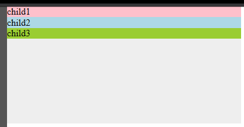
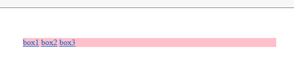
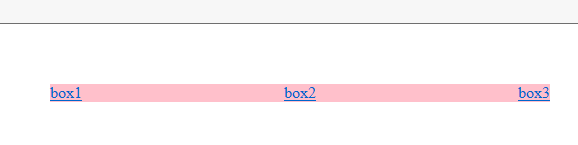

## Preface

I met some bug with MS's flex box.

## Main

- `min-height`
  See code below:

```html
<div class="par">
  <div class="child child1">child1</div>
  <div class="child child2">child2</div>
  <div class="child child3">child3</div>
</div>
```

```css
* {
  margin: 0;
  padding: 0;
}
.par {
  background: #eee;
  width: 400px;
  min-height: 200px;
  display: flex;
  justify-content: center;
  flex-flow: column nowrap;
}
/* _:-ms-lang(x),
.par {
    height: 200px;
} */
.par .child {
  flex: 1 1 auto;
}
.child1 {
  background: pink;
}
.child2 {
  background: lightblue;
}
.child3 {
  background: yellowgreen;
}
```

I think the result is pretty clear. As the image below :


However, what I got in `IE10` and `Edge` is like :



The problem is quite clear. Property `flex` doesn't work in MS when there is only `min-height`. I think it is a bug so I just fix it by hack. And the hack is the comments in the code above.

- IE10 `flex` doesn't work if flex item is inline element

For example:

```css
* {
  margin: 0;
  padding: 0;
}

.box {
  display: flex;
  width: 500px;
  margin: 60px auto 0;
  justify-content: space-between;
  background: pink;
}
```

```html
  <div class="box">
    <a href="" class="box__link">box1</a>
    <a href="" class="box__link">box2</a>
    <a href="" class="box__link">box3</a>
  </div>
```

Code above is quite clear. However, in IE10, you will see:



`justify-content:space-between` doesn't work. If you add

```css
.box__link {
  display: block;
}
```

It will work. See:


