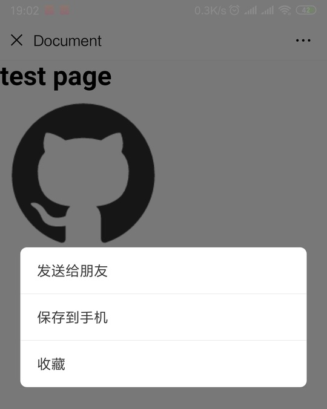

#### Layout

I guess most of you were using `rem`, `vw`, `viewport` etc.

For `rem` or `vw`, we always work with the below tag.

```html
<meta name="viewport" content="width=device-width, initial-scale=1.0" />
```

And then we transformed `px` to `rem` or `vw` by plugins. However, some guys prefer using internal scale logic like below:

```html
<!-- if the device-width is 375 -->
<meta name="viewport" content="width=750, initial-scale=0.5" />
```

It will also work by changing the `width` and `initial-scale` at the same time.

However, in most cases, we can see the `meta[name="viewport"]` with more complicated content. For example,

```html
<meta
  name="viewport"
  content="width=device-width, initial-scale=1.0, minimum-scale=1, maximum-scale=1, user-scalable=no"
/>
```

What if we remove the `minimum-scale`, `minimum-scale` and `user-scalable`? The result is:

- If an `input` was focused on safari, the web page would zoom in. Here is the proof.

  

- You will get the scale buttons like below when you touch the page in WeChat 7.0.0, at least in Android.

  

And the solution is to add `user-scalable=no` or `minimum-scale=1, minimum-scale=1`. But you have to accept a shortcoming:

- **User can't zoom the page using two fingers, at least in my Android WeChat and Chrome 71.** Though in some browsers user can still zoom like UC, QQ etc.

For better compatibility, we may have to use both `user-scalable=no` and `minimum-scale=1, minimum-scale=1`. That's why we always see the code below.

```html
<meta
  name="viewport"
  content="width=device-width, initial-scale=1.0, minimum-scale=1, maximum-scale=1, user-scalable=no"
/>
```

#### Screen With High Resolution

Normally, we would use `png@2x`, `png@3x` etc to solve the vague problem of images brought by high resolution screen. For example,

```css
@media (-webkit-min-device-pixel-ratio: 2), (min-resolution: 192dpi) {
  .example {
    background: url('/images/my_image@2x.png') center center no-repeat;
    background-size: cover;
  }
}
@media (-webkit-min-device-pixel-ratio: 3), (min-resolution: 288dpi) {
  .example {
    background: url('/images/my_image@3x.png') center center no-repeat;
    background-size: cover;
  }
}
```

A convenient way to do this is by [retinajs](https://github.com/strues/retinajs). And for icons, I would suggest you use `svg` if possible.

#### `vh` Is Always Calculated as If the Url Bar Is Hidden.

In brief, `100vh` doesn't equal `window.innerHeight`. For more, check [issues/38](https://github.com/xianshenglu/blog/issues/38).

#### Consider the Pop-Up Keyboard

If there is an input or another form element, the keyboard would pop up when the element was focused. For example,


Is this a bug? Maybe... At least, you have to notice that before deploying. And the best way I think is to consult PM or designer if it's okay.

In that case, the keyboard would make `vh` smaller which may ruin the layout using `vh`.

#### Link Highlight While It's Being Tapped

In my Android Chrome 71, the highlight would show when I touch the link.


We can disable it by the code below.

```css
a {
  -webkit-tap-highlight-color: rgba(0, 0, 0, 0);
  -webkit-tap-highlight-color: transparent; /* For some Androids */
}
```

**I would suggest you disable it because different manufacturers may show different colors**.

#### `img` Without src Would Have 1px White `border` on Mobile Chrome 70.

You may need to add the code below to your _reset.css_ to hide the `img` without `src`.

```css
img:not([src]) {
  opacity: 0;
}
```

#### Qrcode in WeChat

- Use `img` Instead of `background-image`. Otherwise, it won't work.
- Don't put two qrcodes in one screen. Otherwise, it would only recognize one.

#### Format-detection

It is said that iOS safari has a default style for telephone numbers, email, etc. As I tested in iPhoneX 11.3, at least for telephone numbers, it does have a default style like below.


If we want to disable the default style we can use the code below to avoid that.

```html
<meta
  name="format-detection"
  content="telephone=no, email=no, date=no, address=no, url=no"
/>
```

If you want to call telephone, send message etc when the element is clicked you can do it by

```html
<a href="tel:020-11811922">Call me: 020-11811922</a>
<a href="sms:10086">Send me a message: 10086</a>
```

#### Disable Select

You may want to avoid the situation like below when the user is touching the **text of the element**.

 

You can use the code below to avoid that.

```css
.example {
  -webkit-user-select: none;
  -moz-user-select: none;
  -ms-user-select: none;
  user-select: none;
}
```

The user may still hear the tone or feel the vibration, at least in my WeChat 7.0.0. **However, the user can still trigger selection on UC, QQ browser with an extra operation.**

#### Avoid Popup Menu in Long Touch ?（Not Compatible）

You may also want to disable popup like below when the user is touching **an image or other stuff**

 

In this case, `user-select:none` is not enough to cover this. You may have to add js code like below.

```js
window.addEventListener('contextmenu', event => event.preventDefault())
```

Our User may still hear the tone or feel the vibration, at least in my Android Chrome 71. **However, in WeChat, QQ and UC browser, it doesn't work.**

and CSS to disable callout in iOS.

```css
.target {
  -webkit-touch-callout: none;
}
```

#### Use `touchstart` to Imitate `hover`

As we all know, there is no `hover` on mobile. If you really want that, you can use `touchstart` to imitate it.

#### No Need to Worry About the Scroll Bar

On mobile, the scroll bar would hide automatically when you stop scrolling.

[**Source**](https://github.com/xianshenglu/blog/issues/69)

## Reference

- [user-scalable](https://www.w3.org/TR/css-device-adapt-1/#user-scalable)
