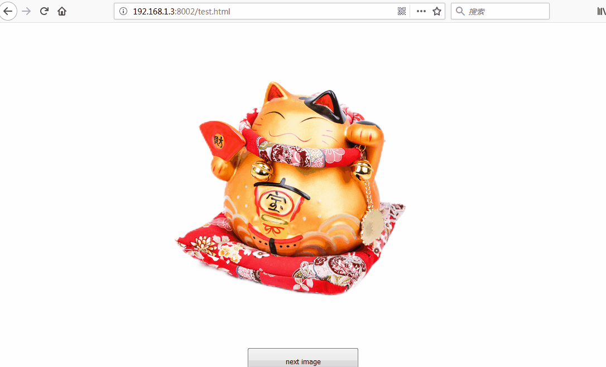

See the demo:

```html
<div id="app" class="app">
  
  <button class="app__button" id="app__button">next image</button>
</div>
<script>
  let app__button = document.getElementById('app__button')
  let app__image = document.getElementById('app__image')
  app__button.addEventListener('click', function(event) {
    app__image.style.visibility = 'hidden'
    app__image.src = './images/hd4.png'
    app__image.onload = function() {
      app__image.style.visibility = 'visible'
    }
  })
</script>
```

The code is easy. But the images are special.

- Type is png.
- Size is more than 10M.
- Alpha channel has been modified.
- Both happen on my win7 and Mac 10.13.

In this case, when we click the button above, the result in Firefox and Safari would be:



If you look at it carefully, you would see the remnant shadows of previous image. That is unexpected because I change the `src` in the `onload` callback. Also, the same thing would happen in Chrome, though the frequency is much lower. So, how do we solve this?

#### Solution

```js
let app__button = document.getElementById('app__button')
let app__image = document.getElementById('app__image')
app__button.addEventListener('click', function(event) {
  app__image.src = '../images/transparent.png'
  let tempImage = new Image()
  tempImage.src = '../images/hd4.png'
  tempImage.onload = function(event) {
    // setTimeout(() => {
    // if you are still worried, you can use setTimeout or requestAnimationFrame to delay
    app__image.src = event.target.src
    // }, 20)
  }
})
```

See? We change the previous image with a transparent image. A little hack, but it works.

Obviously, there is a little interval between images onload and browsers' ready to render the latest image, especially in Firefox and Safari. When the browsers' performance becomes better this problem may not happen again. Anyway, hope we lucky.

[**Original Post**](https://github.com/xianshenglu/blog/issues/22)
