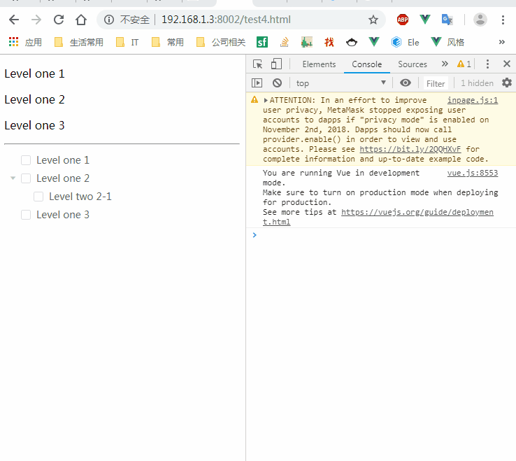

I have to mention this before we go on. As the [doc-Forcing-an-Update](https://vuejs.org/v2/guide/components-edge-cases.html#Forcing-an-Update) says:

> If you find yourself needing to force an update in Vue, in **99.99%** of cases, you’ve made a mistake somewhere.

When I come back to write a blog, I find it's totally true. Well, let's begin. Here is the demo code based on _element-ui@2.4.11_ and _vue@2.5.17_:

```html
<div id="app">
  <p v-for="item in items" :key="item.id">{{ item.label }}</p>
  <hr />
  <el-tree
    :data="items"
    show-checkbox
    node-key="id"
    :default-expanded-keys="[2, 3]"
    v-if="isElTreeShow"
    :key="elTreeVersion"
  >
  </el-tree>
</div>
<script>
  window.app = new Vue({
    el: '#app',
    data: {
      isElTreeShow: true,
      elTreeVersion: 100,
      items: [
        {
          id: 1,
          label: 'Level one 1'
        },
        {
          id: 2,
          label: 'Level one 2',
          children: [
            {
              id: 21,
              label: 'Level two 2-1'
            }
          ]
        },
        {
          id: 3,
          label: 'Level one 3'
        }
      ],
      compare(a, b) {
        return a.id - b.id
      },
      compareReverse(a, b) {
        return -this.compare(a, b)
      }
    }
  })
</script>
```

## Auto Update with Vue's Reactivity System

Go check the doc.

## \$forceUpdate

For example, if someone made a mistake and wrote the code like

```js
let length = app.items.length
app.items[length] = { id: length + 1, label: `Level one ${length + 1}` }
```

You will not see the data update because you just add an nonreactive attribute. In this case, you might need `app.$forceUpdate()`. However, better idea is using code like:

```js
let length = app.items.length
app.items.push({ id: length + 1, label: `Level one ${length + 1}` })
```

or

```js
let length = app.items.length
this.$set(app.items, length, {
  id: length + 1,
  label: `Level one ${length + 1}`
})
```

## Reassign

However, it's common to use third party components. In this case, it may not be easy to modify the component if we find something not good. For example, if we sort the data using:

```js
app.items.reverse()
```

Here is the result:



The part above the `hr` works as expected while the `el-tree` doesn't change even you use `$forceUpdate`. So, in this case, what can we do?

We can make it update by reassigning like:

```js
app.items = app.items.slice()
```

Until now, every thing about force update has been solved. I haven't met problems which can't be solved by ways above. However, there is some way stronger I have to mention.

## v-if/key

In some cases, we do need to destroy and rebuild the component. But I didn't find any API about `rebuild` except [this issue](https://github.com/vuejs/Discussion/issues/356). Some guys said we can rebuild using `v-if="isElTreeShow"`:

```js
app.isElTreeShow = !app.isElTreeShow
app.$nextTick(() => {
  app.isElTreeShow = !app.isElTreeShow
})
```

or a better idea use `:key="elTreeVersion"`

```js
app.elTreeVersion++
```

See? That's pretty cool.

[**Original Post**](https://github.com/xianshenglu/blog/issues/47)
