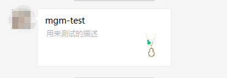
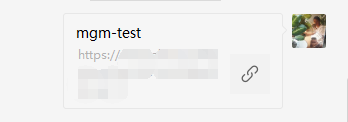

## Preface

产品希望我们在微信分享出去的链接，有自己的样式，而不是仅仅一个链接。用产品的话来说，你发给客户一个链接，客户敢点么？？？

听着比较有意思，不过也不能说完全没有道理，毕竟各种各样的诈骗大家也是有所耳闻，经确认，产品想要：



而我们当前分享是：



## Main

总监给我提示说，微信有 js-sdk ，可以在 js 里设置这个样式。

于是，我找到了[微信 JS-SDK 说明文档][微信js-sdk说明文档]，基本上就是根据文档走些配置，这个要和产品那边要些账号密码，改些东西之类，根据文档来，没什么好说的。

大体流程如下：

1. 步骤一：绑定域名
2. 步骤二：引入 JS 文件
3. 步骤三：通过 config 接口注入权限验证配置

```js
wx.config({}) //传入一些初始化参数
```

4. 步骤四：通过 ready 接口处理成功验证

```js
wx.ready(function() {}) //传入成功回调
```

5. 步骤五：通过 error 接口处理失败验证

```js
wx.error(function() {}) //传入失败回调
```

实际操作的时候，遇到了几点麻烦，这里需要提一下：

#### 测试的时候，注意开启 debug 模式，方便定位问题。

```js
wx.config({ debug: true /*其他参数*/ })
```

#### 出于安全考虑，开发者必须在服务器端实现签名的逻辑。

这个是文档说的，反正就是给后台处理了，最终前端初始化需要的几个字段，除了 `debug` 和 `jsApiList` ，都是从后台拿的。

```js
wx.config({
    debug: true, // 开启调试模式,调用的所有api的返回值会在客户端alert出来，若要查看传入的参数，可以在pc端打开，参数信息会通过log打出，仅在pc端时才会打印。
    appId: '', // 必填，公众号的唯一标识
    timestamp: , // 必填，生成签名的时间戳
    nonceStr: '', // 必填，生成签名的随机串
    signature: '',// 必填，签名
    jsApiList: [] // 必填，需要使用的JS接口列表
});
```

后台在实现的时候，可能需要注意文档提示的两点：

1. access_token（有效期 7200 秒，开发者必须在自己的服务全局缓存 access_token）

2. jsapi_ticket（有效期 7200 秒，开发者必须在自己的服务全局缓存 jsapi_ticket）

因为这会导致一开始生成的签名没错，但是两个小时后就失效了。

#### 代码逻辑

通常的逻辑都是前端从后台拿到上面的几个字段，在前端完成初始化，然后添加初始化成功和失败的回调。

示例：

```js
var link = location.href
$.ajax({
  url: 'your_url', //后台给你提供的接口
  type: 'GET',
  data: { url: link },
  async: true,
  dataType: 'json',
  success: function(data) {
    wx.config({
      debug: false, // 开启调试模式,调用的所有api的返回值会在客户端alert出来
      appId: data.configMap.appId, // 必填，公众号的唯一标识
      timestamp: data.configMap.timestamp, // 必填，生成签名的时间戳
      nonceStr: data.configMap.nonceStr, // 必填，生成签名的随机串
      signature: data.configMap.signature, // 必填，签名，见附录1
      jsApiList: ['onMenuShareTimeline', 'onMenuShareAppMessage'] // 必填，需要使用的JS接口列表，所有JS接口列表见附录2
    })
    wx.ready(function(res) {
      wx.onMenuShareAppMessage({
        title: document.title,
        desc: document.title,
        link: link,
        imgUrl: Imgurl,
        trigger: function(res) {},
        success: function(res) {},
        cancel: function(res) {},
        fail: function(res) {}
      })
      wx.onMenuShareTimeline({
        title: document.title,
        link: link,
        imgUrl: Imgurl,
        trigger: function(res) {},
        success: function(res) {},
        cancel: function(res) {},
        fail: function(res) {}
      })
    })
    wx.error(function(res) {
      alert(res)
    })
  },
  error: function(error) {
    alert(error)
  }
})
```

我司稍微特殊些，直接把初始化的代码放在前面需要引入微信的 js 文件后面了，所以我直接引入这个文件就完成了初始化操作。不过，我还是需要在引入后监听初始化成功和失败的回调。

我司代码：

```html
<script src="./js/shareInWeChat.js?debug=1"></script>
<!-- 里面包含了 wx.config({}) 的代码-->
<!-- 通过 debug 参数来切换调试模式  -->
```

```js
setWeChatShareStyle(product, imgUrl)
function setWeChatShareStyle(product, imgUrl) {
  var success = function(res) {}
  var fail = function(res) {}
  var desc =
    product.description && product.description !== ''
      ? product.description
      : '后备描述'
  wx.ready(function() {
    var eventConf = {
      title: product.name,
      desc: desc,
      imgUrl: imgUrl,
      link: window.location.href,
      success: success
    }
    if (pubMethods.isAndroid()) {
      // 安卓适用于老接口，新接口不行
      wx.onMenuShareAppMessage(eventConf)
      wx.onMenuShareTimeline(eventConf)
      wx.onMenuShareQQ(eventConf)
      wx.onMenuShareQZone(eventConf)
    }
    if (pubMethods.isIOS()) {
      // iOS 适用于新接口，老接口不行
      wx.updateAppMessageShareData(eventConf, success)
      wx.updateTimelineShareData(eventConf, success)
    }
  })
  wx.error(fail)
}
```

最初我担心，这样可能会监听不到 `wx.config` 初始化的结果，结果发现还是可以监听到的，说明 `wx.config` 里面的操作是个异步操作。

#### 代码兼容性

- 统一传参

如上面代码所示，虽然根据微信的文档，对于不同的接口，传的参数稍有区别，但是我为了方便，都放在 `eventConf` 里面了，事实证明也是可以的（不可以我就要吐槽了，毕竟传入的是对象）。

- 接口更新的 bug

虽然微信文档上有接口更新的说明：

_请注意，原有的 wx.onMenuShareTimeline、wx.onMenuShareAppMessage、wx.onMenuShareQQ、wx.onMenuShareQZone 接口，即将废弃。请尽快迁移使用客户端 6.7.2 及 JSSDK 1.4.0 以上版本支持的 wx.updateAppMessageShareData、updateTimelineShareData 接口。_

但我实际上测试的结果是，安卓不支持新接口，iOS 支持，但是我如果把新老接口全用上，有一端会失败，所以最终才有上面那个机型判断的结果，对于不同的机型采用了不同的接口。

```js
if (pubMethods.isAndroid()) {
  // 安卓适用于老接口，新接口不行
  wx.onMenuShareAppMessage(eventConf)
  wx.onMenuShareTimeline(eventConf)
  wx.onMenuShareQQ(eventConf)
  wx.onMenuShareQZone(eventConf)
}
if (pubMethods.isIOS()) {
  // iOS 适用于新接口，老接口不行
  wx.updateAppMessageShareData(eventConf, success)
  wx.updateTimelineShareData(eventConf, success)
}
```

- 分享的图片不能是 base64

由于我司需要对图片进行处理再去分享，所以当我用 `canvas` 导出 `base64` 作为 `imgUrl` 的时候，我发现是没有效果的。

## Ending

## Reference

- [微信分享自定义样式](https://segmentfault.com/a/1190000013491531)

- [微信分享图标设置，以及 wx.config 配置](https://www.cnblogs.com/lxlin/p/6829893.html#undefined)

[微信js-sdk说明文档]: https://mp.weixin.qq.com/wiki?t=resource/res_main&id=mp1421141115
