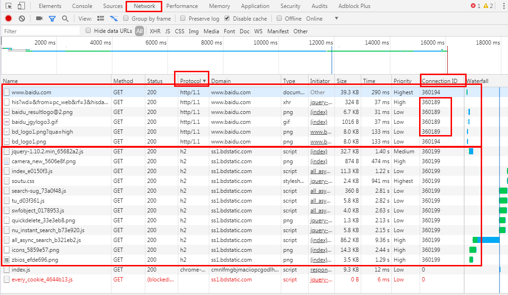
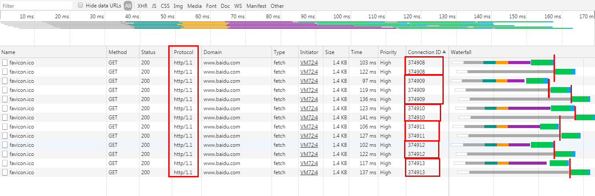
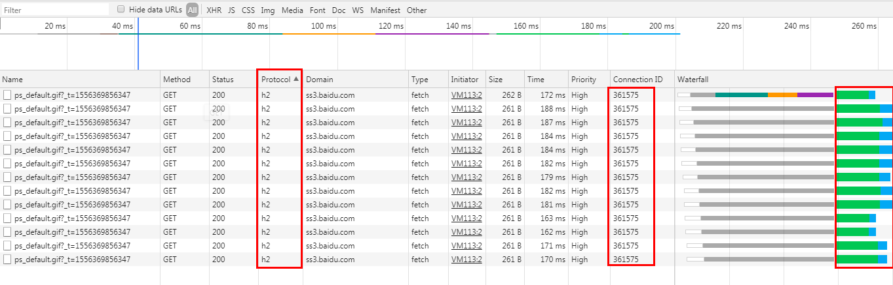

I saw the introduction of http/2.0 in [developers.google.com](https://developers.google.com/web/fundamentals/performance/http2/#request_and_response_multiplexing). However, I feel confused about the request and response multiplexing. So I decided to make a demo or an example for better understanding.

## TCP Connection Reuse

When I saw the TCP connection reuse, I had a lot of questions in my head. For instances,

- how do I know if the TCP was reused?
- What would the network be if the TCP wasn't reused?
- It seems that HTTP 1.1 also supports TCP connection reuse. So, what's the difference?
- ....

After searching, I found that there is a **Connection ID** column in the chrome dev tool **Network** panel. For example, here is the network image of **baidu.com** :



According to this [question](https://stackoverflow.com/questions/34184994/chrome-developer-tools-connection-id/43520092#43520092)

> The new Connection ID Network Panel column in Canary can help indicate to you that a TCP connection was reused instead of handshaking and establishing a new one.

Combined with the above image, we can say that in the network panel of **baidu.com**

- Requests to **ss1.bdstatic.com** are based on H2 (http/2.0.) and share the same TCP connection because there is only one connection ID.
- Requests to **www.baidu.com** are based on http/1.1 and 6 requests share two TCP connections because there are two connection IDs.

It seems http/1.1 also support TCP connection Reuse. So, how can I prove the advantages of H2 or what's the difference between the connection reuse of http/1.1 and 2.0? That confused me in the past.

## Prove The Advantages of H2

I pick two requests from the network record and then fetch it at the console. The code of requests to http/1.1 is:

```js
Array(13)
  .fill()
  .forEach(() => {
    fetch('https://www.baidu.com/favicon.ico', {
      credentials: 'omit',
      referrer: 'https://www.baidu.com/',
      referrerPolicy: 'unsafe-url',
      body: null,
      method: 'GET',
      mode: 'cors'
    })
  })
```

And the code of requests to http/2.0 is:

```js
Array(13)
  .fill()
  .forEach(() => {
    fetch(
      'https://ss3.baidu.com/6ONWsjip0QIZ8tyhnq/ps_default.gif?_t=1556369856347',
      {
        credentials: 'omit',
        referrer: 'https://www.baidu.com/',
        referrerPolicy: 'unsafe-url',
        body: null,
        method: 'GET',
        mode: 'cors'
      }
    )
  })
```

Here are the results:





Take a closer look at the pictures, we can find that

- On http/1.1 connections, chrome would open up to 6 TCP connections per host and reuse the connections. While on http/2.0 connections, chrome would open **only one** TCP connection per host on http/2.0 connections.
- Also, on http/1.1 connections chrome would send the requests **one by one** when the requests are using the same TCP connection. Just as the [developers.google.com](https://developers.google.com/web/tools/chrome-devtools/network/understanding-resource-timing) said:

> On HTTP 1.0/1.1 connections, Chrome enforces a maximum of six TCP connections per host. If you are requesting twelve items at once, the first six will begin and the last half will be queued. Once one of the original half is finished, the first item in the queue will begin its request process.

This would bring more delay when sending more requests.

- While on http/2 connections, chrome would send all the requests to the same origin simultaneously without delay.

## Differences of TCP Connection Reuse between HTTP/1.1 and 2.0

On http/1.1 connections, chrome would reuse TCP connection by default and you can find

```
Connection: keep-alive
```

in the response headers. But according to [docs in mdn](https://developer.mozilla.org/en-US/docs/Web/HTTP/Connection_management_in_HTTP_1.x)

> This connection will not stay open forever: idle connections are closed after some time (a server may use the Keep-Alive header to specify a minimum time the connection should be kept open).

And for http/2.0, according to [developers.google.com](https://developers.google.com/web/fundamentals/performance/http2/#one_connection_per_origin)

> all HTTP/2 connections are persistent, and only one connection per origin is required, which offers numerous performance benefits.

[**Source**](https://github.com/xianshenglu/blog/issues/85)

## Reference
