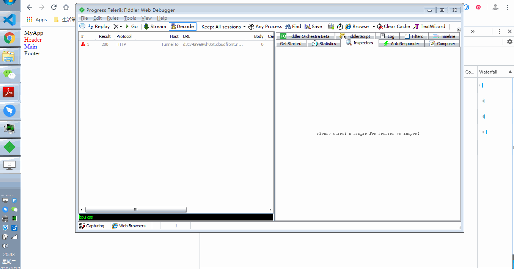
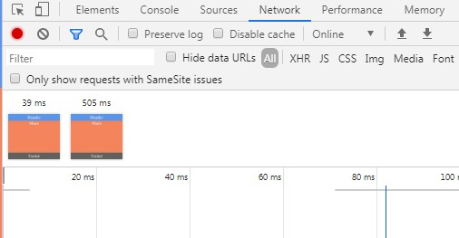
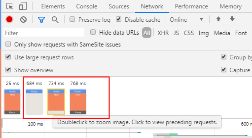

## Preface

For a long time, I was thinking if the _.css_ files would block DOM parsing and rendering. It seems I got different results sometimes. So, I decided to test and summarize the behaviors carefully with chrome.

Let's begin.

### Put _.css_ Files in the `<head>`

Normally, we would put the _.css_ files in the head and _.js_ files at the bottom of `<body>`. For example,

```html
<!DOCTYPE html>
<html lang="en">
  <head>
    <meta charset="UTF-8" />
    <meta name="viewport" content="width=device-width, initial-scale=1.0" />
    <title>Document</title>
    <link rel="stylesheet" href="./static/header.css" />
    <link rel="stylesheet" href="./static/main.css" />
  </head>
  <body>
    <div>MyApp</div>
    <header>
      Header
    </header>
    <main>
      Main
    </main>
    <footer>Footer</footer>
    <script src="./static/app.js"></script>
  </body>
</html>
```

Say we blocked the _.css_ files request by fiddler. And here are the questions,

- Would _header.css_ block DOM parsing and rendering?
- Would _header.css_ block _main.css_, _app.js_ and other resources fetching?

And here are the results.


1. _header.css_ won't block DOM parsing.
2. _header.css_, _main.css_ all blocked rendering which means **the page would be always blank until all the _.css_ files request in the `<head>` finished.**
3. _header.css_ won't block _main.css_, _app.js_ and other resources fetching. Though the codes in the resources won't be executed in advance!
4. After _header.css_, _main.css_ loaded and parsed, we will get the first paint.
5. Then _app.js_ was fetched, parsed and executed with DOM parsing and rendering blocked.
6. After _app.js_ was executed, DOM parsing and rendering keep working.
7. DOM parsing complete.
8. Rendering complete.

### Put _.css_ Files in the `<body>`

It is not very common to see this usage recently. However, test is still needed if we want to know more. Consider the following code,

```html
<!DOCTYPE html>
<html lang="en">
  <head>
    <meta charset="UTF-8" />
    <meta name="viewport" content="width=device-width, initial-scale=1.0" />
    <title>Document</title>
  </head>
  <body>
    <div>MyApp</div>
    <link rel="stylesheet" href="./static/header.css" />
    <header>
      Header
    </header>
    <link rel="stylesheet" href="./static/main.css" />
    <main>
      Main
    </main>
    <footer>Footer</footer>
    <script src="./static/app.js"></script>
  </body>
</html>
```

Say I still block all the _.css_ files with fiddler. What would the results be?



As you can see,

1. **The DOM parsing and rendering would work before they met _header.css_ in the `<body>` which would get an earlier first paint**. User can see something(usually there is a loading bar) before the styles in `<body>` loaded.

2. _header.css_ **blocked DOM parsing**, hence blocked rendering.
3. _header.css_ didn't block other files fetching and _app.js_ is still not executed in advance!
4. After _header.css_ was loaded, **the DOM parsing and rendering keeps working**. Then blocked by _main.css_ again. However, user can see the header now!
5. After _main.css_ was loaded, _app.js_ is executed!
6. DOM parsing complete
7. Rendering complete.

Compared with the first example, we can find the difference is that

- _.css_ files in the `<body>` would block DOM parsing while _.css_ files in the `<head>` wouldn't though they both blocked rendering.

Hence, if we put the styles in the `<head>`, we can make use of the time of styles downloading and parsing to parse more DOM.

However, _.css_ files in the `<body>` would get a faster first paint and is closer to a progressive loading webpage . That's because it doesn't need to load all the styles in the `<head>` and allow content above the `<link>` to render.

Assuming that the requests of the styles need 1 second, let's see the following demo.

```html
<!-- demo1 -->
<!DOCTYPE html>
<html lang="en">
  <head>
    <meta charset="UTF-8" />
    <meta name="viewport" content="width=device-width, initial-scale=1.0" />
    <title>Document</title>
    <link rel="stylesheet" href="./static/app.css" />
  </head>
  <body>
    <link rel="stylesheet" href="./static/header.css" />
    <header>
      Header
    </header>
    <link rel="stylesheet" href="./static/main.css" />
    <main>
      Main
    </main>
    <link rel="stylesheet" href="./static/footer.css" />
    <footer>Footer</footer>
  </body>
</html>
```

```html
<!-- demo2 -->
<!DOCTYPE html>
<html lang="en">
  <head>
    <meta charset="UTF-8" />
    <meta name="viewport" content="width=device-width, initial-scale=1.0" />
    <title>Document</title>
    <link rel="stylesheet" href="./static/app.css" />
    <link rel="stylesheet" href="./static/header.css" />
    <link rel="stylesheet" href="./static/main.css" />
    <link rel="stylesheet" href="./static/footer.css" />
  </head>
  <body>
    <header>
      Header
    </header>
    <main>
      Main
    </main>
    <footer>Footer</footer>
  </body>
</html>
```

Demo2 would render the page after all the styles loaded while demo1 would load and render step by step. Assuming that there is a 1 second delay in _main.css_, the results would be:

_styles in head_



_styles in body_



As you can see, the result of _styles in body_ might be more acceptable and expected. However, with that way we might need more code because we haven't taken consideration of `script`. Things can be more complicated in production.

### Put _.js_ Files in the `<head>` or `<body>`

Actually, it works like styles in `<body>` where we put it in the `<head>` or `<body>`. The script without `async` and `deferred` would block DOM parsing and rendering. Actually, it is specified in W3C specifications.

> For classic scripts, if the async attribute is present, then the classic script will be fetched in parallel to parsing and evaluated as soon as it is available (potentially before parsing completes).
> If the async attribute is not present but the defer attribute is present, then the classic script will be fetched in parallel and evaluated when the page has finished parsing.
> If neither attribute is present, then the script is fetched and evaluated immediately, blocking parsing until these are both complete.

Hence for better experience we can add a loading before the script. So it's common to put the scripts at the bottom of `<body>` to let the loading dom be parsed and rendering first.

### Inline Scripts Blocks Rendering

It's also worth mentioning that if we put an inline script at the bottom of the `<body>` the nearest or even all DOM and styles rendering before the script would be blocked until the script was executed. You can use code below to test

```html
<!DOCTYPE html>
<html lang="en">
  <head>
    <meta charset="UTF-8" />
    <meta name="viewport" content="width=device-width, initial-scale=1.0" />
    <title>Document</title>
    <link rel="stylesheet" href="./static/app.css" />
  </head>
  <body>
    <link rel="stylesheet" href="./static/header.css" />
    <header>
      Header
    </header>
    <link rel="stylesheet" href="./static/main.css" />
    <main>
      Main
    </main>
    <link rel="stylesheet" href="./static/footer.css" />
    <footer>Footer</footer>
    <script>
      let startTime = Date.now();
      let interval = 0;
      while ((interval = Date.now() - startTime) < 10000) {
        if (interval % 1000 === 0) {
          console.log(interval / 1000 + " second passed");
        }
      }
    </script>
  </body>
</html>
```

In that case, users might not see the loading bar. So take care of the inline scripts.

## End

The above tests are tested in windows7 Chrome 80.0.3987.106.

## References


[The future of loading CSS](https://jakearchibald.com/2016/link-in-body/)

[**Source**](https://github.com/xianshenglu/blog/issues/103)
