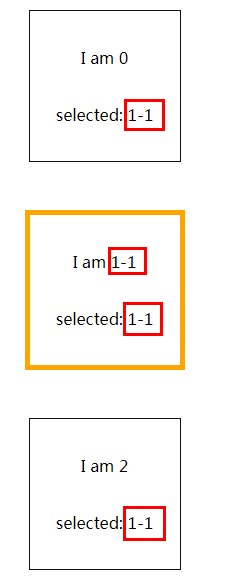
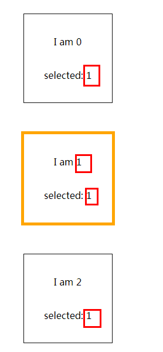

If you have used [vue](https://vuejs.org/index.html) I guess you probably know or have used `computed`. It seems pretty convenient and easy to use. However, it may bring you some problems if you didn't understand it totally.

### Trap in Computed

Let's see the demo below:

```html
<!DOCTYPE html>
<html lang="en">
  <head>
    <meta charset="UTF-8" />
    <meta name="viewport" content="width=device-width, initial-scale=1.0" />
    <meta http-equiv="X-UA-Compatible" content="ie=edge" />
    <title>Document</title>
    <style>
      html,
      body {
        height: 100%;
      }

      .app,
      .app__product {
        width: 100%;
        height: 100%;
        display: flex;
        flex-flow: column;
        justify-content: center;
        align-items: center;
      }

      .app__product,
      .product {
        justify-content: space-evenly;
      }

      .product {
        width: 150px;
        height: 150px;
        margin: 20px;
        text-align: center;
        outline: #111 1px solid;
        display: flex;
        flex-flow: column;
      }

      .product--active {
        outline: orange 5px solid;
      }
    </style>
    <script src="https://cdn.jsdelivr.net/npm/vue@2.5.17/dist/vue.js"></script>
  </head>

  <body>
    <div id="app" class="app">
      <product
        class="app__product"
        :products="products"
        :selected-id.sync="selectedId"
        :current-product="currentProduct"
      ></product>
    </div>
    <script>
      const product = Vue.component('product', {
        template: `
                                        <div>
                                            <div :class="item.id===selectedId?'product product--active':'product'" v-for="(item,index) in products" @click="$emit('update:selectedId',item.id)">
                                                  <div class="product__name">I am {{item.name}}</div>
                                                  <div class="product__name--selected">selected: {{currentProduct.name}}</div>
                                            </div>
                                        </div>`,
        props: ['products', 'selectedId', 'currentProduct']
      })
      const app = new Vue({
        el: '#app',
        components: {
          product
        },
        data: {
          products: [
            {
              id: 0,
              name: '0'
            },
            {
              id: 1,
              name: '1'
            },
            {
              id: 2,
              name: '2'
            }
          ],
          selectedId: 1
        },
        computed: {
          currentProduct() {
            return this.products.find(({ id }) => id === this.selectedId)
          }
        },
        mounted() {
          let selectIndex = this.products.findIndex(
            obj => obj.id === this.selectedId
          )
          this.products[selectIndex].name = '1-1'
        }
      })
    </script>
  </body>
</html>
```

And here is the result:



Until now, nothing weird happens. However, if I changed the mounted hook to below:

```js
let selectIndex = this.products.findIndex(obj => obj.id === this.selectedId)
this.products[selectIndex] = Object.assign({}, this.products[selectIndex], {
  name: '1-1'
})
```

Any difference with the ui ? Yes, it has. The result would be:



As you might thought, `currentProduct` is not right. Is that a bug?

No! Let's look at the doc:

> However, the difference is that computed properties **are cached based on their dependencies**. A computed property will **only re-evaluate when some of its dependencies have changed**.

That is how `computed` works.

In case above, `currentProduct` only has two dependencies which are `products` and `selectedId`. When we use code below:

```js
this.products[selectIndex] = Object.assign({}, this.products[selectIndex], {
  name: '1-1'
})
```

We didn't actually change `products` or `selectedId`. We just change the attributes of `products` not `products` itself. Neither did code below:

```js
this.products[selectIndex].name = '1-1'
```

Code above works because we are changing the existing attributes of `currentProduct`. So, it works as expected.

### Computed or Methods

If that bothers you, doc also gives you another choice:

> Instead of a computed property, we can define the same function as a method instead. For the end result, the two approaches are indeed exactly the same.

But in this case, it needs to be a little complicated. The code would be:

```js
const product = Vue.component('product', {
  template: `
      <div>
          <div :class="item.id===selectedId?'product product--active':'product'" v-for="(item,index) in products" @click="$emit('update:selectedId',item.id)">
                <div class="product__name">I am {{item.name}}</div>
                <div class="product__name--selected">selected: {{getCurProduct().name}}</div>
          </div>
      </div>`,
  props: ['products', 'selectedId'],
  methods: {
    getCurProduct() {
      return this.products.find(({ id }) => id === this.selectedId)
    }
  }
})
const app = new Vue({
  el: '#app',
  components: {
    product
  },
  data: {
    products: [
      {
        id: 0,
        name: '0'
      },
      {
        id: 1,
        name: '1'
      },
      {
        id: 2,
        name: '2'
      }
    ],
    selectedId: 1
  },
  mounted() {
    let selectIndex = this.products.findIndex(obj => obj.id === this.selectedId)
    this.products[selectIndex] = Object.assign({}, this.products[selectIndex], {
      name: '1-1'
    })
    this.$children[0].$forceUpdate()
  }
})
```

The point which needs to take care is

```js
this.$children[0].$forceUpdate()
```

In this case, simply change `currentProduct` to `getCurProduct()` doesn't work because we have to let `product` invoke `getCurProduct()` to get the latest data.

Also, you can use `getCurProduct` in the root:

```html
<div id="app" class="app">
  <product
    class="app__product"
    :products="products"
    :selected-id.sync="selectedId"
    :current-product="getCurProduct()"
  ></product>
</div>
```

```js
const product = Vue.component('product', {
  template: `
      <div>
          <div :class="item.id===selectedId?'product product--active':'product'" v-for="(item,index) in products" @click="$emit('update:selectedId',item.id)">
                <div class="product__name">I am {{item.name}}</div>
                <div class="product__name--selected">selected: {{currentProduct.name}}</div>
          </div>
      </div>`,
  props: ['products', 'selectedId', 'currentProduct']
})
const app = new Vue({
  el: '#app',
  components: {
    product
  },
  data: {
    products: [
      {
        id: 0,
        name: '0'
      },
      {
        id: 1,
        name: '1'
      },
      {
        id: 2,
        name: '2'
      }
    ],
    selectedId: 1
  },
  mounted() {
    let selectIndex = this.products.findIndex(obj => obj.id === this.selectedId)
    this.products[selectIndex] = Object.assign({}, this.products[selectIndex], {
      name: '1-1'
    })
    // this.$children[0].$forceUpdate()
    this.$forceUpdate()
  },
  methods: {
    getCurProduct() {
      return this.products.find(({ id }) => id === this.selectedId)
    }
  }
})
```

### Insist on Computed for Cache Control ?

Sometimes `methods` isn't be a better choice because we really need the cache control like the doc said:

> Why do we need caching? Imagine we have an expensive computed property **A**, which requires looping through a huge Array and doing a lot of computations. Then we may have other computed properties that in turn depend on **A**. Without caching, we would be executing **A’s** getter many more times than necessary!

So, somebody proposed a feature request for `$recompute` in [vuejs/vue#214](https://github.com/vuejs/vue/issues/214). Also, some guys figured out some solutions.

Take a look at the code below:

```html
<div id="app" class="app">
  <product
    class="app__product"
    :products="products"
    :selected-id.sync="selectedId"
    :current-product="currentProduct"
  ></product>
</div>
```

```js
const product = Vue.component('product', {
  template: `
      <div>
          <div :class="item.id===selectedId?'product product--active':'product'" v-for="(item,index) in products" @click="$emit('update:selectedId',item.id)">
                <div class="product__name">I am {{item.name}}</div>
                <div class="product__name--selected">selected: {{currentProduct.name}}</div>
          </div>
      </div>`,
  props: ['products', 'selectedId', 'currentProduct']
})
const app = new Vue({
  el: '#app',
  components: {
    product
  },
  data: {
    products: [
      {
        id: 0,
        name: '0'
      },
      {
        id: 1,
        name: '1'
      },
      {
        id: 2,
        name: '2'
      }
    ],
    selectedId: 1,
    currentProductSwitch: false
  },
  computed: {
    currentProduct() {
      // just let currentProductSwitch become a new dependency of currentProduct
      this.currentProductSwitch
      return this.products.find(({ id }) => id === this.selectedId)
    }
  },
  mounted() {
    let selectIndex = this.products.findIndex(obj => obj.id === this.selectedId)
    this.products[selectIndex] = Object.assign({}, this.products[selectIndex], {
      name: '1-1'
    })
    // update currentProductSwitch to recompute currentProduct
    this.currentProductSwitch = !this.currentProductSwitch
  }
})
```

Do you understand the principle?

I add `currentProductSwitch` in `currentProduct` getter to make `currentProductSwitch` become one dependency of `currentProduct`. So, we can make `currentProduct` recompute when we change the value of `currentProductSwitch`.

Now, let's take a look at the solution [posva](https://github.com/posva) gives:

```js
const product = Vue.component('product', {
  template: `
      <div>
          <div :class="item.id===selectedId?'product product--active':'product'" v-for="(item,index) in products" @click="$emit('update:selectedId',item.id)">
                <div class="product__name">I am {{item.name}}</div>
                <div class="product__name--selected">selected: {{currentProduct.name}}</div>
          </div>
      </div>`,
  props: ['products', 'selectedId', 'currentProduct']
})
const recompute = Vue.mixin({
  data() {
    return {
      __recomputed: Object.create(null)
    }
  },
  created() {
    const watchers = this._computedWatchers
    if (!watchers) {
      return
    }
    if (typeof this.$recompute === 'function') {
      return
    }
    this.$recompute = key => {
      const { __recomputed } = this.$data
      this.$set(__recomputed, key, !__recomputed[key])
    }
    Reflect.ownKeys(watchers).forEach(key => {
      const watcher = watchers[key]
      watcher.getter = (function(getter) {
        return vm => {
          vm.$data.__recomputed[key]
          return getter.call(vm, vm)
        }
      })(watcher.getter)
    })
  }
})
const app = new Vue({
  el: '#app',
  components: {
    product
  },
  mixins: [recompute],
  data: {
    products: [
      {
        id: 0,
        name: '0'
      },
      {
        id: 1,
        name: '1'
      },
      {
        id: 2,
        name: '2'
      }
    ],
    selectedId: 1
  },
  computed: {
    currentProduct() {
      return this.products.find(({ id }) => id === this.selectedId)
    }
  },
  mounted() {
    let selectIndex = this.products.findIndex(obj => obj.id === this.selectedId)
    this.products[selectIndex] = Object.assign({}, this.products[selectIndex], {
      name: '1-1'
    })
    this.$recompute('currentProduct')
  }
})
```

The core code is:

```js
// ....
//* each time called $recompute, reverse the new dependency to let getter recompute
this.$recompute = key => {
  const { __recomputed } = this.$data
  this.$set(__recomputed, key, !__recomputed[key])
}
//* let __recomputed[key] become a new dependency of key's getter
Reflect.ownKeys(watchers).forEach(key => {
  const watcher = watchers[key]
  watcher.getter = (function(getter) {
    return vm => {
      vm.$data.__recomputed[key]
      return getter.call(vm, vm)
    }
  })(watcher.getter)
})
// ....
this.$recompute('currentProduct')
```

Last tip, the same thing also happens on `getters` in `vuex`.

[**Original Post**](https://github.com/xianshenglu/blog/issues/35)
