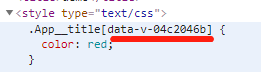

There are some tricks which can't be found easily in [Vue.js homepage](https://vuejs.org/index.html). So, for convenient, I summarized them here.

### Vue

#### Access Global Variable in Template

Have you ever done something like this in lots of components?

```vue
<template>
  <a @click="window.open('...')"></a>
</template>

<script>
export default {
  name: "App",
  data() {
    return {
      window: window
    };
  }
};
</script>
```

or

```vue
<template>
  <a @click="bus.$emit('some-event')"></a>
</template>

<script>
export default {
  name: "App",
  data() {
    return {
      bus: bus
    };
  }
};
</script>
```

Actually, you don't have to, you can register `window` or `bus` in `Vue.prototype` like:

```js
Vue.prototype.window = window;
Vue.prototype.bus = bus;
```

in the _main.js_ or the entry file. Then you can use `bus` or `window` in `template` directly. Also, this usage prevents Vue watching the attributes of `bus` or `window` which would bring a waste of performance.

#### Reactive or Not Reactive

Always, if we want a data reactive, we have to do something like this:

```js
data: {
  newTodoText: '',
  visitCount: 0,
  hideCompletedTodos: false,
  todos: [],
  error: null
}
```

Set some initial value to adds **all the properties found in its data object** to Vue's reactivity system.

Things we need to take care about is:

- If we want to add reactive attributes dynamically, we have to use something like `Vue.set` or `this.$set`. Otherwise, they might not be reactive.
- If we definitely don't want some data to participate in Vue's reactivity system even we initialize it in `data`. We can use something like `Object.freeze()`. For example, freeze a **huge** array to improve **performance**.

#### Scoped Style Won't Work on Dynamically Inserted Elements

I always use the `<style scoped>` tag in _.vue_ files. It is always good except when we want to insert elements dynamically. For example:

```vue
<template>
  <div id="app" ref="app"></div>
</template>

<script>
export default {
  name: "App",
  mounted() {
    this.$refs.app.innerHTML = `<h1 class="App__title">App__title</h1>`;
  }
};
</script>

<style scoped>
.App__title {
  color: red;
}
</style>
```

`color: red` won't work on `.App__title` because of `scoped`. The actual style is rendered with a unique attribute like:



So, how do we solve this? `/deep/` or `>>>`.

```vue
<style scoped>
/deep/ .App__title {
  color: red;
}
</style>
```

They can be used to override child component style. Here is the [doc](https://vue-loader.vuejs.org/guide/scoped-css.html#deep-selectors).

#### Smarter Watchers

Have you ever written code like this:

```js
{
  // ...
  created() {
    this.fetchPostList()
  },
  watch: {
    searchInputValue() {
      this.fetchPostList()
    }
  }
  // ...
}
```

Actually, you can simplify it by

```js
{
  // ...
  watch: {
    searchInputValue:{
      handler: 'fetchPostList',
      immediate: true
    }
  }
  // ...
}

```

As the [doc](https://vuejs.org/v2/api/#vm-watch) said:

> Passing in immediate: true in the option will trigger the callback immediately with the current value of the expression.

#### $attrs and $listeners

I don't know if you have used `$attrs` and `$listeners` from `this`. However, I never used those until I met this situation. For example:

```html
<div id="app">
  <base-input
    :value="value"
    placeholder="parentPlaceholder"
    otherAttrs="otherAttrs"
    @input="inputCb"
    @click="clickCb"
  ></base-input>
</div>
<script>
  let BaseInput = {
    name: "base-input",
    template: `
    <div>
    <input type="text" :value="value" :placeholder="placeholder"  :otherAttrs="otherAttrs" @input="$emit('input',$event)" @click="$emit('click',$event)" @focus="focusCb" />
    </div>`,
    props: {
      value: {
        type: String
      }
    },
    computed: {
      listeners() {
        const listeners = {
          ...this.$listeners,
          focus: this.focusCb
        };
        return listeners;
      }
    },
    methods: {
      focusCb(event) {
        console.log("child", event);
      }
    }
  };
  window.app = new Vue({
    el: "#app",
    components: {
      BaseInput
    },
    data: {
      value: "",
      parentPlaceholder: "parentPlaceholder"
    },
    methods: {
      inputCb(event) {
        console.log(event);
      },
      clickCb(event) {
        console.log(event);
      }
    }
  });
</script>
```

It's obviously tedious to bind every attribute and listener by hand. Actually, this is where `$attrs` and `$listeners` will help us. We can write the `BaseInput` `template` like:

```js
let BaseInput = {
  name: "base-input",
  template: `<div><input type="text" :value="value"  v-bind="$attrs" v-on="listeners" /></div>`,
  props: {
    value: {
      type: String
    }
  },
  computed: {
    listeners() {
      const listeners = {
        ...this.$listeners,
        // move `focus` in to `listeners` instead of adding one more `focus` listener.
        focus: this.focusCb
      };
      return listeners;
    }
  },
  methods: {
    focusCb(event) {
      console.log("child", event);
    }
  }
};
```

### Vue-Router

#### $router and $route

Have you ever wonder about the relationship between `$router` and `$route`? I give you a hint:

```js
this.$router.currentRoute === this.$route; //true
```

### Vuex

#### Commit Data by One Mutation

We can't directly mutate `state` in Vuex. Instead, we have to `commit` a `mutation` to mutate the data. However, it would be tedious to write lots of similar mutations like this:

```js
let store = new Vuex.Store({
  modules: {
    // ...
  },
  mutations: {
    updateName(state, data) {
      state.name = data;
    },
    updateChildrenCount(state, data) {
      state.children.count = data;
    }
    // other similar mutations
  }
});
```

We can write a public mutation to do this like:

```js
let store = new Vuex.Store({
  modules: {
    // ...
  },
  mutations: {
    replaceProperty(state, { path, data }) {
      if (typeof path !== "string") {
        return;
      }
      path = path.split(".");
      let targetObj = path.slice(0, -1).reduce((re, key) => re[key], state);
      targetObj[path.pop()] = data;
    }
  }
});
```

Then we can mutate `state` in anywhere with only one mutation like:

```js
commit(
  "replaceProperty",
  {
    path: "name",
    data: name
  },
  { root: true }
);
commit(
  "replaceProperty",
  {
    path: "children.count",
    data: data
  },
  { root: true }
);
commit(
  "replaceProperty",
  {
    path: "some.other.deep.path.in.state",
    data: data
  },
  { root: true }
);
```

It would also work for modules!

[**Original Post**](https://github.com/xianshenglu/blog/issues/52)

## Reference

- [7 Secret Patterns Vue Consultants Don’t Want You to Know - Chris Fritz](https://www.youtube.com/watch?v=7lpemgMhi0k)
- [vue-loader/issues/749](https://github.com/vuejs/vue-loader/issues/749)
