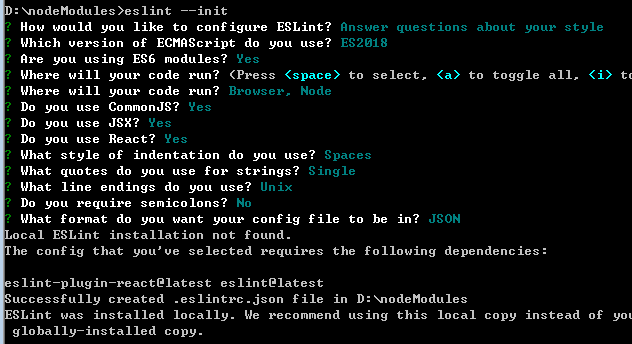
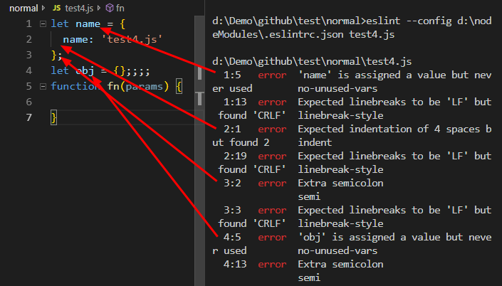
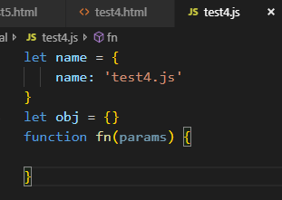
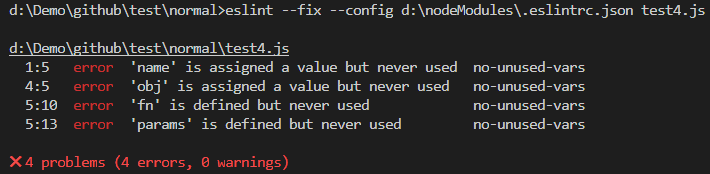
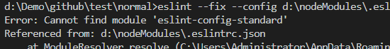
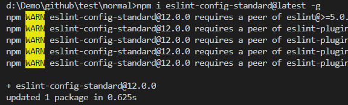
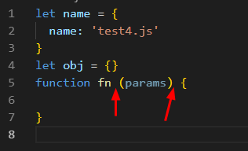
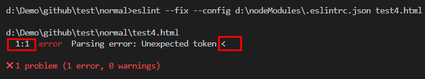
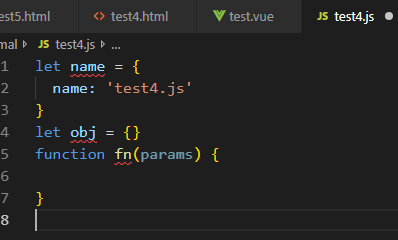
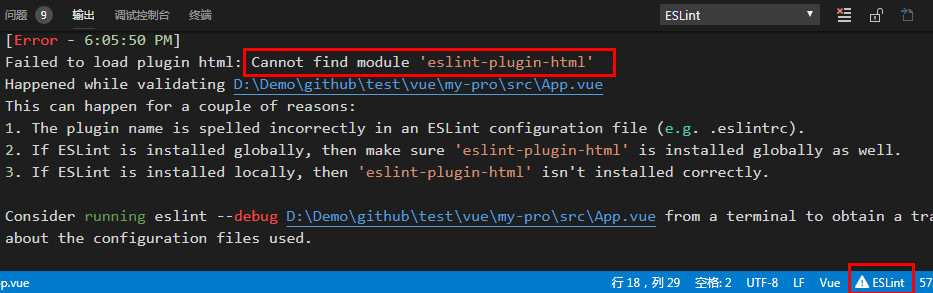

## Preface

I won't start with questions like what or why. I will start with how and why. Let's begin.

## Main

### install eslint

Install global eslint package:

```bash
npm i eslint@latest -g
```

Then setup a config file. For example:

```bash
cd /
cd d/nodemodules
eslint --init
```

Then it will give you some choices.



**tips:**

1. _You may need to `npm init` first but you can remove it later._
2. _If you can't use arrow key, you may try use cmd.exe instead_.

After that you will get a config file with some settings.

According to tips on terminal, you will need to load some packages like me because of your previous choices. So, I need to:

```bash
npm i eslint-plugin-react@latest -g
```

Actually you can remove the _package.json_ ( if you have ) now because we are making global eslint settings, not for a project.

As far, I have a global eslint config file (_d:\\nodemodules\\.eslintrc.json_). And my test file is _test4.js_. Here is the origin code:

```js
let name = {
  name: "test4.js"
};
let obj = {};
function fn(params) {}
```

So, how can I lint _test4.js_ by _d:\\nodemodules\\.eslintrc.json_?

### run eslint on terminal

Let's switch to the folder of _test4.js_. Then for me, I run code below:

```bash
eslint --config d:\nodeModules\.eslintrc.json test4.js
```

Result:



Here it is. Well, of course we want to fix it when run lint. So, according to [ESLint doc][eslint doc] we can try code below:

```bash
eslint --fix --config d:\nodeModules\.eslintrc.json test4.js
```

Result:





ESLint will fix some problems, mainly spaces. In the case above, **no-unused-vars** problems will not be fixed.

### set custom rules

Futhermore, the expected indent is 4 spaces. But I want 2 spaces to be the default indent. So, we always set our own rules based on ESLint. In my case, I altered the _d:\\nodemodules\\.eslintrc.json_ like:

```js
{
   //other settings
    "rules": {
        "indent": [
            "error",
            2
            //change to 2 not 4
        ],
      //other rules
    }
}
```

Then, run the code above again:

```bash
eslint --fix --config d:\nodeModules\.eslintrc.json test4.js
```

It works immediately. If you want to change other rules, you may have to know more about the existing rules in [Eslint rules][eslint rules].

For me, For me, I usually set own rules based on **standard** not **recommended rules** and my custom rules is like:

```js
{
  //other settings
  "extends": "standard",
  //other settings
  "rules": {
    "indent": ["error", 2],
    "linebreak-style": ["off", "unix"],
    "quotes": ["error", "single"],
    "semi": ["error", "never"],
    "no-multiple-empty-lines": [
      "error",
      {
        "max": 1,
        "maxEOF": 0
      }
    ]
  }
}
```

In this case, we run again:

```bash
eslint --fix --config d:\nodeModules\.eslintrc.json test4.js
```

Actually, I got error:



So, I have to run

```bash
npm i eslint-config-standard@latest -g
```

It turns out I got more warnings.



So, I keep installing:

```bash
npm i eslint-plugin-import@latest eslint-plugin-node@latest eslint-plugin-promise@latest eslint-plugin-standard@latest -g
```

After that, there is no **correct** warnings. So, I run

```bash
eslint --fix --config d:\nodeModules\.eslintrc.json test4.js
```

I got a little difference because of different rules:



### script in .html

If you use code above to format js in .html, it will fail. For example:

```html
<!-- test4.html -->
<!DOCTYPE html>
<html lang="en">
  <head>
    <meta charset="UTF-8" />
    <meta name="viewport" content="width=device-width, initial-scale=1.0" />
    <meta http-equiv="X-UA-Compatible" content="ie=edge" />
    <title>Document</title>
    <style>
      html,
      body {
        width: 100%;
        height: 100%;
      }
    </style>
  </head>

  <body>
    <canvas id="canvas"></canvas>
    <div>
      <div>
        <div></div>
      </div>
    </div>
    <script>
      let name = {
        name: "test4.js"
      };
      let obj = {};
      function fn(params) {}
    </script>
  </body>
</html>
```

```bash
eslint --fix --config d:\nodeModules\.eslintrc.json test4.html
```

Result:



See? Actually, we need plugins for non .js files. After search, I have to run code:

```bash
npm i eslint-plugin-html@latest -g
```

Also, we need to update _d:\\nodeModules\\.eslintrc.json_ and it would be:

```js
{
  "env": {
    "browser": true,
    "commonjs": true,
    "es6": true,
    "node": true
  },
  "extends": "standard",
  "parserOptions": {
    "ecmaFeatures": {
      "jsx": true
    },
    "ecmaVersion": 2018,
    "sourceType": "module"
  },
  "plugins": ["html"],//add this plugin
  "rules": {
    "indent": ["error", 2],
    "linebreak-style": ["off", "unix"],
    "quotes": ["error", "single"],
    "semi": ["error", "never"],
    "no-multiple-empty-lines": [
      "error",
      {
        "max": 1,
        "maxEOF": 0
      }
    ]
  }
}
```

After that, you run the code and ESLint would work for .html files.

### move --fix to editor

As far, it seems there is only one flaw left. Do we have to run the code every time we want to format?

Actually, we don't have to. For me, using vscode, ESLint provides plugins to do these jobs. For other editor users, you may want to check the ESLint doc.

Here is the operations for vscode.

Install ESLint plugin. Then add some settings in your _User Settings._

```js
{
  "eslint.options": {
    //replace with your filename and path
    "configFile": "D:/nodeModules/eslint/.eslintrc.json"
  },
  "eslint.alwaysShowStatus": true,
  "eslint.autoFixOnSave": true,
  "eslint.run": "onSave",
  "eslint.validate": [
    "javascript",
    "javascriptreact",
    {
      "language": "html",
      "autoFix": true
    },
    {
      "language": "vue",
      "autoFix": true
    }
  ]
}
```

After restarting your editor, you will see



And


If your default settings of `formatOnSave:true`, then ESLint would format your code onSave.

### make global and local config file independent

Until now, everything seems perfect with ESLint. But there is one thing I need to mention. Suppose that you create a new vue project using vue-cli.

```bash
vue create my-proj
cd my-proj
```

You may find that ESLinter error like below:



You can see this because we set the `eslint.options` in the `User Settings`. `eslint.options` setting is like passing it on the command line in a terminal using the `--config`. If you do this ESLint respects this and will not use the one in the project folder.

However, if we delete the `eslint.options` it won't be able to format other files. So, the compromise solution is :

1. delete the `eslint.options`
2. move the global config file to the top.

For example:

```
home
  .eslintrc
  projects
    projectOne
      .eslintrc
    projectTwo
```

If we move the _d:\\nodeModules\\.eslintrc.json_ to home, then delete the `eslint.options`. The result would be:

- code in project one will be validated using the local .eslintrc file
- code in project two will be validated using the .eslintrc file in your home directory

Got it? I learn this from [Override global eslintrc if one is found in current project][override global eslintrc if one is found in current project].

At last, eslint in `User Settings` is:

```js
{
   "eslint.options": {
    // "configFile": "D:/nodeModules/eslint/.eslintrc.json",
  },
  "eslint.alwaysShowStatus": true,
  "eslint.autoFixOnSave": true,
  "eslint.run": "onSave",
  "eslint.validate": [
    "javascript",
    "javascriptreact",
    {
      "language": "html",
      "autoFix": true
    },
    {
      "language": "vue",
      "autoFix": true
    }
  ]
}
```

And in the folder of all projects, I have global eslint config file:


## Ending

## Reference

- [Override global eslintrc if one is found in current project][override global eslintrc if one is found in current project]

[override global eslintrc if one is found in current project]: https://github.com/Microsoft/vscode-eslint/issues/527
[eslint doc]: https://eslint.org/docs/user-guide/command-line-interface
[eslint rules]: https://eslint.org/docs/rules/
