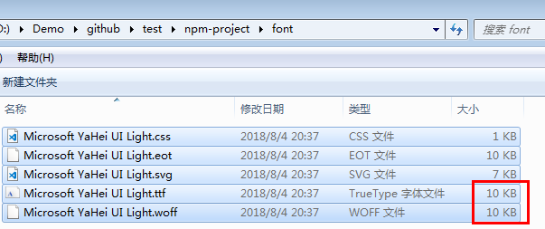

## Preface

CSS3 can set custom `font-family` with src pointing to the specific font file. We can use it for some cool font or use it when there is no specific font on the user's computer.

However, when I try to use it I find something blocking my way.

## Main

Well, it's about the language problem.

As we all know, if I try to use some font for Non-English language the font file may not be small enough. For example, I am trying to use some kind of Chinese font and I find the font file. However, the file is more than 5M and I haven't handled the compatibility problem.

So, I am trying to find a solution about this. And I find [fontmin][fontmin]!

[fontmin][fontmin] will extract the text you files used and generate the corresponding font file which is much smaller than your original font file.

For example:

```js
var Fontmin = require('fontmin')
var srcPath = 'src/font/*.ttf'
var destPath = 'asset/font'
var text = '我说你是人间的四月天；笑响点亮了四面风；轻灵在春的光艳中交舞着变。'

// initial
var fontmin = new Fontmin()
  .src(srcPath) // font file you want to simplify
  .use(
    Fontmin.glyph({
      // extract glyph
      text: text // all the text you will use
    })
  )
  .use(Fontmin.ttf2eot()) // eot transform plugin
  .use(Fontmin.ttf2woff()) // woff transform plugin
  .use(Fontmin.ttf2svg()) // svg transform plugin
  .use(Fontmin.css()) // css generation plugin
  .dest(destPath) // output the simplified font file

// run
fontmin.run(function(err, files, stream) {
  if (err) {
    console.error(err)
  }

  console.log('done')
})
```

In my case, I need to extract text from some file. So, I do it like this:

```js
var text
var fs = require('fs')
fs.readFile('data.js', 'utf8', function(er, data) {
  if (er) {
    return console.log(er)
  }
  text = data

  var Fontmin = require('fontmin')
  var srcPath = 'font/*.ttf'
  var destPath = 'font/'
  // initial
  var fontmin = new Fontmin()
    .src(srcPath) // font file you want to simplify
    .use(
      Fontmin.glyph({
        // extract glyph
        text: text // all the text you will use
      })
    )
    .use(Fontmin.ttf2eot()) // eot transform plugin
    .use(Fontmin.ttf2woff()) // woff transform plugin
    .use(Fontmin.ttf2svg()) // svg transform plugin
    .use(Fontmin.css()) // css generation plugin
    .dest(destPath) // output the simplified font file

  // run
  fontmin.run(function(err, files, stream) {
    if (err) {
      console.error(err)
    }

    console.log('done')
  })
})
```

And here is what I got:



which is much smaller than origin Microsoft YaHei UI Light.ttf(**11M**).

However, here is a little tip I want to give you.

After you run the script above, **the original font file _\*.ttf_ has been replaced.** So, you had better back up the original font file before you run the script. Then if you need to run the script again, you should use the original font file, not the file which has been updated.

[fontmin]: https://github.com/ecomfe/fontmin/
