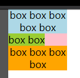

## Preface

As the title says, what I want is like image below:



Is that Possible, ha?

## Steps

At the first, I thought that was impossible with css only. But I find an answer in SO. Here is the code:

```html
<div class="par">
  <span class="child child1">box box box box box </span>
  <span class="child child2">box box</span>
  <span class="child child3">box box box box</span>
</div>
```

```css
* {
  margin: 0;
  padding: 0;
}
.par {
  background: pink;
  width: 100px;
  text-align: left;
}
.par .child {
  display: inline-block;
  text-align: center;
}
.par .child1 {
  background: lightblue;
}
.par .child2 {
  background: yellowgreen;
}
.par .child3 {
  background: orange;
}
```

That is magic!

Because inline-blocks is an inline-level element. So, it will be in the left of the container `.par` built because of `text-align:left`. The width of `inline-block` is determined by the content which is only one line. So, `text-align:center` on the `.child` doesn't work because the width of `.child` is equal to the width of one line content in the `.child`.

Also, the `inline-block` is a block container. When there is more than one line, the width of `inline-block` will be equal to the width of `.par`. In this case, `text-align:center` will work on the last line because the width of last line is less than the width of the `inline-block`.

## Ending

Anyway, this solution is awesome. Thanks to the reference.

## Reference

[how-can-i-use-text-align-last-except-when-i-have-only-one-line-of-text](https://stackoverflow.com/questions/43556557/how-can-i-use-text-align-last-except-when-i-have-only-one-line-of-text/43556943#comment88476400_43556943)
