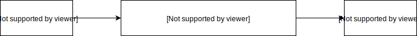

When we want to communicate between two irrelevant components we have many choices. The two most common was using sharable data and event bus. And in lots of scenarios, they both can handle that. However, what we choose might have an influence in the code controllability, readability and quality.

Consider the situation below:

```html
<!DOCTYPE html>
<html lang="en">
  <head>
    <meta charset="UTF-8" />
    <meta name="viewport" content="width=device-width, initial-scale=1.0" />
    <meta http-equiv="X-UA-Compatible" content="ie=edge" />
    <title>Document</title>
    <link
      rel="stylesheet"
      href="https://cdn.jsdelivr.net/npm/element-ui@2.10.1/lib/theme-chalk/index.css"
    />
    <style></style>
  </head>
  <body>
    <div id="app"></div>
    <script src="https://cdn.jsdelivr.net/npm/vue@2.5.17/dist/vue.js"></script>
    <script src="https://cdn.jsdelivr.net/npm/element-ui@2.10.1/lib/index.js"></script>
    <script src="https://cdn.jsdelivr.net/npm/lodash@4.17.14/lodash.min.js"></script>
    <script src="via-event.js"></script>
    <!-- <script src="via-data.js"></script> -->
  </body>
</html>
```

```js
// via-event.js
const Event = Vue.extend({
  name: "eventBus"
});
Vue.prototype.$eventBus = new Event();

const SearchForm = Vue.extend({
  props: ["paginationConf"],
  data() {
    return {
      formData: {
        name: ""
      }
    };
  },
  template: `
      <el-form inline>
        <el-form-item label="name">
            <el-input v-model="formData.name"  />
        </el-form-item>
        <el-form-item>
            <el-button type="primary" @click="onSubmit">submit</el-button>
        </el-form-item>
      </el-form>
      `,
  created() {
    this.$eventBus.$on("app:submit-search-form", this.validateForm);
  },
  destroyed() {
    this.$eventBus.$off("app:submit-search-form", this.validateForm);
  },
  methods: {
    onSubmit() {
      this.paginationConf.pageNum = 1;
      this.validateForm();
    },
    validateForm() {
      this.fetchData();
    },
    fetchData() {
      console.log("fetched data");
    }
  }
});

const SearchResult = Vue.extend({
  props: ["paginationConf"],
  template: `
    <el-pagination
        :current-page.sync="paginationConf.pageNum"
        :page-size.sync="paginationConf.pageSize"
        :total="100"
        layout="total, sizes, prev, pager, next"
        @size-change="sizeChange"
        @current-change="currentPageChange"
    ></el-pagination>
    `,
  methods: {
    sizeChange(pageSize) {
      this.paginationConf.pageNum = 1;
      this.$eventBus.$emit("app:submit-search-form");
    },
    currentPageChange() {
      this.$eventBus.$emit("app:submit-search-form");
    }
  }
});

const App = Vue.extend({
  components: {
    SearchForm,
    SearchResult
  },
  data() {
    return {
      paginationConf: {
        pageSize: 20,
        pageNum: 1
      }
    };
  },
  template: `
  <div>
      <SearchForm :pagination-conf="paginationConf"  />
      <SearchResult :pagination-conf="paginationConf"  />
  </div>`
});
new App().$mount("#app");
```

```js
// via-data.js
const SearchForm = Vue.extend({
  props: ["paginationConf"],
  data() {
    return {
      formData: {
        name: "",
        count: 0
      }
    };
  },
  template: `
      <el-form inline>
        <el-form-item label="name">
            <el-input v-model="formData.name"  />           
        </el-form-item>
        <el-form-item>
            <el-button type="primary" @click="onSubmit">submit</el-button>
        </el-form-item>
      </el-form>
      `,
  watch: {
    // paginationConf: {
    //   deep: true,
    //   handler() {
    //     this.validateForm()
    //   }
    // }
    "paginationConf.pageNum"() {
      this.validateForm();
    },
    "paginationConf.pageSize"() {
      this.validateForm();
    }
  },
  methods: {
    onSubmit() {
      this.paginationConf.pageNum = 1;
      this.validateForm();
    },
    validateForm: function() {
      this.fetchData();
    },
    fetchData() {
      console.log("fetched data");
    }
  }
});

const SearchResult = Vue.extend({
  props: ["paginationConf"],
  template: `
      <el-pagination
          :current-page.sync="paginationConf.pageNum"
          :page-size.sync="paginationConf.pageSize"
          :total="100"
          layout="total, sizes, prev, pager, next"
          @size-change="sizeChange"
      ></el-pagination>
      `,
  methods: {
    sizeChange(pageSize) {
      this.paginationConf.pageNum = 1;
    }
  }
});

const App = Vue.extend({
  components: {
    SearchForm,
    SearchResult
  },
  data() {
    return {
      paginationConf: {
        pageSize: 20,
        pageNum: 1
      }
    };
  },
  template: `
    <div>
        <SearchForm :pagination-conf="paginationConf"  />
        <SearchResult :pagination-conf="paginationConf"  />
    </div>`
});
new App().$mount("#app");
```

I wrote two implementations here. _via-event.js_ is a implementation of event stream while _via-data.js_ is data stream implementation. In most cases, they will work as expected. However, they are totally different and even get different results in some cases.

### Controllability

Let's test these cases.

1. If we click the `submit` button, there should be one `fetched data` in the console.
2. If we change the `pageSize`, there should be one `fetched data` in the console.
3. If we change the `pageNum`, there should be one `fetched data` in the console.
4. If we change the `pageSize` when the `pageNum` doesn't equal 1, the `pageNum` should be set to 1 and there should be **only one `fetched data`** in the console.
5. If we click the `submit` button and the `pageNum` doesn't equal 1, the `pageNum` should be set to 1 and there should be **only one `fetched data`** in the console.

It doesn't matter which one we choose in the first 3 cases. However, we will get **two `fetched data`** in the console if we choose data stream, i.e. _via-data.js_.

Why would this happen?

In the case 4, `pageSize` changes and then `pageNum` changes! Two changes brought two invocations.

In the case 5, `submit` triggers once and the change of `pageNum` brought one invocation again.

If we want to avoid duplicate invocations, we can use `_.debounce` to reduce the invocations. In that case, code would be

```js
// via-data.js
const SearchForm = Vue.extend({
  // ...
  methods: {
    onSubmit() {
      this.paginationConf.pageNum = 1;
      this.validateForm();
    },
    validateForm: _.debounce(function() {
      this.fetchData();
    }),
    fetchData() {
      console.log("fetched data");
    }
  }
  // ...
});
```

However, we still can't take a full control of callback(i.e. `validateForm` in the above case) like event stream.

- Without `debounce`, the callback would run as many times as data changes.
- With `debounce`, the callback would only run once in a given time.
- While with event stream we can invoke the callback at any time and any frequency we want.

### Readability

In the _via-event.js_, reading `sizeChange` is like



While in the _via-data.js_, the flow is like


If you have encountered this situation many times, you might know that there must be another line like below in some places or files.


If someone is not familiar with the data stream, it might take a while to adapt. In my opinion, event stream is more intuitive.

[**Issue**](https://github.com/xianshenglu/blog/issues/100)

[**Source**](https://github.com/xianshenglu/blog/blob/master/source/_posts/vue-components-communication-data-stream-vs-event-stream.md)

## Reference
