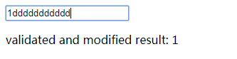
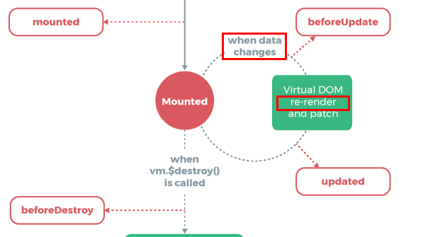

## Preface

When I was using form validate in Vue, I found sometimes vue doesn't render data which was modified by me. I even thought it was a bug. Anyway, let's take a look.

## Main

Here is a simple demo:

```css
html,
body {
  width: 100%;
  height: 100%;
}

.app {
  width: 100%;
  height: 100%;
}
```

```html
<div class="app" id="app">
  <form>
    <input
      type="text"
      id="positive-num"
      :value.trim="positiveNum"
      @input="oldValidate"
      :placeholder="positiveNumTip"
    />
    <p>{{positiveNumResTip}}{{positiveNum}}</p>
  </form>
</div>
```

```js
let app = new Vue({
  el: "#app",
  data: {
    positiveNumTip: "please enter a positive num",
    positiveNum: "",
    positiveNumResTip: "validated and modified result: "
  },
  methods: {
    oldValidate(event) {
      let value = event.target.value;
      let reg = /^[\d]+[.]?[\d]*$/;
      let newVal = Number.parseFloat(value);
      if (!value.match(reg)) {
        if (!isNaN(newVal) || newVal > 0) {
          this.positiveNum = newVal;
        } else {
          this.positiveNum = 1;
        }
      } else {
        this.positiveNum = value;
      }
    }
  }
});
```

When I was pressing _dddddddddd_, what did I got?



The first letter was replaced to 1 but the others not. And the most important is the result I got is always 1 which means `this.positiveNum` is 1 while the value in the `input` is not 1.

Why?

I even thought it was a bug until one day I met a similar problem which was solved in SO.

The key is the Lifecycle. The guide mentions it before but I didn't understand it until now. Let's see the picture again:



See?

The first time we change `positiveNum` to 1 and then we always change `positiveNum` to 1. So, vue wouldn't re-render because the data doesn't change. So, the connection between `input` and `positiveNum` was cut off until `positiveNum` isn't equal to 1.

We can add `updated` to see how many times data has changed:

```js
let app = new Vue({
  el: "#app",
  data: {
    positiveNumTip: "please enter a positive num",
    positiveNum: "",
    positiveNumResTip: "validated and modified result: "
  },
  methods: {
    oldValidate(event) {
      let value = event.target.value;
      let reg = /^[\d]+[.]?[\d]*$/;
      let newVal = Number.parseFloat(value);
      if (!value.match(reg)) {
        if (!isNaN(newVal) || newVal > 0) {
          this.positiveNum = newVal;
        } else {
          this.positiveNum = 1;
        }
      } else {
        this.positiveNum = value;
      }
    }
  },
  updated() {
    console.log("data updated"); //only triggered once
  }
});
```

As explained before, you can only see `'data updated'` once.

So, how can we solved this problem?

The key is still the Lifecycle. Vue wouldn't re-render because data doesn't change. So, we can update data after data has been changed and rendered. Understood? See code below:

```html
<div class="app" id="app">
  <form>
    <input
      type="text"
      id="positive-num"
      :value.trim="positiveNum"
      @input="newValidate"
      :placeholder="positiveNumTip"
    />
    <p>{{positiveNumResTip}}{{positiveNum}}</p>
  </form>
</div>
```

```js
let app = new Vue({
  el: "#app",
  data: {
    positiveNumTip: "please enter a positive num",
    positiveNum: "",
    positiveNumResTip: "validated and modified result: "
  },
  methods: {
    oldValidate(event) {
      let value = event.target.value;
      let reg = /^[\d]+[.]?[\d]*$/;
      let newVal = Number.parseFloat(value);
      if (!value.match(reg)) {
        if (!isNaN(newVal) || newVal > 0) {
          this.positiveNum = newVal;
        } else {
          this.positiveNum = 1;
        }
      } else {
        this.positiveNum = value;
      }
    },
    newValidate(event) {
      let value = event.target.value;
      let reg = /^[\d]+[.]?[\d]*$/;
      this.positiveNum = value;
      this.$nextTick(() => {
        if (!this.positiveNum.match(reg)) {
          let newVal = Number.parseFloat(this.positiveNum);
          if (!isNaN(newVal) || newVal > 0) {
            this.positiveNum = newVal;
          } else {
            this.positiveNum = ""; //for better use I changed the wrong value to ''
          }
        }
      });
    }
  },
  updated() {
    console.log("data updated");
  }
});
```

See? I move the origin logic to the `this.$nextTick(callback)`. Every time you press the wrong button, it will pass the wrong value to `positiveNum` and will be corrected in `this.$nextTick(callback)` which will make the logic run correctly. Also, you can see the updated log at the console.

## Ending

## Reference

- [change child-component checked state from parent-component synchronously fail](https://stackoverflow.com/questions/49920790/change-child-component-checked-state-from-parent-component-synchronously-fail)
