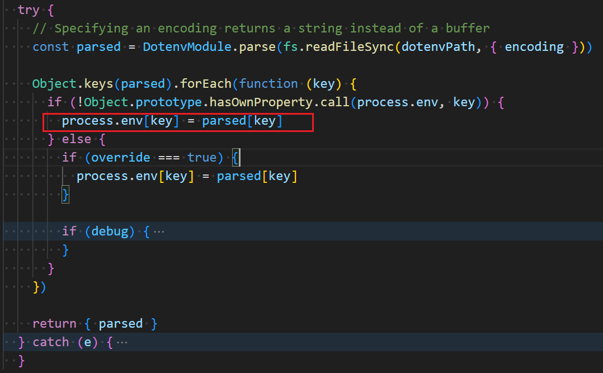

We often use `process.env` to manage environment variables in front-end or Node.js projects.

### How the env works in the front-end 

In lots of cases, we're using `dotenv` or `cross-env` to manage environment variables.

If you check the source code of [`dotenv`](https://github.com/motdotla/dotenv), you will find that it assigns all the defined env variables to the `process.env`.



According to the document of [Node.js](https://nodejs.org/dist/latest-v8.x/docs/api/process.html#process_process_env).

> It is possible to modify this object(`process.env`), but **such modifications will not be reflected outside the Node.js process**.

And [cross-env](https://github.com/kentcdodds/cross-env) will pass the target env to `cross-spawn` to launch a child process.


> The `child_process.spawn()` method spawns a new process using the given command, with command line arguments in args.

In conclusion, the env variables set by `dotenv` or `cross-env` are only visible in the running Node.js process.

But it doesn't matter normally because the env is set in the same process as the app or the app is running in a child process with the target env.

Thus **if you open the Windows system environment variable dialog when your app is running, you will not see the defined env** because it's out of the app process.

If you set env by `$env:TEST_ENV=dev` in PowerShell or `set TEST_ENV=dev` in cmd, you will not get the expected value in another shell or cmd by `$env:TEST_ENV` or `echo "%TEST_ENV%"`.

### Change the env variable like editing in the Windows "environment variable dialog" 

If you want to do this, you can use `setx TEST_ENV dev` in Powershell or cmd. Then **open a new process(not a new child process)** you will get the new `TEST_ENV` value.

For example, if you change the env out of vscode, you need to restart the vscode. Otherwise, even if you open a new shell in the vscode, you still can't see the new env value.

If you don't want to restart vscode you can use `refreshenv` in the vscode powershell or cmd after installing [chocolatey](https://chocolatey.org/install)(_Package Manager for Windows_). For example,

```powershell
$env:TEST_ENV  # dev
setx TEST_ENV prod
$env:TEST_ENV  # dev, not change
refreshenv
$env:TEST_ENV # prod, changed
```

Since we can use `setx` to set the env variable permanently, we can also let Node.js execute the `setx` command. For example,

```js
const { spawnSync } = require("child_process");
spawnSync('setx', ['-m', 'TEST_ENV', 'prod']);
```

In the script,

> The `child_process.spawnSync()` method is generally identical to `child_process.spawn()` with the exception that the function will not return until the child process has fully closed.

[**Issue**](https://github.com/xianshenglu/blog/issues/150)

[**Source**](https://github.com/xianshenglu/blog/blob/master/source/_posts/what-are-we-doing-when-we-are-changing-environment-variables.md)

## Reference
