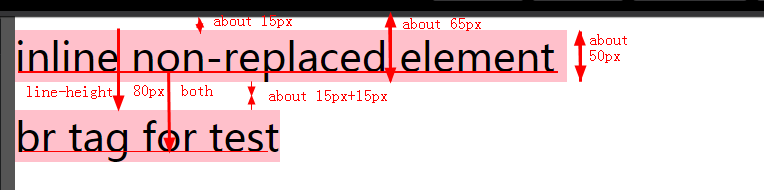
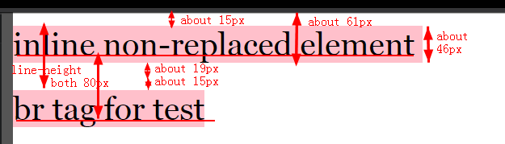

## Preface

As we all know, when we set `background-color` in block-level non-replaced elements, the height of `background-color` is equal to `border-top`+`padding-top`+`height`+`padding-bottom`+`border-bottom` according to box-model which is very clear.

## Question

However, things get weird when we set `background-color` to inline non-replaced element because `height` doesn't apply to the element. For example:

```html
<div class="inline">
  inline non-replaced element
</div>
```

```css
* {
  margin: 0;
  padding: 0;
}
html {
  font-family: Microsoft YaHei;
  font-size: 40px;
}
.inline {
  display: inline;
  background-color: pink;
  line-height: 2;
}
```



So, here is the question,

* Assume there is no `margin` and `padding`,how much is the size of the `background-color` area which is also the content area ?any rules?

And here is the answer I figured out:

* It depends.

Then we are going to talk a lot about how it depends.

If we measured the direction as the screenshot above ,we can get some data below, called Case A :

* font-size:40px
* background-color's height : about 50px
* top/bottom space : about 15px

May be you thought that those data should be like these, called Case B :

* font-size:40px
* background-color's height : about 40px
* top/bottom space : about 20px, equals to half-leading

It seems Case B is more reasonable.

However, the fact is that Case A is applied until Chrome-66.

Anyway, `line-height` is definitive, always 80px.

After reading [10.6.1 Inline, non-replaced elements][2] in CSS2.1 and SO, I think the point is below:

> The 'height' property does not apply. The height of the content area should be based on the font, but this specification does not specify how. A UA may, e.g., use the em-box or the maximum ascender and descender of the font.

> (The latter would ensure that glyphs with parts above or below the em-box still fall within the content area, but leads to differently sized boxes for different fonts; the former would ensure authors can control background styling relative to the 'line-height', but leads to glyphs painting outside their content area.)

According to the specification above, I think that Case B means

> A UA use the em-box which would ensure authors can control background styling relative to the 'line-height', but leads to glyphs painting outside their content area.

while Case A means

> A UA use the maximum ascender and descender of the font which would ensure that glyphs with parts above or below the em-box still fall within the content area, but leads to differently sized boxes for different fonts.

Then, I try to prove it with different fonts which will lead differently sized boxes according to specification above.

For example, change `font-family`from `Microsoft YaHei`to`Georgia`:

```html
<div class="inline">
  inline non-replaced element <br>sss
</div>
```

```css
* {
  margin: 0;
  padding: 0;
}
html {
  font-size: 40px;
  font-family: Georgia;
}
.inline {
  display: inline;
  background-color: pink;
  line-height: 2;
}
```



As you can see ,these data becomes:

* font-size:40px
* background-color's height : about 46px
* top space : about 15px
* bottom space: about 19px

## Conclusion

So, precisely, assuming that there is no `margin` and `padding`,we can say that background-color's height of inline non-replaced element is

* determined by `font-size`
* and modified partially by `font-family` which depends on the rules UA takes.

And also the area outside of the `background-color` area isn't equal to half-leading.

Reference:

[Inline elements and line-height][4]

[2]: https://www.w3.org/TR/2011/REC-CSS2-20110607/visudet.html#inline-non-replaced
[4]: https://stackoverflow.com/questions/28363186/inline-elements-and-line-height
