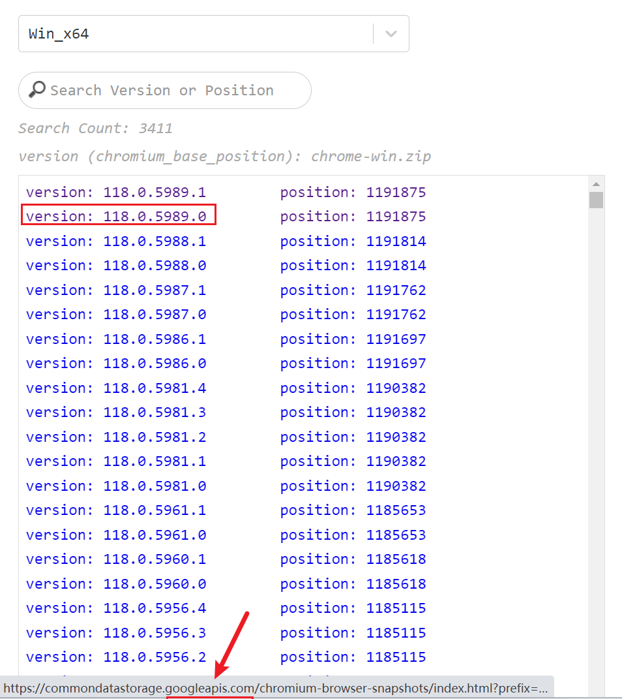
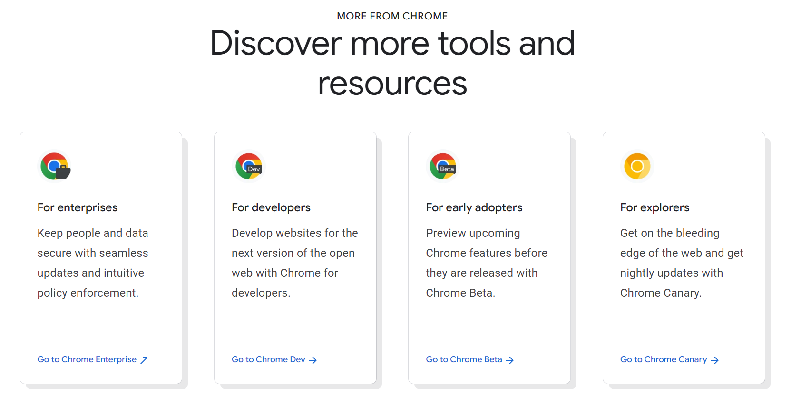
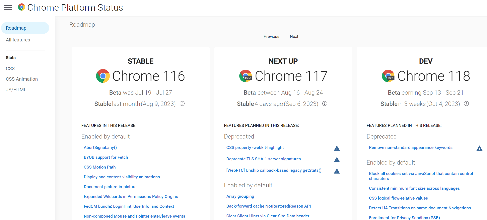

Sometimes we need a specific chrome version to test because of 

- the minimal supporting version 
- or customers' feedback
- ...

Sadly it's not easy to find a real and safe chrome history version. As [chromium](https://opensource.google/projects/chromium) said

> Google does not offer old builds as they do not have up-to-date security fixes.

Some people also don't know where to find the future versions. So I write this article to note how to find these resources.

### Old chrome

**Non-official resources**

There're some websites providing some old versions. But use it cautiously!

- https://www.slimjet.com/chrome/google-chrome-old-version.php
- https://filehippo.com/download_google-chrome/history/

**Official chromium versions**

According to the [chromium](https://opensource.google/projects/chromium) document

> Chromium is the web browser that Google Chrome is built on.

Normally you can reproduce the issues you met using the corresponding chromium version. 

Chromium provides a way to download old builds. You can follow the steps listed in the [document](https://www.chromium.org/getting-involved/download-chromium/#downloading-old-builds-of-chrome-chromium).

Another way is using [chromium-history-page](https://mrseawave.github.io/chromium-history-page/). **It's not an official page, but it'll redirect you to the official builds download page.**

Then you can install the specific version to test.

### Future Chrome versions

It's quite easy to download the future versions. In the [homepage](https://www.google.com/chrome/), you can find them and download them.

Basically, they're `beta`, `dev`, and `canary`. `beta` version is the next version, and also the version that developers are searching for when they need a future version.

Because chrome is distributed gradually. Some people's browsers will be affected first. Developers might receive defects coming from customers because the experimental changes make their websites unavailable. And they can not reproduce on their own computer. 

In this case, we can download the `beta` version and sometimes need to turn on some feature flags to reproduce the defects and fix them.

You can also see the release date, progress, and changes in the [roadmap](https://chromestatus.com/roadmap).

Okay, now you know where to download the old and future Chrome versions!

[**Issue**](https://github.com/xianshenglu/blog/issues/151)

[**Source**](https://github.com/xianshenglu/blog/blob/master/source/_posts/when-you-need-a-specific-chrome-version-to-test.md)

## Reference
